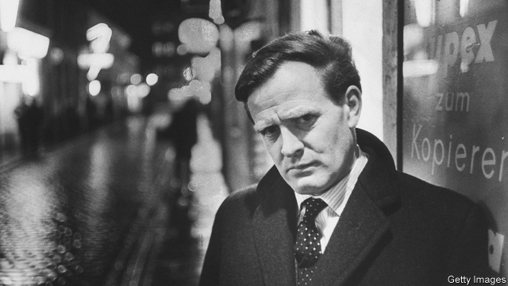

###### The enemy within

# John le Carré’s 25th novel is blisteringly contemporary 

 

> print-edition iconPrint edition | Books and arts | Oct 17th 2019 

Agent Running in the Field. By John le Carré.Viking; 288 pages; $29 and £20. 

WHEN JOHN LE CARRÉ’S third book, “The Spy Who Came in From the Cold”, was published in 1963, it presented the world of espionage in a harsh new light. Spies were not brave, suave heroes. “They’re a squalid procession of vain fools, traitors too,” explains the flawed and beleaguered protagonist, Alec Leamas. They are “sadists and drunkards, people who play cowboys and Indians to brighten their rotten lives.” The novel preferred intrigue to adventure, gritty reality to escapist fantasy. Readers expecting a finale in which good conquered evil were instead offered convoluted twists and a bleak denouement. 

That book redefined the spy novel and relaunched its author’s career. Mr le Carré’s first two novels had been conventional mysteries. From his groundbreaking third onwards, he explored topical conflicts and human duplicity in complex dramas that were rich in cloak-and-dagger machinations and moral ambiguity. His famed “Karla Trilogy” placed that ultimate cold warrior, George Smiley, centre stage. 

Since the fall of the Berlin Wall, Mr le Carré’s stories have revolved around latter-day concerns—Russian money-laundering in “Single & Single” (1999), big pharma in “The Constant Gardener” (2001) and extraordinary rendition in “A Most Wanted Man” (2008). Then, in “A Legacy of Spies” (2017), the author (pictured above in 1964) surprised and delighted his readers by bringing back Smiley and other “unsleeping spies of yesterday”, crafting a tale which ingeniously tapped into “The Spy Who Came in From the Cold” and “Tinker Tailor Soldier Spy” (1974). 

Two years after his previous book and 58 years after his first—and in the wake of a public spat with a former head of MI6, over the author’s jaundiced depiction of a service for which he once worked—his 25th novel again swaps old characters and exploits for new players and present upheavals. “Agent Running in the Field” is narrated by Nat, a 47-year-old spy for British intelligence—known not as “the Circus” of yore but, more prosaically, as “the Office”. 

After years spent handling secret agents overseas Nat has returned to London to take charge of “the Haven”, an “outstation” of the Russia department that doubles as “a dumping ground for resettled defectors of nil value and fifth-rate informants on the skids”. With Florence, his number two, Nat throws himself into Operation Rosebud, which involves the surveillance of a London-based Ukrainian oligarch with links to Russian intelligence. Then Florence unexpectedly resigns and won’t return Nat’s calls. Equally abruptly, the powers-that-be pull the plug on the operation. 

The plot thickens. Mr le Carré introduces Russians of various hues, from double agents to mafia kingpins. Operation Rosebud is superseded by the bigger, more fiendish—and, it turns out, politically sensitive—Operation Jericho. Increasingly sidelined, Nat embarks on a freelance mission to find out what is going on. To decompress he plays badminton with Ed, a “researcher” and loner who is as dissatisfied with his job as he is disillusioned with his country. Ed rails against Brexit (“an unmitigated clusterfuck bar none”) and Donald Trump (“he is presiding over the systematic no-holds-barred Nazification of the United States”). When Ed piques the interest of the Office, Nat finds himself under suspicion. His loyalties are tested. 

Other than a brief “wildcat journey” to the Czech Republic, this time Mr le Carré’s lean narrative plays out entirely in London. The menace is subdued and the shock-value low. Unlike another of his late-career works, “Our Kind of Traitor” (2010), this novel ends not with a bang but a whimper. Nevertheless, it is satisfyingly murky and labyrinthine, filled with wrong turns and dead ends. Nat is a sympathetic hero, whether he is sifting sources in his search for answers or fighting to clear his name in a tense interrogation. In stark contrast to the Bush-bashing rants and anti-war diatribes that marred “Absolute Friends” (2003), Ed’s state-of-the-nation commentaries add texture to his character and help justify his actions. 

“[I]f you spy for long enough”, Nat says, “the show comes round again.” It doesn’t in Mr le Carré’s novels. He may recycle some tropes and tradecraft but each new book is refreshingly different and uniquely compelling. This is no exception. ■ 

