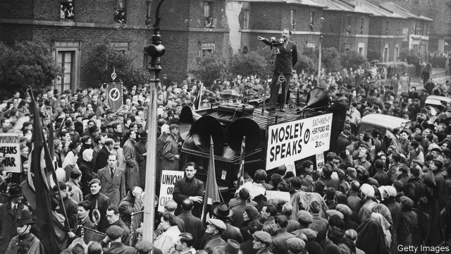
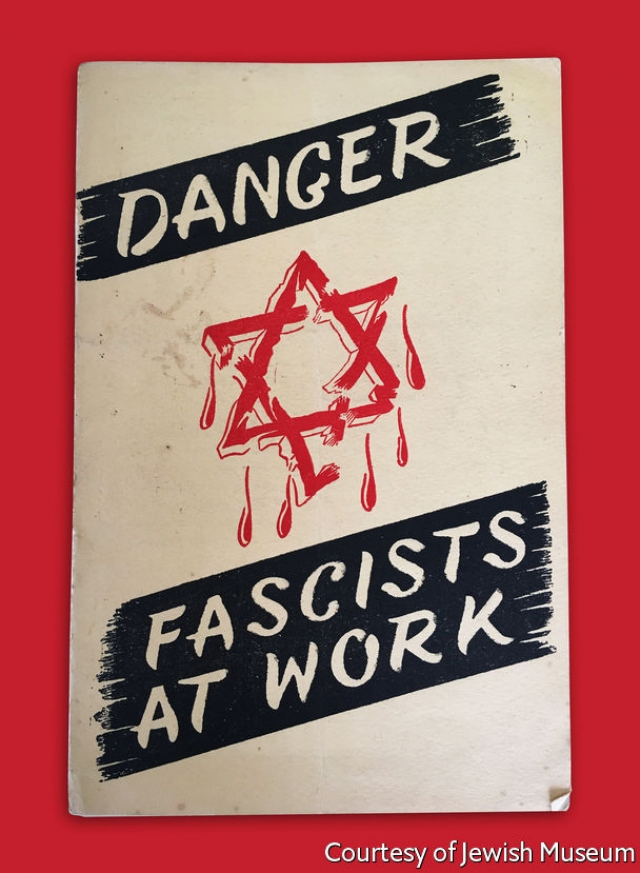

###### What had to be done

# When fascists and Jews battled on the streets of London 

 

> print-edition iconPrint edition | Books and arts | Oct 19th 2019 

We Fight Fascists. By Daniel Sonabend. Verso; 384 pages; £20. 

THEY MARCHED along the seafront in Brighton, waving flags and heralded by drummers. As they reached the pier and turned inland, towards a park known as The Level, they were set upon by a gang of toughs. Dazed and cut off from the ranks behind them, the men at the front were promptly assailed by another gang barrelling down to the beach. For the rest of that summer day, June 5th 1948, the attackers thrashed their quarry all over town. A leader of the march, Jeffrey Hamm, was hospitalised with a broken jaw. “There was fighting on every street corner,” remembers Jules Konopinski. “That was lovely.” 

Now 89, Mr Konopinski was one of the fearsome assailants in Brighton. Today he is a white-haired, welcoming great-grandfather, with an impressive recall of ancient adversaries and brawls. Seventy years ago he was known as “Mad Jules”. “Given an order and asked to do something,” he says of his bygone self, “he did it.” He and Harry Kaufman, a diminutive 88-year-old raconteur, are two of the last surviving members of the 43 Group, an organisation set up after the second world war to wipe fascists—such as the concussed marchers in Brighton—from the streets of Britain. Their uncompromising outfit, says Mr Kaufman, was “a great band of brothers”. 

Britons like to think they are less susceptible to extreme politics than their neighbours on the continent. Sir Oswald Mosley, leader of the hapless British Union of Fascists in the 1930s, tends to be remembered as a goose-stepping goon, who had somehow failed to notice that his country just wasn’t that kind of place. Fascism’s unlikely recrudescence in Britain in the years after the war—and the resistance it met—are scarcely remembered at all. Now, in another era of rumbling prejudice, rows over the limits of political speech and doubts about the resilience of democracy, this forgotten episode is freshly resonant. Now, as in the late 1940s, ordinary citizens are meant to trust democratic institutions to contain the threats that system faces. The 43 Group decided they couldn’t. 

As Daniel Sonabend lays out in “We Fight Fascists”, a new, comprehensive history of the group, the origin of its name is hazy. It might have come from the door number of the room in which some of its members gathered before smashing up a fascist event in Holborn. Or it may simply refer to the number of people present at the founding meeting. Most (but not all) of those members were ex-servicemen. Most (but not all) were Jewish. 

Either way, its mission was clear. In 1940 leading British fascists had been interned for reasons of national security. Mosley, a pukka former MP, was let out on compassionate grounds in 1943 after his mother-in-law “pestered her former bridesmaid, Clementine Churchill”, the prime minister’s wife. At a Christmas party for released internees in 1945, Mr Sonabend recounts, Mosley’s appearance set off chants of “Heil white man!” 

Dingy, battered post-war Britain was in some ways fertile territory for political insurgents. Parts of London and other cities were bombed-out wastelands. Housing was short; food rationing grew even tighter than during the conflict; crime spiked. The winter of 1946 was severe. “As economic conditions decline, manifestations of anti-Semitism will increase,” predicted a bulletin of the 43 Group, now held in the archive of the Jewish Museum in London. “And we all know what that will mean.” Anti-Semitism—stoked by the notions that Jews had caused the war, and were stealing housing from the “natives”—was heightened by friction between Zionist paramilitaries and British forces in Palestine. The murder of two British sergeants in 1947 ignited riots across the country. 

A panoply of ambitious fascists tried to exploit the discontent. Hamm (the casualty of Brighton) had been interned on an improvised prison ship off the Falkland Islands, then in a camp in South Africa. In a post-war pamphlet he described communism as “a Jewish confidence trick whereby Jews acquire the nation’s wealth by pretending to nationalise it.” “If a Jew walks on the same pavement,” advised John Marston Gaster, another would-be martinet, “knock him into the gutter where he belongs.” Dozens of fascist gatherings were held every week in London alone, clustering in Jewish areas in the city’s north and east. Devotees sang the Horst-Wessel song and chanted, “The Yids, the Yids, we gotta get rid of the Yids!” The fascist lightning-bolt symbol was graffitied on Jewish premises, along with the semi-occult slogan “Perish Judah”. 

The fascists were riven by factional infighting—but so were British Jews. That split was in part caused by the war, which, as wars tend to, shook up the views of those who had fought in it. One of the 43 Group’s leaders was Gerry Flamberg, a paratrooper who had been shot and captured at Arnhem. Searingly, some of the members had helped liberate concentration camps; most had lost relatives in the Holocaust. “They came back from the war, walked into their homes, and they found their families afraid to go out,” says Mr Konopinski, who (like Mr Kaufman) was among a clutch of streetwise youngsters who hadn’t served but joined the group anyway. “And they decided: ‘This can’t happen’.” His own parents had fled Germany in 1938. “My mother and father lost all their families.” 

In the only book about the 43 Group before Mr Sonabend’s, one of its founders, Morris Beckman, writes that “The keep-your-head-down and get-indoors-quickly mentality”, which much of Anglo-Jewry had adopted when the Mosleyites harassed them in the 1930s, “had gone for good.” It hadn’t entirely. Older people and established community organs still thought restraining the fascists was the government’s job. “My parents’ attitude was, ‘Keep out of it’,” says Mr Konopinski. 

But, beyond using existing police powers to regulate street marches, the Labour government was disinclined to intervene, thinking it imperative to re-establish pre-war civil liberties. The police, meanwhile, were more attuned to threats from the left than the right; some sympathised with the fascists. “Throughout the length and breadth of Britain”, a 43 Group publication railed, “the beast is stirring.” 

From the summer of 1946, its members disrupted the fascists’ activities and closed down their meetings wherever they could (as, sometimes, did communists and other like-minded groups). They asked the police to intervene (they wouldn’t), then heckled and yelled and threw tomatoes or light bulbs. If none of those did the trick, they formed a “flying wedge”, heavies at the front, to drive past the lines of fascist stewards and police protection and get to the speaker who, typically, would be perched on a wooden box. 

This was no-platforming in the rawest, most literal sense. “Go for the speaker, turn the platform over,” summarises Mr Konopinski. “Job done.” The job got harder when the speakers began perching on an armoured van known as “the Elephant” (pictured with Mosley on the previous page), so that they had to be bombarded from a distance. On the postcards that summoned the members to operations, the codeword “Arnold” meant all-hands-on-deck. 

 

The violence in the resulting skirmishes was grisly. “We didn’t particularly worry about where we hit them, and how we hit them, or what with,” says Mr Konopinski pitilessly. “It’s a great wonder that nobody got killed.” Combatants wielded coshes, belt buckles and cut-throat razors; Mr Kaufman explains that a tightly folded newspaper can be an effective weapon, too. Vidal Sassoon, in his youth a 43 Group stalwart, carried a pair of hairdresser’s scissors; he remembered being called a “dirty Jew bastard” by the police. (A teenage Harold Pinter was also a recruit.) Throughout the summer of 1947 there was a running battle around Ridley Road in now-hip, then-gritty Dalston in east London. “Knuckledusters, lead pipes; 8 arrests”, reported the Daily Mail after one scrap. 

Intimidating characters were fielded by both sides. The Lipman brothers, two of the victors of Brighton, “were pre-war all-in wrestlers when it was a tough game,” recalls Mr Kaufman. As for the hardscrabble Goldberg twins, says Mr Konopinski, even the Krays, infamous East End hoodlums, “would not go near them”. On one occasion, Maltese gangsters pelted the 43 Group with razor-encrusted potatoes on the fascists’ behalf. The group liaised with Jack “Spot” Comer, a notorious Jewish racketeer, but decided against enlisting him. “I was always scared,” confides Mr Konopinski, “but it’s fear that makes you brave.” 

As “We Fight Fascists” entertainingly documents, however, fighting was only part of the technicolour story. The 43 Group published and distributed pamphlets (see picture) and a newspaper, and raised funds to cover hospital bills and legal expenses. When fascists framed Flamberg for attempted murder, he was defended by one of the Nuremberg prosecutors. There was a headquarters in Bayswater and later near Leicester Square, and training in unarmed combat at a Soho gym. 

And, using cloak-and-dagger tradecraft that—like the expertise in violence—was a legacy of the war, the group ran surveillance and intelligence operations. One agent rose through the ranks of fascist stewards, tussling with unwitting 43 Group comrades, to became Mosley’s bodyguard (and facilitate the burglary of his paperwork). A female spy became the mistress of a leading fascist. A couple who went undercover together were eventually shipped off to Canada in a hurry. “They all had one thing in common: failure,” the extracted man wrote witheringly of the die-hards he had duped. “They were men and women who had failed to make the grade.” 

When, in November 1947, Mosley signalled the formation of a new party, the Union Movement, meant to subsume the bickering fascist cells, the 43 Group’s infiltrators learned the venue for the announcement and the hall was besieged. But the fascist moment, such as it was, was already passing. Austerity slowly abated; the British withdrawal from Palestine in 1948 muted an anti-Semitic rallying cry. Mosley’s new emphasis on pan-European fascist solidarity baffled his followers. Before long the tin-pot movement disintegrated amid acrimony and half-hearted marches. 

Members of the 43 Group drifted away, too. At a time when sacrifice was demanded, and for a cause that seemed to warrant it, many had paid for their commitment in injuries or arrests. In the mêlée at Brighton Mr Konopinski, then apprenticed to a handbag designer, had his nose accidentally “flattened” by a former circus strongman fighting on the same side. In 1949, just before his national service, Mr Kaufman was convicted and fined for his part in a fracas. People were trying to hold down jobs and restart their lives after the war. An organisation boasting perhaps 2,000 members at its peak formally wound up in June 1950. Mark Burman, a BBC producer, met some of its veterans for a radio documentary of 2008; he recalls “silver-haired men who could have been your uncle Morrie, shyly offering up knuckledusters and secret paperwork”. Now they are almost all gone. 

Was it all worth it—and was it really necessary? “It was very bloody and very nasty,” reckons Gerry Gable, editor of Searchlight, a magazine that keeps track of neo-Nazis, but the 43 Group “basically shut Mosley down”. To its critics, including some in the Jewish community, the group’s bravado merely boosted the fascists’ publicity (if so, comments Mr Sonabend, it was bad publicity, since “the fascists remained associated with street violence and chaos”). A more basic question is whether, in the wake of the war against Hitler, fascism, of all ideologies, was ever likely to become a serious force. In the circumstances, Chuter Ede, the home secretary, thought it safe “to leave these people to the sense of humour of the British people”. 

To the 43 Group, in the shadow of the Holocaust, that sounded like classic British complacency. Theirs was a peculiarly traumatised time; but, in different guises, the choices they faced remain sharp and vexed today. When does an opponent become an enemy, and a problem an emergency? When does faith in orthodox politics, even in the rule of law, run out? When is enough enough? “We had to do what had to be done,” insists Mr Konopinski. In the 1960s he helped set up a new organisation to take on the revivified far right. For his part, long after the 43 Group disbanded, Mr Kaufman would sometimes drop into a London bookshop that doubled as a fascist HQ, just to let them know he was there. ■ 

