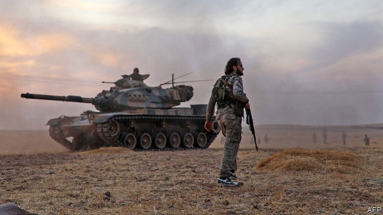
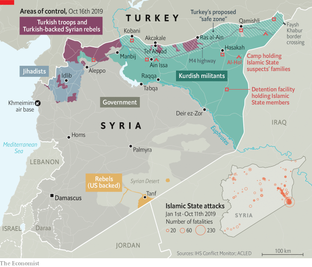

###### Another fine mess

# Donald Trump triggers a Turkish invasion and trashes the national interest 

 

> print-edition iconPrint edition | Briefing | Oct 17th 2019 

BASHAR AL-ASSAD surely cannot believe his good fortune. For six years the Syrian dictator has had little control over the north-east of his country, home to Syria’s modest oilfields and some of its most fertile farmland. The jihadists of Islamic State (IS) seized power there in 2014. As their caliphate crumpled, a Kurdish-led militia which was doing much to bring about that crumpling took over, establishing an autonomous fief known as Rojava in 2016. 

Then, on October 6th, President Donald Trump ordered the American troops stationed in north-eastern Syria to withdraw. On October 9th Turkey invaded. Four days later the Kurdish militia which ran Rojava, the People’s Protection Units (YPG), made a deal with Mr Assad at Russia’s Khmeimim air base, in the north-west of Syria; if the Syrian army came into Rojava to protect his country’s territory against the Turks, the Kurds would fight alongside him. A video released by Russian state media soon afterwards showed Syrian troops advancing past Americans withdrawing down the same road, their respective pennants flapping in the wind. With his flag now flying over towns such as Hasakah, Kobani and Qamishli, and with control of the country’s two largest dams, Mr Assad has reclaimed more north-eastern territory in a few days than he previously had in a few years. 

Mr Trump’s decision has reshaped the Levant. Now expanded to include almost all American troops in Syria, it has ensured that America will have no influence over the final settlement of Syria’s civil war. That will be orchestrated by Russia, which benefits greatly from the new situation. Being a friend to Turkey and Syria alike is potentially tricky while fighting continues. But it is a good position from which to broker its end. 

The president’s decision has also left American allies around the world newly worried that they too could be left in the wind, just as the Kurds have been. It has put new strains on NATO. And it has given IS a chance to rise again. 

Turkey says its invasion is an act of self-defence. The YPG is linked to the Kurdistan Workers’ Party (PKK), a group responsible for dozens of deadly attacks across Turkey since its peace talks with the government of President Recep Tayyip Erdogan broke down in 2015. America’s decision to arm and work with the YPG during the fight against IS was widely seen in Turkey as an act of betrayal. At the Turkish border troops returning from Syria are welcomed by children saluting and making victory signs. Those who challenge the mood too obviously risk joining more than 186 people detained on terrorist charges for social-media posts critical of the invasion. “People who classify this as a war”, as opposed to a counter-terrorism operation, Turkey’s interior minister, Suleyman Soylu, has said, “are committing treason.” 

When backed up by Western air power in the fight against IS the YPG had been a pretty effective force, though the Kurds still lost 11,000 fighters in the struggle. With neither air support nor armour, the militia was no match for Turkey’s army, the second largest in NATO. Turkey quickly took a section of the M4, an east-west highway about 30km south of the border, cutting the YPG’s supply lines. Much of the advance has been led by ill-disciplined Syrian rebels, a tactic which both reduces Turkish casualties and provides deniability when it comes to crimes such as the murder of Hevrin Khalaf, a Kurdish politician, and the roadside execution of prisoners. 

Following the deal with Mr Assad, YPG forces are now under the command of the Syrian army’s Fifth Corps. This is said by the YPG to be a purely military arrangement. The Kurds purport to believe that the bits of Rojava to which government forces have returned can continue to be run as they were before, with “the self-administration’s government and communes intact”, in the words of one official. But Mr Assad’s regime does not have a history of forbearance with populations returned to its control. Promises of local autonomy made when it retook the southern province of Daraa were quickly broken. “Reconciliation” deals with the locals ended with people jailed or pressed into military service. 

In the north-east, Kurds and Arabs who worked with the Americans will be particularly vulnerable to such reprisals. The hasty withdrawal left no time to whisk them out; more than one official likened the situation to the fall of Saigon in 1975. Nor is it easy for people to leave under their own steam. Iraqi Kurds have closed their border to Syrians, Kurdish or otherwise, unless they are sick. Most of the 160,000 people estimated to have been displaced are heading south. 

The departing Americans did manage to exfiltrate some of the most notorious IS prisoners being held in north-eastern Syria. But they left behind a great many more. More than 70,000 prisoners taken from the former caliphate—a mix of IS fighters, their families and civilian refugees—are held in camps dotted across north-east Syria. The Kurds who have been guarding them now have other priorities. On October 13th over 800 IS-linked detainees escaped from Ain Issa camp in the chaotic aftermath of Turkish shelling. More will follow. 

 

Jailbreaks will give the battered rump of IS fresh manpower. Mr Assad’s return will give it a new rallying cry—IS will be able to present itself as a pre-eminent adversary. The bits of IS still running a low-level insurgency in northern and western Iraq may be revived, too. All of this is a return to form. IS has been “defeated” before, only to regroup in ungoverned spaces with angry populations. Its blitz across Iraq in 2014 was made possible by massive jailbreaks. 

If IS does rise again, Mr Trump will blame the Kurds. Most others will blame him. American allies in the region felt let down by President Barack Obama, who made a deal with Iran and refused to strike Syria. They hoped Mr Trump would suit them better. King Salman of Saudi Arabia gave him a gilded reception in Riyadh in June 2017. Binyamin Netanyahu, Israel’s prime minister, all but anointed him the messiah. 

The welcome given to Russia’s president, Vladimir Putin, when he arrived in Saudi Arabia on October 14th did not have all the bells, whistles and ceremonial swords accorded to Mr Trump two years ago. But his visit, and his promise “to reduce to zero any attempt to destabilise the oil market”, were still significant. So was his subsequent trip to Abu Dhabi. Despite their differences on Syria—differences which are fading as Arab states quietly reconcile with Mr Assad—Gulf leaders have noted that it was Russia, not America, that stood by its partner. They also note that, for all Mr Trump’s bellicosity, he has done little to stop Iran becoming more assertive—and indeed attacking major oil installations. The 1,800 American troops deployed to Saudi Arabia on October 11th do not lay those worries to rest, though they do show that Mr Trump’s aversion to foreign entanglements is untroubled by consistency. 

Israel is distinctly fretful at the sight of an American ally so swiftly thrown aside. Mr Netanyahu did not mention Mr Trump directly when he condemned Turkey’s attack and warned against “the ethnic cleansing of the Kurds”. Some of his ministers are less cagey. The purpose of America’s remaining deployments in Syria, in the south-east, is to stop the creation of a permanent supply line between Iran and the Hizbullah forces it supports on Israel’s borders. Should those troops leave too, Israel will be yet more alarmed. 

Seeing America’s stock fall so precipitously has alarmed many in Washington. Democrats were quick to make hay. Republicans in Congress were vocal, too. They have frequently made foreign policy an exception to their general rule of not criticising the president’s breaches of decorum and reason. Even given that track record, though, the dissent from Mr Trump’s decision was striking. Lindsey Graham of South Carolina, a national-security hawk and erstwhile Trump whisperer, called in to one of the president’s favourite television shows to berate him. “I fear this is a complete and utter national security disaster in the making,” Mr Graham later tweeted. 

Congressmen from both parties argue that, although they realise that Americans have had enough of foreign wars, abandoning brave allies and letting IS regroup are beyond the pale. On October 16th a measure condemning Mr Trump’s decision passed in the House by 354 to 60, with 129 Republicans voting against the president. 

That enraged Mr Trump, who maintains that his decision was “strategically brilliant”. The White House has released a letter threatening Mr Erdogan with the destruction of the Turkish economy if he were to take bloody advantage of the opportunity Mr Trump had provided him with: “Don’t be a tough guy. Don’t be a fool!” If this was sincere it was somewhat belated, being sent on the day of the invasion. 

Mr Trump has dispatched Mike Pence to Turkey to press for an immediate ceasefire, though his boss’s professed lack of interest in the fate of the Kurds seems likely to undercut the vice-president’s position. On October 14th he also announced penny-ante sanctions. Mr Graham and Chris Van Hollen, a Maryland Democrat, have crafted a more muscular package. 

The crisis has also triggered another threat to Turkey’s economy, albeit indirectly. On October 16th prosecutors in New York unsealed an indictment against Halkbank, one of Turkey’s biggest state lenders, accusing “high-ranking” Turkish officials of operating a scheme to bypass American sanctions against Iran. Mr Trump is reported to have tried to stymie aspects of this case at Turkey’s bidding. According to Timothy Ash, an analyst at BlueBay Asset Management, the fact that the prosecutors have now made their move shows that “developments in Syria and impeachment have broken the dam.” The news had an immediate impact on Turkey’s banking sector. The bank index dropped by 4%, with Halkbank shares down 7.2%. The government banned short-selling in the stock of Halkbank and six other banks. 

Mr Graham also talks of suspending Turkey from NATO. This is nonsensical: the North Atlantic Treaty offers no mechanism for suspensions or expulsions. What is more, Turkey really matters to NATO; its well-trained forces, on which it has been spending a lot, are woven deeply into the alliance’s fabric. The NATO land command is hosted in Izmir; one of its nine “high-readiness headquarters”, which could command tens of thousands of troops in a crisis, is just outside Istanbul. Turkey’s navy plays a key role in the Black Sea, a priority since Russia seized Crimea. It has almost 600 troops in NATO’s mission in Afghanistan. Radars on its territory scan the skies between Iran and Europe for missiles. And it hosts American B61 nuclear bombs as part of NATO’s nuclear-sharing scheme. 

Turkey and its NATO partners have been increasingly at odds over the past few years. America’s embrace of the YPG was one factor. So was the dismissal of thousands of Turkish officers after the attempted coup against Mr Erdogan in 2016; “A drastic de-NATO-isation of the Turkish armed forces” as a report for the Clingendael Institute, a Dutch think-tank, puts it. Turkey’s purchase of the S400 air-defence system from Russia made matters worse. 

An EU arms embargo enacted on October 14th will hurt Turkey: about a third of its arms imports come from Spain and Italy. But if such actions push it towards a negotiating table, it will be a table supplied by the Russians—who will be quite happy to supply arms, too, as part of an eventual deal. While it will remain part of the alliance, Turkey may start fielding ever-less-interoperable weapons, and sharing ever fewer goals. 

It may also rethink its attitude to Syrian refugees. Part of Turkey’s justification for its excursion into Syria is the creation of a safe space to which Syrian refugees can return—or, if necessary, be sent. If stymied, it might yet decide instead to let them through into Europe. 

Some, though, will not go anywhere. In Akcakale on the Turkish-Syrian border, Ahmet Toremen, a construction worker, walks past the broken window-frames, burnt mattresses and bloodstains covering the bottom floor of his ramshackle house. It was hit by Kurdish mortar fire from Syria. At least 20 civilians have died in such attacks, according to officials in Ankara. For Mr Erdogan their deaths offer a chance to show that the war was a matter of necessity, not choice. He can rely on no Turkish newspaper pointing out that there were no such attacks before October 9th, just as they do not report the civilians being killed in Syria. On October 16th the Syrian Observatory on Human Rights put this toll at 71, along with 15 killed in an air strike on a humanitarian convoy. 

Mr Toremen’s family was next door when the shell landed in the corner of their living room; the house had been rented out to a Syrian family. One woman was blinded, one wounded and the family’s baby was killed. “They escaped war”, says Mr Toremen, “and war found them here.” ■ 

