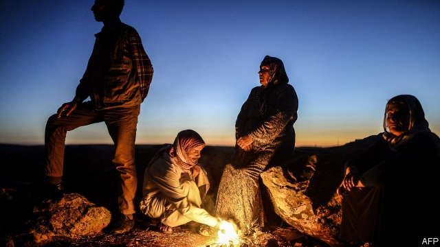
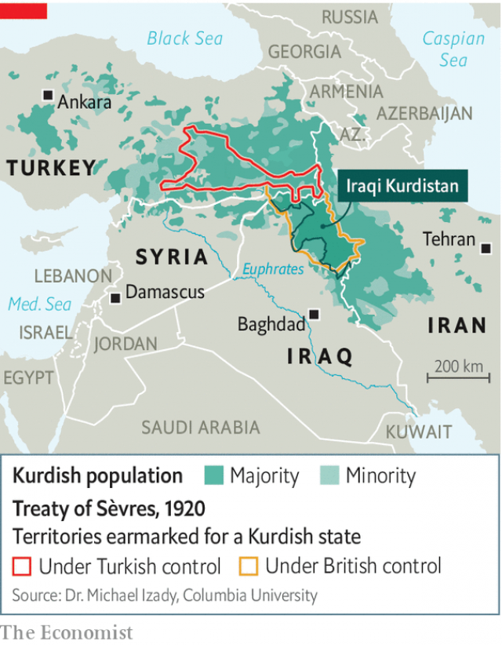

###### A century of betrayal

# Kurdish dreams of a homeland are always dashed 

 

> print-edition iconPrint edition | Briefing | Oct 17th 2019 

THE TREATY OF SEVRES, signed in 1920, carved the carcass of the Ottoman Empire into a number of nation states, including a “Kurdish State of the Kurds…east of the Euphrates, south of the southern boundary of Armenia as it may be hereafter determined, and north of the frontier of Turkey with Syria and Mesopotamia.” It would, said Winston Churchill, Britain’s minister of colonies, be “a friendly buffer state” between Turks and Arabs. 

Three years later, the Treaty of Lausanne ditched the idea. Britain was too spent by the first world war to fight another battle with Turkey, resurgent under Kemal Mustafa Ataturk. Iraq’s new Hashemite king needed the Kurds, who were Sunnis, to dilute his Shia majority. And some of the Kurds, who were new to the idea of nationalism, rebelled, demanding the restoration of Ottoman rule. That led to bombings by the newly formed Royal Air Force. 

The Kurds were to spend the next century strewn across four states, each determined to crush their nationalist dreams. Occasionally someone would seem to help. In 1946, the Soviet Union stood up a Kurdish Republic of Mahabad in an attempt to create a client state and keep control of northern Iran, which it had said it would leave. Western pressure brought about its collapse in less than a year. In the early 1970s the American secretary of state, Henry Kissinger, instructed the CIA to help Israel and the Shah of Iran stoke a Kurdish rebellion in Iraq as a way to sap the Baathist regime’s aspirations for Arab hegemony. But in 1975 the shah cut the Kurdish lifeline. “Fuck [the Kurds] if they can’t take a joke,” shrugged Mr Kissinger. Saddam Hussein’s Republican Guard obliged. 

 

In the later part of Saddam’s war with Iran, his cousin Ali Hassan al-Majid waged a genocidal campaign against the Kurds, emptying 80% of the Kurdish villages in Iraq’s three northern provinces as the West looked the other way. Still, when President George Bush called on Iraqis “to force the dictator to step aside” during the 1991 Gulf war the Kurds obligingly rose up. This time, the West imposed a no-fly zone in the skies of northern Iraq and encouraged an autonomous Kurdish government beneath it. But when in 2017 those Iraqi Kurds held a referendum to press their demands for statehood, the West ignored it. 

To be the underdog is not to be blameless. The Kurdish record features internecine conflicts, smuggling, sanctions-busting and banditry. Armenians remember them as the Turks’ foot-soldiers in the genocide. Arabs in parts of Iraq and Syria captured by Kurds champ at their second-class status. The Middle East has few saints. But it also has few peoples more regularly betrayed than those now fleeing the Turks in Syria.■ 

