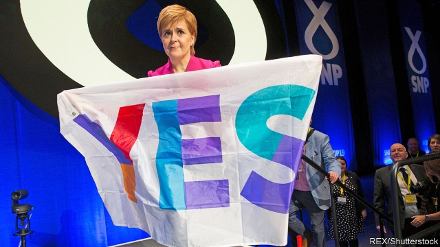
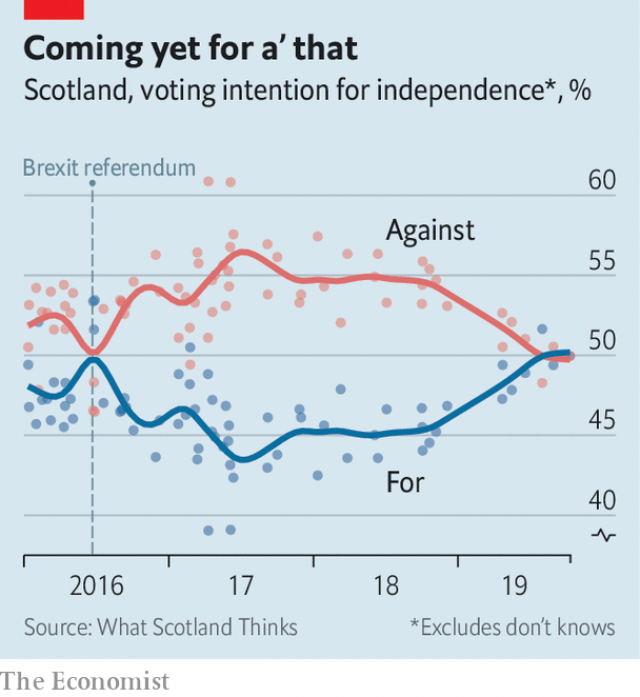

###### The other exit negotiations

# Another Scottish referendum beckons—and this time the nationalists may win 

 

> print-edition iconPrint edition | Britain | Oct 17th 2019 

IT IS A defining characteristic of the modern Scottish nationalist movement that it refuses to engage in extreme methods to advance its cause. This week, as Spain’s supreme court jailed Catalan separatist leaders for between nine and 13 years for sedition, following an illegal referendum and unilateral declaration of independence in 2017, the Scottish National Party was gathering peacefully in Aberdeen for its annual conference. 

Nicola Sturgeon, the SNP’s leader and first minister of Scotland, was quick to condemn the Spanish court’s decision as “dreadful”. But the contrast between the two movements is stark. When it comes to radical activity, Scottish nationalists might engage in a boisterous march through the streets of Edinburgh or, if especially grumpy, wave some placards outside the “biased” BBC. But they obey the law. 

This perhaps reflects the fact that Britain has been a union of choice for more than 300 years and has largely operated to Scotland’s advantage. Even with the separatist SNP repeatedly elected to power at Holyrood, Scotland’s devolved parliament, over the past decade, the nation has remained a reasonably relaxed part of Britain, voting 55-45 to stay in an independence referendum in 2014. 

It is relaxed no longer. Polls in recent months have shown support for independence creeping up to 50% and above (see chart). One reason is Brexit, which Scots opposed 62-38 and whose implementation is proving to be messy. The other is the capture of Britain’s two main political parties by ideological ultras. Neither Boris Johnson’s Conservatives nor Jeremy Corbyn’s Labour holds much appeal. A growing number of Scots are drawing the conclusion that the union is broken and that an independent Scotland inside the EU would be preferable to staying in an English-dominated, Brexited Britain. 

 

It may not be long before they are once again asked to make such a decision. Ms Sturgeon says she will request a Section 30 order from Westminster, enabling another referendum, by the end of this year. It seems unlikely that a Conservative government would oblige before the next Holyrood election in 2021. But should the Tories fail to win a majority in the general election that is expected soon, it may be that Labour is able to form a government with the support of the SNP. The price of its support would be a second referendum. 

With their objective suddenly and unexpectedly looming into prospect again, some of the more excitable Scottish nationalists are growing impatient. In Aberdeen, the SNP’s leadership had to fight off an attempt by rebels to force the party to adopt a Plan B for securing independence—for example, that it should treat winning a majority of Scottish seats at Westminster or Holyrood as a mandate to begin break-up negotiations. 

Ms Sturgeon’s critics say there is a sense of drift at the top. “Support for independence may be at 50%, but given the state of UK politics why isn’t it at 60%?” asks one prominent SNP politician. “People don’t have a clear sense of what the strategy is,” says another. “The unhappiness is real and stronger than the leadership would like outsiders to believe.” 

The first minister has long had to balance the SNP’s gradualists against its fundamentalists. The latter are often loyal to Alex Salmond, who led the party for most of the time between 1990 and 2014, and whose approach to politics was considerably more abrasive and divisive than Ms Sturgeon’s. There is also the matter of Mr Salmond’s trial, due early next year, for attempted rape and other sexual offences. No one is clear what the political consequences will be or what the voters will make of it; there is even talk that Ms Sturgeon herself could be forced to resign in the aftermath. 

Privately, SNP strategists accept that the most likely—and, in fact, most desirable—route to independence is to win a majority in Holyrood in 2021. This, they know, would establish an undeniable mandate for a new referendum. Before then, they want to deepen support for leaving, and drive that 50% figure higher. “Our model isn’t the Brexit vote, it’s the devolution referendum in 1997 [which was won 74-26],” says a leadership source. “We want to make independence the ‘settled will’ of the Scottish people.” In her conference speech Ms Sturgeon promised that “we will win our independence, but not the Brexit way…We will win by inspiring and persuading.” 

Despite the grumbles, SNP gradualists still have the upper hand. They believe their lifelong goal of Scottish independence has never been closer, and that playing by the rules will get them across the line sooner rather than later. And the truth is that Ms Sturgeon, like all clever democrats, doesn’t want to have the fight until she is sure she can win it. ■ 

