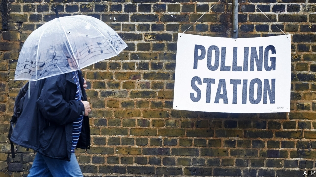

###### Identity politics

# Britain plans to require that voters show photo ID 

 

> print-edition iconPrint edition | Britain | Oct 19th 2019 

FOR MUCH of the 20th century, governments agreed on changes to electoral law with opposition parties, to calm fears of partisan gain. That is not quite how things work today. In the Queen’s Speech on October 14th, Boris Johnson’s government proposed a number of changes, including requiring voters to present photographic ID at the polls, to “protect the integrity of democracy”. Jeremy Corbyn, Labour’s leader, called the plans “clearly discriminatory”. Angela Eagle, a Labour MP, said they were no less than “an attempt by the Conservative Party to suppress voting, and…designed deliberately to hit the poorest hardest.” 

Demanding papers at the polls is common in countries with ID cards (which Britain does not have). Photo ID has also been required in Northern Ireland since 2002, to combat a situation where polling staff “were willing to turn a blind eye when half the inhabitants of the local cemetery turned up to cast their vote,” recalls Richard Mawrey, a former judge. But there is little evidence that in-person voter fraud is common in the rest of the United Kingdom. Thus Labour suspects the plans are designed to disenfranchise its supporters, who are twice as likely as Conservative voters to lack a driving licence. Under the plans, any voter without photo ID would be able to apply for a free “electoral identity document”. Yet how many would bother? 

In Northern Ireland, there was no sign of a fall in turnout when ID was required. Similarly, recent evidence from America suggests that, despite intense controversy, laws introducing identity checks have not reduced turnout among black voters. But a pilot in English local elections this year found, in two of the four wards with sufficient data, a correlation between the size of the Asian population and the number of people turned away. It is impossible to say whether this indicated fraudsters being thwarted or legitimate voters being disenfranchised, says Stuart Wilks-Heeg of the University of Liverpool. Another possible explanation is that turnout tends to be higher in Asian areas, which may be why a greater number of voters was rejected. 

Whether or not the need for photo ID puts off legitimate voters, the reforms will probably fail to stamp out a bigger source of fraud: postal votes. In 2004 Labour candidates in Birmingham manipulated postal ballots in a case of “electoral fraud that would disgrace a banana republic”, as Mr Mawrey, then sitting as an election commissioner, put it. Rules have since been tightened a bit. And the government now wants to ban “campaigners” from handling postal votes, put in place a limit on the number that can be handed in by one person, and make people reapply for a postal vote every three years. 

But postal fraud will still be far from impossible. People have got used to the convenience of voting by mail, so there is little hope of returning to a system that allowed it only in special circumstances. As Eric Pickles, a Conservative peer who wrote a report on electoral fraud in 2016, notes: “Once the toothpaste is out of the tube, it’s very tough to get it back in.” ■ 

