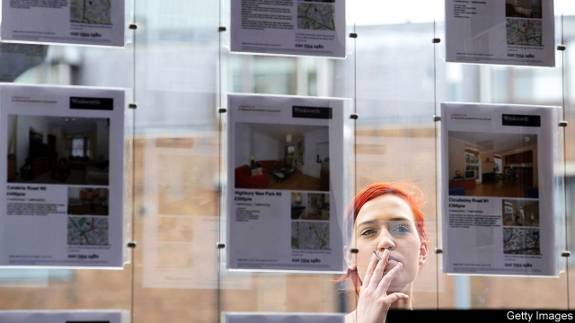

###### Making room

# Britain’s housing paradox: overcrowding and underoccupancy are both rising 

 

> print-edition iconPrint edition | Britain | Oct 19th 2019 

FOR PHILLIP ROUSE and his girlfriend, Martelle, both immigrants from Australia, home is a three-bedroom flat in south London. It is shared with two other people. That is not ideal, says Mr Rouse, who is 32. “When we were in Australia we lived by ourselves,” he says. When sharing, “you’re never quite grounded in your own space.” But ultimately the couple decided they had little choice. Their monthly rent and bills come to about 30% of their joint income. If they rented their own flat, it would be twice that. “That is too many lifestyle changes we would have to make,” Mr Rouse says. 

About 100 miles north, in Birmingham, Britain’s second-biggest city, Helen White, a 65-year-old retired charity worker, lives on her own in a three-bedroom house in an inner suburb. She bought it after a couple of relationships went sour and she felt she needed the security of her own place. Living alone is “great”, she says, “because you do not have to compromise”. 

In recent years, Britain’s housing shortage has seemed to relent. After a deep post-recession slump, construction has climbed back up towards previous highs. Homeownership rates, which had been steadily falling, have stabilised since 2014. Yet there is a huge generational imbalance. Older people are occupying ever more space. Indeed, there is a boom in older people living on their own (see chart). For most younger people, however, affordable housing remains scarce. They crowd into shared flats in the most expensive parts of the country. 

 

Last year the number of people living alone crossed 8m. But the increase has been entirely among those aged over 45. Between 2008 and 2018 their number rose by 810,000, or 14%. The number under that age fell by 340,000, or 18%. Some 746,000 homes were overcrowded last year, meaning that there were not enough bedrooms for each single adult, couple or pair of children to have one to themselves. That was a 14% increase on a decade before. Meanwhile the number of homes that were underoccupied, meaning that they had at least two spare bedrooms, also increased, by 10%, to 8.6m. 

What is driving this? Some of it is simply growing life expectancy: people are most likely to live alone when they are in their twilight years. But divorce also plays a part. The number of marriages breaking up has fallen drastically in the past few decades, probably because fewer people are getting hitched in the first place. But the number of over-50s divorcing has increased sharply. Those newly single people need more space. 

And they can afford it. Britain’s tax system encourages people to “consume as much housing as they can afford”, says Rose Grayston of Shelter, a charity. Property taxes are lower, proportionately, on bigger houses. Stamp duty, a tax on buying property, can make downsizing expensive. Recently older buyers’ spending power has risen relative to that of younger people. In real terms, earnings have fallen since 2008 across the board, but most of all for the young. Rents have also fallen, but not by as much as interest rates or wages. 

One consequence of this is that more and more young adults live with their parents. A quarter of those aged 20-34 are still at home, up from around one-fifth a decade ago. But not everyone has a family to live with. And the poorest young people are particularly exposed. In the parts of London where it is legal, there is a booming business in converting offices into tiny bedsits cheap enough for people on housing benefit. Someone under the age of 35 on welfare only gets enough to rent a room in a shared home, notes Ann Berrington of the University of Southampton. 

Some housing wonks now think that Britain is building enough homes to go around. Projections of the growth in the number of households have been cut back, so that from now on the government expects demand to undershoot construction, for the first time in years. But even a surplus of homes may not be enough to stop the young and poor from having to play sardines, if the old and rich are incentivised to spread out. ■ 

