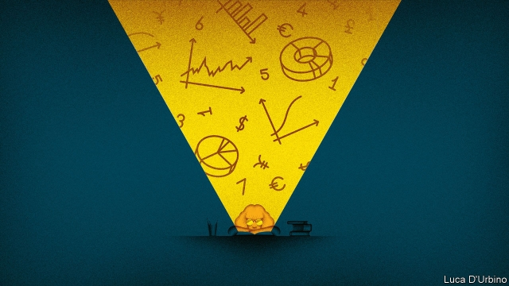

###### Sample bias

# Economists try to broaden the appeal of the dismal science 

 

> print-edition iconPrint edition | Britain | Oct 19th 2019 

ALTHOUGH MORE than half of Britain’s undergraduates are women, just a third of those studying economics are female. Only physics, engineering and computing are more male. Boys are three times as likely as girls to do an economics A-level. But dismal scientists are waking up to this dismal state of affairs. On October 15th the Royal Economic Society (RES) began Discover Economics, a campaign to widen the pipeline into the profession. 

An economist might first want to be convinced that the disparity does not simply reflect differences in girls’ and boys’ preferences. But there are good reasons to think that students make their choices with limited information. Sarah Smith, an academic at Bristol University and one of the founders of the campaign, says many schoolchildren think economics is narrower than it is. Most 15- to 17-year-olds, when asked, associate the subject with money. Economists have much in common with other social scientists. But whereas girls make up half to three-quarters of those studying geography and psychology, they shun economics. Nor can an aversion to numbers explain the problem: economics is even less popular among girls than maths. 

The subject’s lack of diversity might itself be off-putting. When Ali Norrish of Economy, a charity that seeks to make the subject more accessible, asks children to draw an economist, most sketch older men in suits. An economist attending the campaign’s launch recounted how his offer to speak to pupils at his old state-run school was rebuffed, because it would raise “unrealistic expectations”. Perhaps that explains why a quarter of privately educated boys study the subject, compared with 16% of all boys. 

All this means some young people are put off a career they might otherwise have found fulfilling—and which is relatively lucrative. Meanwhile the profession fails to attract the best talent, and the shedding of women and minorities at senior levels makes matters worse. That in turn narrows its appeal to students. 

Confronted with these market failures, economists are seeking to explain better what it is they do. A website will outline the breadth of the subject. Undergraduate “ambassadors” to schools will teach economics-related lessons. Economists from organisations such as the Bank of England and McKinsey, a consultancy, will visit schools in poor areas. Budging entrenched opinions won’t be easy. But this year’s unusually diverse set of Nobel prizewinners may help (see article). And, as economists know, more information should lead to better choices.■ 

