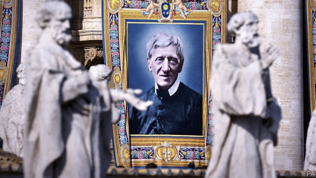

###### A saint for all seasons

# English Catholics rejoice over Cardinal Newman’s canonisation 

 

> print-edition iconPrint edition | Britain | Oct 19th 2019 

HE WAS A towering intellectual, a friend of the poor, a stickler for religious dogma and a hero, at least posthumously, of the gay-rights movement. With the canonisation on October 13th of Cardinal John Henry Newman (1801-1890), English Catholicism has acquired its first saint who lived any more recently than the 17th century. For tens of thousands of compatriots who have campaigned for his spiritual and intellectual gifts to be recognised, this was one of the sweetest moments since the Reformation, when England’s monarchy and ruling institutions broke with Rome and established a new church, leaving Catholics a somewhat embattled minority. 

As behoves an unusual cleric from an ever more diverse land, the ceremony in Rome was full of peculiarities. The British state was personified by Prince Charles, who would lose his entitlement to the throne, and hence his future status as ceremonial head of the Church of England, if he were to become a Catholic. The cardinal’s home town of Birmingham was represented by the lord mayor, Mohammed Azim, an adherent of the Muslim faith in which a plurality of the city’s youngsters are being raised. All that may be apt. During his lifetime, Newman won friends, as well as adversaries, in a wide variety of circles. 

“St John Newman pray for us,” tweeted Jacob Rees-Mogg, the fervently Catholic leader of the House of Commons and hardline Brexiteer, in response to the news. Meanwhile, Peter Tatchell, a campaigner for sexual freedom, said the church was guilty of homophobia in playing down Newman’s companionship with fellow Catholic convert, Ambrose St John. Mr Tatchell has described as “sacrilege” the church’s decision in 2008 to remove Newman’s remains from the two men’s common grave and place them in a more formal tomb. The church insists the pair’s relationship went no further than friendship. 

Whatever Newman would make of tinkering with his relics, he would probably have appreciated the diverse state of Catholicism in England. Since 1983 the share of people in Britain who call themselves Anglican has tumbled from 40% to 12%, while Catholics have slipped less drastically, from 10% to 7%. They have also done better at attracting people to church and retaining the young. About a quarter of British Catholics go to Mass most weeks. Peter Brierley, a religious statistician, says attendance in England ticked up last year. 

Behind these numbers lie huge contrasts. Strongholds created by Irish migration to the north of England are in decline, while Polish, Filipino and Latin American migrants join older residents to pack out the churches of London. “At least half a dozen Catholic churches in the London area attract thousands every weekend and they’d be [called] mega-churches if they were Protestant,” says Stephen Bullivant of St Mary’s University. “But there are churches in the formerly Irish bits of Liverpool that are emptying out and can’t find Catholic kids to fill their schools.” 

Cardinal Newman’s Victorian world might seem remote to England’s Catholic newcomers. But shrines and saints are something they relish. Catholics from southern India are now among the keenest venerators of the shrine of the Virgin Mary in Walsingham, an ancient English pilgrimage site. The tomb of England’s new saint, in Birmingham, will draw visitors from many places and persuasions. ■ 

