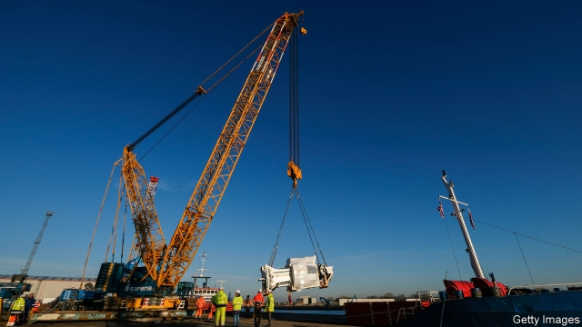

###### Keep digging

# Sirius Minerals, Britain’s first deep mine in decades, is in a hole 

 

> print-edition iconPrint edition | Britain | Oct 19th 2019 

SINKING DEEP mine shafts is hard, says Graham Clarke, operations director at Sirius Minerals, a company digging the first properly deep mine—a mile down—in Britain for over 40 years. At a certain depth, earth movement can cause trouble, or an aquifer needs sealing. One of Sirius’s shafts has descended 120 metres beneath the North York Moors on the way to a 260m-year-old, 2.69bn-tonne fertiliser deposit. Mr Clarke is surprised to have got so far. “Everyone said we would never get planning permission, then when we did they said we wouldn’t get our first funding.” 

The naysayers may yet win. Last month the FTSE-250-listed firm cancelled a $500m junk bond issue. It would have unlocked a $2.5bn loan from JPMorgan Chase, or enough in all to finish the £3.1bn ($4bn) project. Now Sirius could run out of money. Investors got spooked by market conditions, Brexit and the risks of shaft-sinking. Sirius also let it be known that the government in August refused a request to guarantee $1bn of bonds in 18 months’ time, even though state backing via export credit agencies is common in project finance. 

A challenge for Sirius, as well as the shafts, is getting its product, polyhalite, widely accepted by farmers. It is a speciality potash that is chloride-free (an advantage, since chlorine tolerance varies across crops). It has more nutrients that plants need than the two mainstream products, sulphate of potash and muriate of potash. Produced at scale, polyhalite has potential to disrupt the global fertiliser industry. 

That explains why existing powerful players, such as EuroChem, a Russian-owned giant with revenues of $5.6bn, have been talking down polyhalite, presumably adding to bond investors’ worries. Nevertheless, Sirius has struck multi-year sales agreements with customers to supply in total 13.8m tonnes a year at the peak. That will claim most of the mine’s initial production capacity. One is a ten-year deal announced on October 11th to supply polyhalite to Muntajat, a giant Qatari petrochemicals firm. 

But Sirius’s current funding—it has raised over £1.5bn—will run out by March. It has slowed operations; eventually it would have to fill in and cap its shafts and close off the mile that it has already dug of a 23-mile-long tunnel to carry the polyhalite to Teesside to be processed and shipped off as “Poly4” to fertiliser firms around the world. Never before has a mine been joined to a long tunnel—the design avoids unsightly railway tracks over the moors. 

At full capacity, Sirius’s positive impact on the local economy could be substantial. The company plans to ship £2.5bn-worth of polyhalite a year at full production and send an annual £470m to the exchequer. It employs 1,200, mostly local, workers and will need 2,800 more. In Teesside its tunnel cuts into the earth from an old ICI site near shut-down steelworks; local politicians such as Ben Houchen, Tees Valley’s mayor, are backers. So are around 85,000 retail investors, many from Yorkshire and the north-east, who piled into Sirius shares over the past eight years. Many lost out when Sirius’s bond issue was cancelled. 

One reason the government declined to back the financing—in addition to its fears about the risk to the taxpayer—was that politicians reckon there are other funding options, say people close to the firm. Sirius is to come up with alternative plans by the end of the month. One option could be a strategic partner with a hefty balance-sheet. Given the push that the government has put behind boosting the north, it might not let the project fail. Even for believers in Sirius, however, the light at the end of the tunnel is getting hard to make out. ■ 

