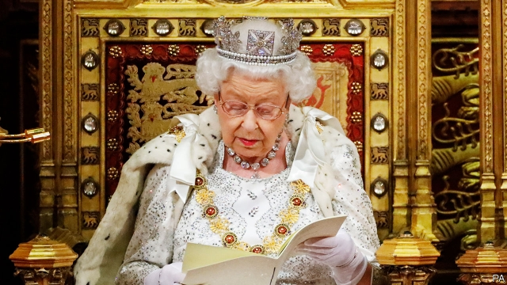

###### Ma’am’s manifesto

# The Tories target health and crime in a political Queen’s Speech 

 

> print-edition iconPrint edition | Britain | Oct 19th 2019 

THE QUEEN glittered. Flunkeys wore regalia that made them look like Christmas crackers. The leader of the House of Lords stood bearing the “cap of maintenance”, which looks a bit like a Santa hat, on a stick. The state opening of Parliament on October 14th, in which the government lays out its policy agenda, was much like any other, but for one exception. With the government 45 seats short of a majority, the chances of its proposals passing into law this parliament are nil. They may, however, soon be adorning election posters. 

Boris Johnson’s speech, read out by the queen, was an election pitch rather than a programme for government. The 26 bills introduced ranged from making it easier for leaseholders to install broadband to preparing for the Birmingham Commonwealth games in 2022. But the main themes of the speech were Brexit, health and crime. By happy coincidence, these are also the top three responses when voters are asked what are the three biggest issues facing Britain, according to Ipsos MORI. In short, a Conservative manifesto was outlined by the Crown. 

Crime hogged the stage, with seven new bills laying out measures including longer sentences for violent criminals. Some were rather smaller than billed: a proposed crackdown on people breaching deportation orders, for instance would result in about ten extra deportations per year, according to the Independent. But with an election expected soon, such details do not matter. Voters are more concerned about crime than at any point since 2011, when England suffered riots in its big cities. 

A focus on law and order, and crowd-pleasing but ineffective policies, jar with the insistence of Mr Johnson and his allies that he is really a liberal. So do the views of Priti Patel, the right-wing home secretary (see Bagehot). This hardline stance may prove temporary. After an election, Ms Patel may even end up being jettisoned, whispers one Tory adviser. 

Law and order is home turf for the Conservatives. But they are now also picking fights on the National Health Service, normally a vulnerable point for the party. Mr Johnson rarely opens his mouth without a paean to the beloved but ailing NHS. The Queen’s Speech contained a plan for a new body to investigate safety problems in the service. The Tories have already promised the NHS another £20bn ($26bn) per year in real terms by 2024. This may pale in comparison to the once-in-a-generation spending spree that Labour launched under Tony Blair. Funding is still far lower than the trend line suggested before austerity began in 2010. But the Tories are hoping that years of straitened spending have lowered expectations when it comes to funding health care. 

The aim is to appeal to the people whom James Johnson, Downing Street’s head of polling under Theresa May, dubs “Conservative considerers”. These voters tend to be working class, female and northern. They voted Leave, but care more about public services than Brexit. The Conservatives courted them in the 2017 election, to no avail. In that year’s manifesto, aside from Brexit the Conservatives offered only a thin gruel of punishing reforms of things like social care and little in the way of extra spending. Now, the party paints policies in primary colours. 

Still, the first words out of the queen’s mouth this week concerned Brexit. She reiterated the government’s pledge to leave by October 31st. Yet the Conservative Party itself does not seem sure it will manage it. Tory leaflets warning that the Brexit Party “could yet block” Brexit have already been circulated to election agents. 

As for that election, one senior backbencher suggests voters could be left waiting until the spring. When it has at last been and gone, the queen will find herself back in Parliament, perhaps this time reading out a policy agenda that has a chance of making it into law. ■ 

For coverage of the EU summit on October 17th and 18th, and the parliamentary sitting the next day, go to economist.com/britain 

