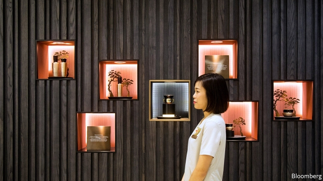
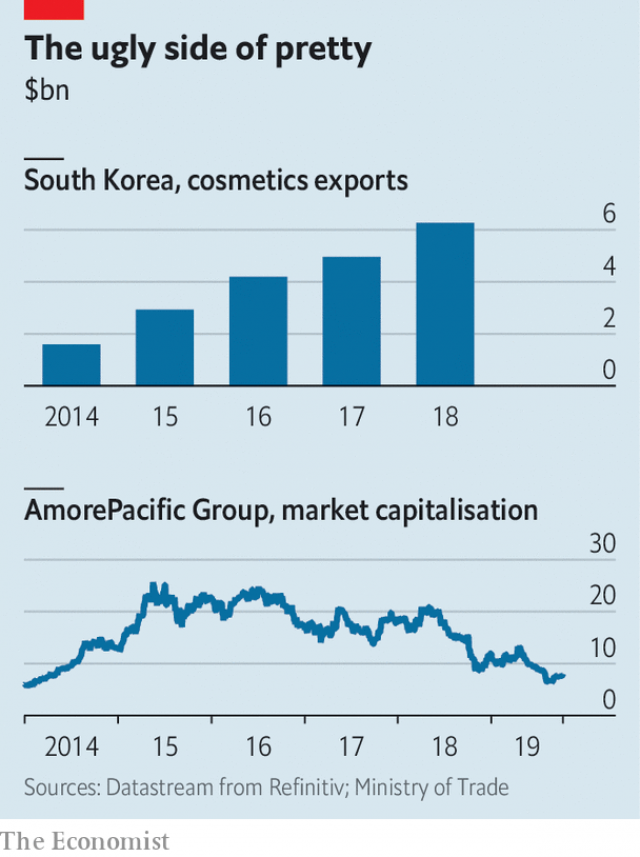

###### Looking wan

# AmorePacific, South Korea’s biggest beauty firm, is struggling 

 

> print-edition iconPrint edition | Business | Oct 19th 2019 

IN A QUIET street in a glitzy part of Seoul’s Gangnam district sits a sleek building covered in a shimmering grid of gold-effect metal. Inside the flagship store for Sulwhasoo, a luxury skincare line, looks less like a shop and more like a museum. Tiny $150 jars of face cream are backlit for effect; metal plaques next to miniature bowls of green tea and ginseng extol the wondrous properties of the ingredients. Upstairs, customers can book an eye-wateringly expensive facial or sip coffee on the roof terrace. A few streets away Dr. Jart, a brand aimed at younger women, woos them with talk of high-tech lotions. Monthly redecorations in line with themes like “sleep” or “staying cool in the heat”, and face masks in bright-coloured milkshake cups, with straws for home-mixing and lids depicting baby faces, are the main draw. 

Welcome to the world of cosmetics as entertainment, which has attracted women (and a few men) around the globe to Korean beauty trends. “The element of fun distinguishes K-beauty from more traditional European brands,” says Son Sung-min of the Korea Cosmetic Industry Institute, a government-sponsored body that aims to improve the industry’s global competitiveness. People started noticing that Korean celebrities appear to have good skin (never mind that most have also had plastic surgery). Aided by influencers on YouTube and Instagram, where young women in Europe and America look for trends, K-beauty’s ten-step cleansing programmes, snail-slime facials and panda face masks are following in the footsteps of K-pop and Korean barbecue as a global phenomenon. South Korean cosmetics exports quadrupled from $1.6bn to $6.3bn between 2014 and 2018. 

You would, then, expect the country’s biggest cosmetics firm to be thriving. Yet AmorePacific Group (which owns Sulwhasoo and other brands) has struggled. Its sales, two-thirds of which are generated at home, with most of the rest from China, have not recovered since a Chinese boycott following the installation of an American missile-defence system in South Korea two years ago. Profitability has plunged, giving investors a black eye that even a panda mask cannot conceal (see chart). 

 

Although the missile spat did not help AmorePacific, its other problems are self-inflicted. Most important, it was late to a shift in the market. South Korea’s cosmetics business, once dominated by own-brand shops and department stores, is increasingly about online sales and shops selling multiple brands. This benefits smaller, nimbler companies. Unlike LG, a sprawling conglomerate best known for electronics that is its main domestic competitor, AmorePacific may have relied too heavily on its mass-market products at the expense of the luxury segment, where margins are plusher. 

Timothy Park, AmorePacific’s chief strategist, thinks it can catch up. Rather than K-beauty, a term he dislikes partly owing to its pop associations, “the focus now is more on organic ingredients and A-beauty,” he says, where the A stands for Asian. Accordingly, the Sulwhasoo website is liberally slathered with mentions of “Asian wisdom” and “natural harmony”. The company has poured vast amounts of money into luxury-segment marketing in Asia, in the hope of improving competitiveness at home and in China. It is also hoping to expand farther afield; it recently opened Sulwhasoo outlets in Galeries Lafayette, a famed Parisian department store, and plans to establish a presence in 20 new countries over the next five years. 

The dominance of local conglomerates will be hard to break in Europe and America, says Kim Ju-Duck of Sungshin Women’s University. Consumers there are familiar with K-beauty trends but not yet its brands. In the short run success will hinge on Mr Park’s ability to convince Chinese consumers to pick his brands over those of LG or Japanese and European competitors like Shiseido or Estée Lauder, which have long dominated luxury cosmetics. Home-grown Chinese firms look set to hang on to the lower end of the market. 

At home, meanwhile, a new challenger is emerging not in the form of upstart producers but the year-old “corset-free movement”. These women spurn make-up, long hair and tight clothes, and post pictures of crushed cosmetics and shorn locks on social media. AmorePacific will be hoping that this salvo against the prevailing ideal of Korean beauty will inflict less damage than the missile dispute. ■ 

