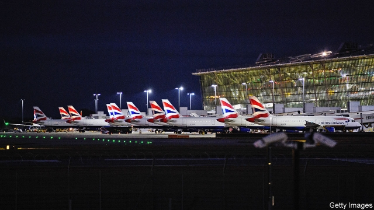
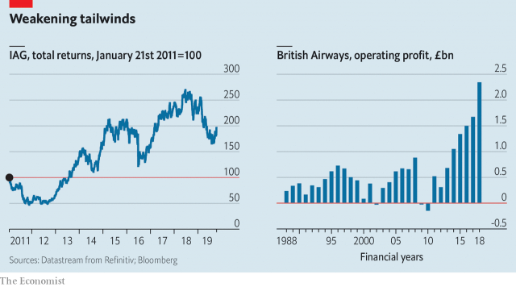

###### The world’s 19th-favourite airline

# British Airways’ profits may not fly high much longer 

 

> print-edition iconPrint edition | Business | Oct 19th 2019 

BRITISH AIRWAYS (BA) hoped that 2019 would be a year of celebration. The airline that carries its kingdom’s flag traces its roots back 100 years to a flight between London and Paris which transported one paying passenger and freight that included clotted cream and several brace of grouse. But another date in its corporate history chimes more loudly. In 1924 the British government, reckoning that air connections might help hold together the empire, created Imperial Airways, another forerunner of BA. Before any of its planes took off, its pilots went on strike. 

A two-day walkout by BA’s airmen in September 2019 put another dent in a reputation already under strain. As in the 1920s, pay and conditions were a gripe. But the pilots voiced a wider concern. As Brian Strutton of BALPA, their union, puts it, they are frustrated with the “dumbing down” of BA’s service after years of cost-cutting. True, profits are piling up. But doubts are growing over BA’s ability to sustain its financial success and dominant position in Britain. 

BA once justifiably advertised itself as the “world’s favourite” airline. Until the mid-2000s it was known for its innovative edge, says Peter Knapp of Landor, a brand consultancy. Its Concorde pioneered supersonic travel and its introduction in 2000 of the first business-class seats that turned into flat beds revolutionised premium flying. A merger with Spain’s Iberia in 2011 created International Consolidated Airlines Group (IAG), which has taken Ireland’s Aer Lingus, as well as Vueling and Level, a pair of low-cost carriers, under its wing. IAG’s boss, Willie Walsh, previously ran BA. IAG brought economies of scale and consolidation of back-office functions. Its constituent parts prospered—none more so than BA. IAG declined to make an executive available for an interview. 

A system where each airline competes for capital from the parent company has kept all of them on their toes. The group offers Vueling for low-cost short haul and Level for the equivalent in long haul. In Aer Lingus, it has a thrifty full-service airline. BA and Iberia lead the way with South American services from Europe. And IAG has more lucrative seats available between Europe and North America than any rival. 

Financially, IAG comfortably outperforms Lufthansa and Air France-KLM, Europe’s other big legacy airlines. BA is the main reason. Its return on capital has risen and it makes most of IAG’s operating profits. In 2018 it accounted for €2.7bn ($3.1bn) out of a total of €3.7bn. Its margins exceeded those of easyJet and Ryanair, the carriers that once seemed to threaten the existence of Europe’s big legacy carriers. 

In other ways, though, BA has declined dramatically. IT meltdowns caused severe disruption worldwide in 2017 and at three London airports in August. A data breach in 2018 affected 400,000 customers and led to a fine of £183m ($229m). Computing problems were compounded by deliberate downgrading of services. Ending free food on short-haul routes, ancient video screens, evasive call centres, cramming in more seats, charging for bags and seat allocation on shorter routes and other money-saving measures looked like penny-pinching and have hurt its upmarket image. These budget-level—or worse—service standards take place on old aircraft. The average age of BA’s fleet is 14 years, compared with eight years for both Ryanair and easyJet, according to Airfleets.net, a website. 

Two years ago BA plummeted to 40th place in an annual ranking of passenger satisfaction by Skytrax, a consultancy. It has since climbed to 19th—far below the lofty heights of 2006, when it came top. Another recent survey of airline reputation by Alva, a research firm, placed BA in 55th position out of 65 airlines. 

Other airlines, like America’s Delta and Southwestern, have suffered IT problems without as big a backlash. Most legacy airlines have had to compete with low-cost rivals. But perhaps because its planes are emblazoned with a Union Jack, BA, which was privatised in 1987, is subject to intense public scrutiny. The country’s prying press and disgruntled passengers see its shortcomings as an affront to Britishness itself. 

Ten years ago it was investors who felt short-changed. BA was loss-making and struggling in the wake of the financial crisis. Low-cost carriers like Ryanair and easyJet hurt its business on short-haul routes in Europe, which feed its lucrative long-haul flights from London. On longer routes BA was challenged by Gulf carriers and Asian ones such as Singapore Airlines. Their business- and first-class cabins set new standards BA could not afford to match. 

Faced with a choice of chasing the premium carriers or competing in no-frills flying, BA tried to do both—satisfying neither group of customers. The airline now acknowledges that it needs to up its game to regain some of its former lustre. Its current boss, Alex Cruz, who earned his low-cost spurs at Vueling, would doubtless claim that the bulk of the cost-cutting is done and BA can now invest in improving its service. Spending £6.5bn on new planes to update an ageing fleet may help. Upgraded business-class cabins, which now trail even European rivals, let alone the Gulf and Asian carriers, are in the works. 

 

The main reason BA has so far managed to keep investors happy despite irritating passengers is its chokehold on London’s Heathrow airport. (Lord Deighton, the chairman of The Economist’s parent company, is also chairman of the holding company that owns Heathrow.) It may no longer be the world’s favourite airline but it is still the world’s “most favourably situated”, says Andrew Charlton of Aviation Advocacy, a consultancy. London is the world’s biggest and most lucrative aviation market. Dominating the city’s hub has ensured that BA made it through tough periods and allowed it to cash in when times were better. 

Heathrow is ideally positioned to serve the money-spinning North Atlantic routes. According to OAG, an airline-intelligence firm, BA flights between Heathrow and JFK in New York alone generated nearly £1bn in revenues last year. The other 200-odd destinations served by the airline raked in £12bn between them. Some 30% of those Heathrow-JFK seats were in business- or first-class cabins, where margins are as plush as an Emirates fold-out bed. 

With American Airlines, its joint-venture partner, BA controls almost half the total seat capacity between London and New York, according to CAPA, another consultancy. No surprise that fares are consistently high. Four in five flights across the North Atlantic are controlled by three main airline groups which have long proved reluctant to engage in any serious price competition. And BA has scrapped to keep other rivals out. A “dirty tricks” campaign in the 1990s aimed at the loudest critic of its position at Heathrow, Virgin Atlantic, ended with its then boss, Sir Richard Branson, winning a libel action against BA. 

When airlines were state-owned companies it served the national interest to maintain connections with the world through a flag-carrying monopolist. At privatisation BA’s control of valuable slots at Heathrow was a big selling-point. Around two-fifths were carried over to the privatised firm, which has added more through the reallocation of existing unused slots, purchases in the secondary market and, under IAG’s wing, the acquisition in 2012 of BMI, a smaller British carrier. BA now has over half the landing and take-off slots at Heathrow (rising to 55% for IAG as a whole). The next largest airline, Lufthansa, has 8%. 

Now that BA is privately owned and part of a multinational business, its falling standards and dominant position at Heathrow are harder to stomach. A lack of competition is hurting passengers. Around 18.5m of them, a quarter of Heathrow’s total, fly on a route served only by IAG. In a report commissioned by Virgin, the rival most vocal in its calls to break BA’s hold on Heathrow, consultants at WPI Economics estimate that this costs travellers up to £170m a year. It may be much higher. 

Britain’s government is reviewing slot allocation in readiness for a third runway at Heathrow, which would increase capacity by over 50% once ready in 2026. Slots currently change hands for between $25m and $75m. Slot ownership at any airport is legally murky. But the right to use them is well established, governed in Europe by EU regulations which are themselves based on guidelines drawn up by the International Air Transport Association, a trade body. Airlines retain a “grandfathered right” to a current slot for the next year as long as they used it for 80% of the previous year. So entrenched is this right that Virgin raised £220m in 2015 from a slot-backed bond (legal complexities were one reason BA pulled out of a similar transaction in 2012). 

Any attempt to reshuffle current slots by the government, which could probably assert legal ownership, would be challenged in the courts. Expansion has ignited a row over divvying up new slots. Today’s rules say that half should go to new entrants and the rest distributed in proportion to current allocation. That would give IAG around 100 new ones. But these rules were drawn up to redistribute incremental increases in capacity, not a windfall. 

Post-Brexit Britain would not be bound by EU rules. Britain’s government wants to improve competition and boost connections to international and domestic destinations, which means ensuring airlines have enough faith in long-term prospects to invest the large sums required to open new routes. Virgin spies an opportunity to become a second hub carrier at Heathrow, with enough short-haul routes to create a long-haul network that would not make sense without transfer passengers. WPI reckons that a new hub airline would need at least a third of the new capacity. Virgin recently laid out plans to serve up to 84 new destinations in Britain and abroad, compared with the 19 long-haul ones it will serve from Heathrow in 2020, if it gets what it wants. The government is set to publish its allocation scheme next year. 

Mr Charlton sums up BA’s attitude to the third runway: “the only new infrastructure BA wants to see at Heathrow is a moat”. Though IAG nominally supports the expansion, Mr Walsh often moans about the £14bn project, which he does not trust Heathrow to bring about on time or on budget. IAG says Britain needs a “competitive hub airport that enhances the country’s global trading links” but adds that it has “absolutely no confidence in [Heathrow’s] ability to deliver cost-effective expansion”. John Holland-Kaye, Heathrow’s boss, has called efforts to talk down a new runway as “a blatant attempt by Mr Walsh to maintain a dominant monopoly for BA at Heathrow”. 

Keeping that fortress is critical for BA. IAG’s years of rapid rise may be over. On September 26th it warned that operating profits would be €215m, or nearly 8%, lower in 2019, largely owing to the BA strike. Underspending, which has propped up margins but contributed to multiple snafus, looks increasingly unsustainable. Transatlantic competition is stiffening at last. BA’s exposure to booming Asia is weak—it barely scrapes into the top ten European airlines flying to China. IAG’s share price is down by 30% since a peak in mid-2018. Without its privileged position at Heathrow, BA could risk joining Imperial Airways as a dimly remembered part of aviation history rather than its future.■ 

