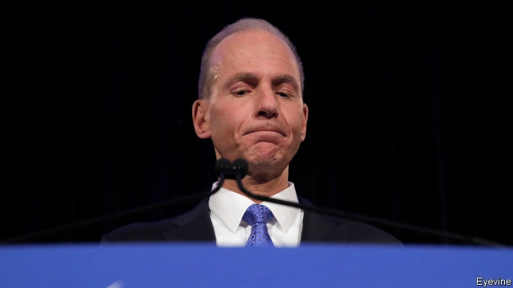
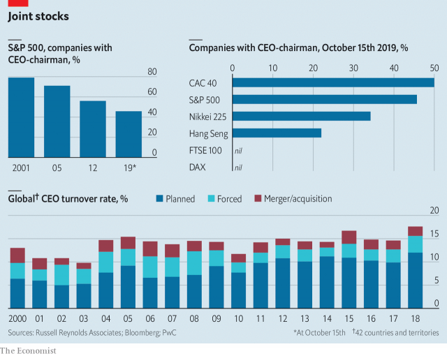

###### Power decouples

# CEO-chairmen are an endangered species 

 

> print-edition iconPrint edition | Business | Oct 19th 2019 

ON OCTOBER 11TH Boeing, still navigating the fallout from two fatal crashes of its aircraft, announced it was stripping its embattled chief executive, Dennis Muilenburg, of his role as the aerospace giant’s chairman. The same day the board of Renault voted to remove its CEO, Thierry Bolloré, as part of its own governance overhaul in the wake of financial-misconduct charges against his longtime predecessor, Carlos Ghosn, who was CEO-chairman of both Renault and Nissan, the French carmaker’s Japanese partner (Mr Ghosn denies wrongdoing). Last year Elon Musk shed his chairmanship but remained at the executive wheel of Tesla amid an investigation of his tweets by America’s Securities and Exchange Commission. 

It is not just scandal-prone firms that are choosing to split the two roles. Since 2001 the share of S&P 500 firms with one person tasked with both managing and governing has nearly halved (see chart). Britain’s corporate-governance code frowns on the practice. Germany’s bars it altogether. New regulations in America have made shareholders pay more attention to it. Likewise in Japan Inc. 

“CEO duality” allows for quicker execution of the board’s strategic decisions and helps leadership maintain a unified front. But it also dulls a firm’s checks and balances. Resulting conflicts of interest may inflate executive salaries or discourage whistleblowing. Studies examining the link between company performance and CEO-chairmanships have been collectively inconclusive. 

 

Challenger, Gray & Christmas, a job placement firm, says that 2019 is on track for a record-high turnover in the corner office. Since September heads have rolled at WeWork, eBay and SAP. If trends hold, newly minted bosses should not expect to oversee themselves.■ 

