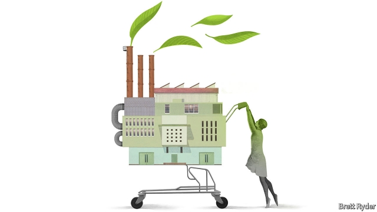

###### Schumpeter

# Can business tread more lightly on the planet? 

 

> print-edition iconPrint edition | Business | Oct 19th 2019 

ALMOST 50 YEARS before Extinction Rebellion, a British-born protest movement, exported its brand of climate activism to the world, young Americans did so on Earth Day, April 22nd 1970. The youth then was more bell-bottomed than nowadays but felt no less “bamboozled and cheated” (as The Economist put it at the time) that their elders were bequeathing them a wrecked planet. 

Their main concern was different from today’s: unbridled economic growth and consumerism would, they warned, swiftly exhaust the world’s resources. Their Malthusian concerns proved misguided. Raw materials have never come close to running out. Now the focus has turned from scarcity to excess—specifically, of carbon dioxide in the air. In the past 50 years the burning of fossil fuels has more than doubled its concentration, accelerating global warming with its potentially calamitous consequences. Andrew McAfee of the MIT Sloan School of Management thinks that these fears, too, are overblown. Humankind, he posits in a new book, “More From Less”, is reaching “peak stuff”—though people consume more, businesses use fewer resources to make it. With an anti-capitalist crusade focused on a surfeit of stuff once again gathering steam among eco-socialists, it is a timely assertion. Sadly, it is an oversimplification. 

Mr McAfee builds on “The Second Machine Age”, the bible of techno-optimism he co-authored with Erik Brynjolfsson in 2014. This time he mines data on America’s resource use since the first Earth Day to argue that the world is moving beyond the “industrial era” of resource-heavy goods. The latest computer age is making things so much lighter and less material-intensive that it promises to decouple economic growth from environmental degradation. 

A look at the physical building blocks of the American economy—metals, minerals, wood, paper, fertiliser, water and energy—indeed suggests that in many cases their absolute usage has peaked in recent decades, even as GDP has soared. Everything from farms (the average American cow produces more than four times as much milk as in 1950) to iPhones (each one contains a calculator, camera, tape recorder, map and other gizmos) have, as Mr McAfee puts it, gradually “dematerialised”. Some rich European countries are on a similar path. India and China may follow. 

This is down to two pairs of factors. First, technology and capitalism, blamed for many of the ravages of industrialisation, are now reinforcing each other in favour of dematerialisation. Hardware, software and networks enable goods to be slimmed down, optimised, even eradicated, as Google Maps has rendered useless the likes of London’s A-Z. Competition in free (albeit regulated) markets encourages companies to lower costs by using fewer materials or substituting expensive ones for cheaper alternatives. 

A second pair of factors, Mr McAfee contends, has accelerated the trend of late. Public awareness and responsive governments are helping rectify the shortcomings of free markets, such as the failure to price in the cost of pollution. Global environmental governance is getting better—a bold claim, the author concedes, but not completely outlandish even in America, where many cities and states are setting carbon-reduction goals at odds with the climate-sceptic-in-chief in the Oval Office. 

Mr McAfee’s focus on corporate use of resources is refreshing. Too often, businesses are caricatured as rapacious predators of Earth’s bounty. In fact, since the dawn of capitalism, they have produced products that become lighter on the ground and on the wallet because profit-hungry bosses see advantage in thrift. No company has thrived in the long term by using resources less sparingly. Likewise, cutting emissions involves using less power per unit of output and more renewable power. The first helps the bottom line. As solar and wind energy get cheaper, so does the second. 

Producing less overall is a different matter, however. Sceptics about the extent of dematerialisation, Mr McAfee’s central contention, go back to William Jevons, a British economist who argued in “The Coal Question”, an essay from 1865, that more efficient use of the fossil fuel inevitably leads to higher total consumption. “Jevons was wrong,” Mr McAfee claims confidently, citing the recent decline in coal use in America even as it has become cheaper. 

Not so fast. Some of the West’s purported dematerialisation may be down to more of the goods it buys being manufactured abroad, not at home. Mr McAfee thinks that this is negligible. It probably isn’t (see article). And though the coal question may have been extinguished, at least in America, its modern-day version—call it the carbon question—remains burning. 

In a book published nearly 150 years after Jevons’s treatise, Vaclav Smil, a Czech-Canadian scientist (and a favourite of Bill Gates), argued that as goods become lighter and cheaper the market for them explodes and, as Jevons predicted, increases demand for resources. The weight of the average mobile phone in 2011 was one-sixth what it had been in 1990. But the number of phones ballooned from 11m to 6bn. So the total mass of phones globally went from 7,000 tonnes to about 700,000 tonnes. Less, Mr Smil writes memorably, is “an enabling agent of more”. 

For businesses, the “Jevons paradox” is not merely academic. Fearing a backlash from eco-conscious consumers, firms are striving to lower their carbon intensity. So long as this brings down costs, CEOs happily oblige and society reaps the benefits of higher efficiency and better resource allocation. But if that leads to higher sales, companies’ overall environmental impact may rise. 

They should not be shamed—or required to urge customers to buy less of their wares, as some activists who glued themselves to corporate headquarters in London seem to demand. Governments can make citizens want less by making consumption pricier, with carbon taxes or other regulations. Until they do, firms will try to sell more stuff—because most people want more of it. ■ 

