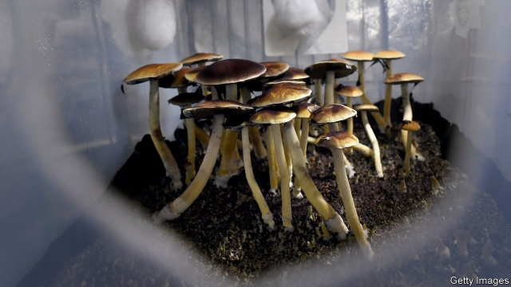

###### Schroom to grow

# Investors hope psychedelics are the new cannabis. Are they high? 

 

> print-edition iconPrint edition | Business | Oct 19th 2019 

CHRISTIAN ANGERMAYER has never drunk alcohol nor smoked a cigarette. He is, however, a fan of ketamine. In January ATAI Life Sciences, the German biotech company he founded last year, acquired a majority stake in Perception Neuroscience, a biopharmaceutical firm from New York which is developing a medication for pyschiatric conditions like depression from the drug, which is illegal in parts of the world (though not in America). Along with Peter Thiel, a veteran Silicon Valley investor known for headline-grabbing bets, ATAI has also backed COMPASS Pathways, a startup in London aiming to be the first legal provider of psilocybin, which gives mushrooms their magic. 

Messrs Angermayer and Thiel are not alone in putting money into the medical application of psychedelics. A clutch of investors see these drugs going the way of cannabis, whose creeping decriminalisation has spurred commercial interest in the weed’s medical uses. In particular, backers think, psychedelic drugs could be used to treat mental-health disorders like depression, anxiety and addiction. In April Imperial College London, inaugurated the first research centre dedicated to psychedelics research. Last month Johns Hopkins University in Baltimore launched America’s first such scientific outfit. 

The market for antidepressants is dispiritingly large. Over 300m people worldwide suffer from depression. A report last year by the Lancet Commission, a body of experts, estimated that mental-health disorders could cost the global economy $16trn by 2030. Sales of antidepressants were $14bn in 2017 and analysts expect them to grow to $16bn-19bn by the middle of the next decade. 

In October last year America’s Food and Drug Administration granted COMPASS “breakthrough therapy” designation, which fast-tracks the approval process. The company is using the $38m it has raised to run the largest clinical study of psilocybin ever. Ekaterina Malievskaia, its co-founder, hopes that the therapy could go on sale within five years “if everything works out”, including the science. Patients would receive carefully controlled doses in one-off, therapist-run sessions. These may last all day and cost $1,000 a pop. Field Trip Ventures, a Canadian startup, plans to open speciality clinics where they could be administered (and clinical trials conducted). 

Sceptics doubt COMPASS can get its drug to market by 2024—if at all. Worries about psychedelics’ side-effects, which can include drug-induced psychosis, abound. And it is unclear their medical use can ever be more than a niche. Finicky treatments make psychedelics trickier to scale than cannabis, which can be self-administered in spliffs, cakes and other forms. Field Trip Ventures’ co-founder, Ronan Levy, concedes as much. Big Pharma has steered clear, preferring pills which can be manufactured cheaply once approved and need to be taken regularly rather than just once, providing steady revenue streams. That left an opening for startups like COMPASS. Time will tell if ushering people through the doors of perception is a hard-headed business propostion—or a trippy one. ■ 

