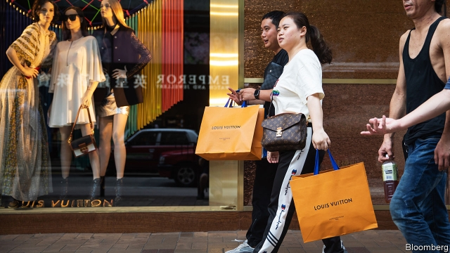

###### A tale of two handbags

# LVMH, Kering and other French luxury groups are thriving 

 

> print-edition iconPrint edition | Business | Oct 19th 2019 

PURVEYORS OF BLING ought to be in a bit of a funk these days. Chinese economic prospects are mixed and American retail sales fell unexpectedly in September for the first time in months. Hong Kong, the spiritual home of luxury in Asia, is rocked by a hailstorm of rubber bullets. Economic crystal-ball gazers are slashing their forecasts: on October 15th the IMF warned global GDP growth would fall to its lowest level since the financial crisis (see article). Who would shell out on a new gold-studded designer handbag now? 

Some shoppers seem to have missed the gloomy headlines. On October 9th LVMH, the world’s biggest luxury group, unveiled stellar results. Sales at its Dior, Louis Vuitton and myriad other brands went up by 11% year on year (excluding acquisitions). That is nearly double the 6% trend rate of growth in personal luxury goods, which includes everything from watches to ties and posh heels. Its high-end rivals, Kering, which owns Gucci, and Hermès, are expected to follow suit. Their share prices all rose by give or take a third in the past year. 

Other brands have not been so lucky. A day after LVMH’s shiny earnings Hugo Boss, a German fashion house, issued a second profit warning in as many months. In America Tiffany & Co. and Tapestry, which owns Coach and Kate Spade, have struggled. So too have medium-sized Italian firms like Prada and Tod’s. The shares of those smaller companies are now priced like last season’s accessory, gathering dust in an out-of-town “factory store”. 

Luxury has always been a cyclical industry: even those with plenty of cash to spare tend to spend more of it when times are good. Overall growth rates have slowed since 2018, when sales rose by over 10%. But the impact has not been felt evenly. “What you see is the luxury pie expanding at a slower pace—and the biggest players are grabbing a bigger slice,” says Rogerio Fujimori of RBC, a bank. 

Take Hong Kong. Sales in the Chinese territory have slumped by 50% in recent months, analysts reckon, largely as visitors from mainland China have stopped shopping there. With continued anti-government unrest in the streets, few think the situation will improve soon. The city represents 5-10% of sales for luxury groups. Smaller rivals with only a foothold in Hong Kong, which has traditionally served as a gateway to Asia, will have lost most sales as a result. In contrast, bigger ones like Gucci have built vast networks of stores on the mainland, through which they will recoup some of those losses. 

The main question for the industry is whether Chinese consumers will keep spending lavishly. A crackdown on corruption was expected to decimate sales a few years ago, but hardly registered. Chinese buyers account for 33% of all luxury sales, double the share in 2010, according to Bain, a consultancy. About two-thirds of the industry’s growth comes from China. 

The prospect of a trade war has so far not clobbered Chinese consumer confidence, which has only recently come off all-time highs. And a decline in sales would again be felt first by second-tier players. Especially among emerging middle-class buyers in places like China, consumers purchase one product a year, says Luca Solca of Bernstein, a research firm. On a tight budget, they will go for “the brand of the moment”, poaching sales from lowlier rivals. 

The likes of LVMH and Kering have continued pumping marketing dollars to keep their brand equity healthily inflated. They have also outspent smaller rivals on their ability to sell their wares online, a channel which represents about 10% of sales now but is growing quickly. In America the fate of lesser luxury brands is tied to that of department stores, which are dying off. Bigger brands have their own shops. 

One headwind that would hit luxury firms of all sizes is a rise in protectionism. The retaliatory tariffs America recently imposed on Europe to compensate for illegal aerospace subsidies included some spirits, which LVMH also sells (champagne was mercifully excluded). However, the conglomerate has crafted an elegant solution to mitigate future import levies. This week its boss, Bernard Arnault, opened Louis Vuitton’s latest workshop—in Texas. ■ 

