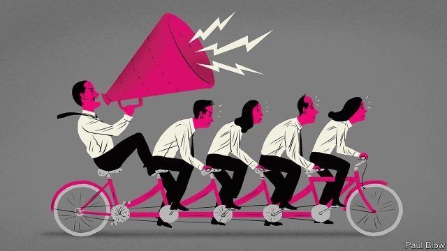

###### Bartleby

# The usefulness of managers 

 

> print-edition iconPrint edition | Business | Oct 17th 2019 

IS YOUR MANAGER really necessary? It is not always clear to workers how much their supervisors are contributing to the success of an organisation. It may not even be clear to the managers themselves. After a long day filled with meetings, many bosses must wonder what they have actually achieved. 

Finding a way to measure the direct contribution of managers can be difficult. But Stephan Billinger and Stephen Rosenbaum, two academics from the University of Southern Denmark, have made a brave attempt. Their study* used a variation of a common laboratory experiment, known as a public-goods game, to test the impact of managers on worker collaboration. 

In the public-goods game, participants are awarded a number of tokens which generate a level of earnings in each round. They can choose whether or not to reinvest their earnings at each stage. All reinvested earnings are doubled and the gains divided among the members, whether or not they contributed. The game is a test of the willingness of participants to collaborate, in a situation where some people can gain by free-riding. 

The academics varied the game by dividing the group into “managers” and “workers”. The managers did not do any managing. But they were bound by different rules. In some games, they were permitted to contribute in each round, in others they were forbidden from doing so. In certain versions of the game, the managers were paid a fixed proportion of the returns; in others they had discretion over how much of the return they received. The academics compared the results with a game in which there was no hierarchy. 

There is good news and bad news for those who believe that managers matter. On the plus side, contributions were higher when team members were divided into managers and workers than when they were not. The mere presence of managers, it seems, even notional ones, encouraged workers to collaborate. 

However, managerial incentives can make workers suspicious. The end results were much better when the managers were allowed to contribute than when they were not. Understandably, workers who feel that they are doing all the work are reluctant to chip in. 

Just as predictably, managers react to incentives. They do so in sneaky ways. Where they had discretion over the returns they received, they either made payments or skewed the rewards to workers in the early rounds, when the sums were small, thereby encouraging underlings to stump up. They then awarded themselves a higher proportion of the bigger pot in the later rounds, when it was too late for the workers to react. The managers, in other words, worked out how to game the system and to short-change the workers in the process. 

Of course, the paper describes a laboratory experiment in which the gains were trifling; participants received just over $15 on average. But it lends even more weight to the idea that managerial incentives can have distorting effects on business performance. That is certainly the view of Andrew Smithers, a British economist and author of a new book, “Productivity and the Bonus Culture”. He believes that the way that managers are incentivised has led to sluggish growth in business investment, which in turn explains the poor recent productivity record of America and Britain. 

The problem, he argues, is that managers are incentivised with share options. That encourages them to pay spare cash to investors in the form of dividends and buy-backs, which tends to boost the share price in the short term. In contrast, new investment tends to lower earnings per share immediately afterwards—and with them the share price. 

The proportion of cash paid out to shareholders by non-financial American companies was 40.7% from 2000 to 2017, when share options became popular. Between 1947 and 1999, when they were not, it was 19.6%. As a corollary, the proportion used for investment fell. 

All organisations need management. But when it is difficult to measure what managers do, it can be tricky to design incentives to reward them. And as the Danish study and Mr Smithers’s work suggest, managers will game whatever incentive scheme they are offered. Managers are necessary. It is also necessary to watch them closely. 

“Discretionary mechanisms and co-operation in hierarchies: An experimental study”, Journal of Economic Psychology 74 

