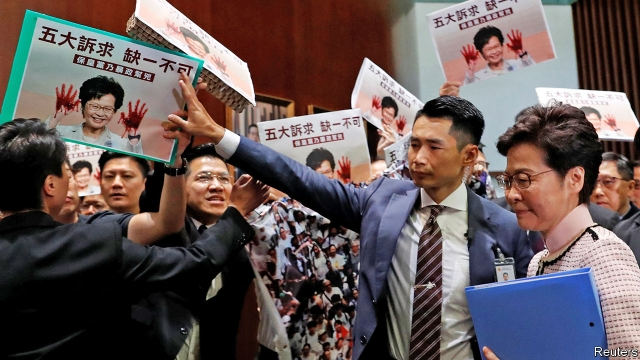

###### Anger in the chamber

# In Hong Kong’s legislature, pro-democracy members heckle Carrie Lam 

 

> print-edition iconPrint edition | China | Oct 19th 2019 

UNUSUALLY, PROTESTORS stayed away from Hong Kong’s Legislative Council when it reopened on October 16th after a break of more than three months. Inside the chamber, however, pro-democracy legislators were in a feisty mood. They heckled the territory’s leader, Carrie Lam (pictured), when she arrived to give her annual policy address. Some wore masks—recently banned at public protests—and held placards showing Mrs Lam with bloodied hands, demanding that she resign. She withdrew minutes later and released a recorded video of her speech instead. In it she promised more public housing and support for poor families but offered no political solutions to the turmoil that has roiled Hong Kong for more than 18 weeks.■ 

