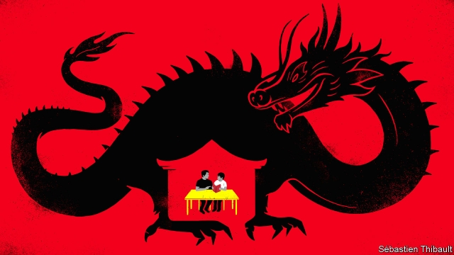

###### Well read v well red

# More Chinese are home schooling their kids 

 

> print-edition iconPrint edition | China | Oct 19th 2019 

A  SIGN ON the door of Yuan Honglin’s ocean-front townhouse in the southern city of Xiamen says “study at home”. To Mr Yuan that means “instead of going to school”. That is what he decided was best for his daughter, Xiaoyi, when she grew bored with kindergarten in 2002. He withdrew her and became her full-time teacher for the rest of her school career. It was a radical choice. In the West home schooling, once regarded as eccentric, has become more popular in recent decades. In China officials are wary. They say schools play a vital role in turning children into “builders of socialism”. But growing numbers of Chinese parents are rebelling. 

It was not easy for Mr Yuan, a think-tanker turned businessman. Official permission is required for home schooling during the nine years of compulsory education, which usually spans the period between the ages of six and 15. It is given only in rare circumstances, such as when a child suffers from a medical condition with which schools cannot cope. As a precaution, Mr Yuan moved home several times to avoid attention. His tactics worked. Last year Xiaoyi graduated from university with a self-taught degree. Mr Yuan still teaches at home, though his dozen full-time students are from other families. 

Home schooling remains highly controversial. In 2017, for the first time, the education ministry openly attacked the practice, calling it “very unfavourable to a child’s lifelong development”. It reminded parents that home schooling without authorisation was banned. In March the ministry threatened parents with unspecified “legal action” if they failed to comply. 

Some parents are undeterred. In 2017 a Beijing-based think-tank estimated that about 56,000 children were being home schooled or were about to be withdrawn for that purpose. It said the number had nearly tripled since 2013. Many home-schooling parents say it is far higher. One such person in Beijing reckons there may be “hundreds of thousands” of families like hers. Some share their experiences on home-schooling chat groups, which have sprung up in recent years on WeChat, a messaging app. Most do not have permission for home schooling. They do not even bother applying, assuming the answer will be no. Despite the government’s warnings, home-schooling has continued to grow in the past two years, albeit more slowly, says Wang Jiajia of Jiangsu University. 

There are several reasons why parents risk it. In Mr Wang’s surveys, by far the commonest is dislike of the “ideology” and “teaching methods” of state schools (Mr Yuan stresses independent thinking and open debate). Another is contempt for “school culture”, such as the adulation of pupils who swot day and night. A few prefer home education for religious reasons. China’s schools promote atheism. 

Most of the parents are urban and well educated. They usually came of age in the relatively liberal years of the mid-to-late 1990s. Some are inspired by home schooling in America, where it was illegal in 30 states until the 1980s and now about 3% of school-age children are educated this way. (Even if there are hundreds of thousands of children in China being home schooled, that would still be less than 1% of the total number aged between six and 15). 

Home schooling in China takes two main forms. The first involves one parent, typically the father, quitting work or working part-time to take up teaching. Su Nan, a 17-year-old in the central province of Shaanxi, dropped out of school when he was ten. His father, a lecturer, became his full-time teacher. But now that Nan (not his real name) is older, his father has returned to his former work. Nan sets his own schedule, a mix of independent study, online courses and volunteer work. Parents who want their children to attend university in China must ensure they learn party ideology—knowledge of it is essential for the entrance exam. But Nan, like many children being home schooled in China, is aiming for a university in the West. 

The second, less usual, form is the “collective home school” such as the one now run by Mr Yuan in Xiamen. The teacher often charges a fee—in Mr Yuan’s case, about 50,000 yuan ($7,070) annually per pupil. 

So why are parents getting away with it? It may be that the government, while trying to discourage the practice, does not yet see it as common enough to pose a serious threat to its political grip. Some officials may even sympathise with home schoolers. Before the education ministry began issuing its warnings in 2017, state media reported on the rise of home schooling with a hint of approval, suggesting it might help to reduce children’s stress. 

It is also possible that officials, for now, are more intent on curbing fake home schooling, involving parents who pretend to be doing it while illegally sending their children to work. Anecdotal evidence points to this. One parent in Shanghai whose pre-teen daughter is home schooled says she received a surprise call a few months ago from the local education department. The parent was asked where her child was enrolled. She told the truth and has not been contacted since. She says several other home-schooling families in Shanghai have had the same experience—suggesting officials are turning a blind eye (the notice on Mr Yuan’s door is a sign he expects them to). Wang Dong, a lawyer in the southern city of Kunming who specialises in education, has yet to hear of any parent being prosecuted for home schooling. 

But amid an ideological chill, some are still nervous. In July the education ministry urged schools to step up efforts to inculcate the virtues of “loving the country” and “following the party”. In August state media recalled the words of China’s leader, Xi Jinping, that schools must ensure “the seeds of core socialist values take root and grow” in children’s hearts. Officials may wonder whether home-schooling parents are complying. Xu Xuejin, the founder of an online club for such people, is playing safe. He recently took down his website to protect the identity of its members. ■ 

