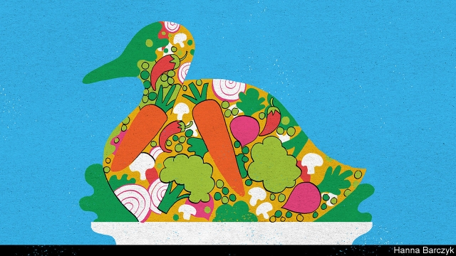

###### Chaguan

# The planet needs China to curb its appetite for meat 

 

> print-edition iconPrint edition | China | Oct 19th 2019 

THE PLANET needs China to curb its appetite for meat. In the first three decades of the “reform and opening” era the number of farmed animals in the country tripled. Raising them polluted water supplies and gobbled up scarce arable land. Around the globe, China’s growing hunger for red meat, specifically, has seen its beef imports grow 40-fold between 2010 and 2018. The boom threatens Latin American forests and Arctic ice caps alike, as cattle-rearing prompts land-clearing and emits greenhouse gases. 

To be fair, China’s 1.4bn people are being asked to show a self-restraint unknown in the gluttonous West. Even now, in a China where children yawn at dishes their grandparents once saw only at weddings and high holidays, meat consumption per person is only half of America’s. But China’s government, too, wants its people to eat less meat. Obesity, type-2 diabetes and high blood pressure are taking a growing toll. To curb such afflictions, guidelines issued in 2016 urge adults to eat just 40-75 grammes of meat a day, or about half the current national average. Market signals are also pushing shoppers to cut back. China’s most popular meat, pork, is nearly 70% costlier than a year ago because herds are being wiped out by African swine fever, a disease harmless to people but lethal to pigs. 

Even before this latest animal epidemic, Chinese living in wealthier cities were having qualms about excessive meat-eating. In 2017 a survey of big-city residents found 36% of respondents intending to eat less pork, red meat and poultry in the year ahead. They cited concerns about their health, the environment and food safety, in that order. But a solution common in other countries—declaring oneself strictly vegetarian or vegan—remains strikingly rare. Less than 2% of the Chinese population is vegetarian, the food industry estimates. The proportion is 10% in neighbouring Taiwan, an island with centuries of shared Chinese culture and history. Its contrast with China in terms of attitudes to vegetarianism reveals much about the mainland’s society, and how it either embraces or resists change. 

In the West, angst about animal welfare or disgust at the idea of meat are big motives for vegetarians. Chinese consumers are less squeamish. Few mention animal suffering in surveys about dietary choices, and fewer still a distaste for meat. This week Chaguan visited Number 8 Market, a bustling foodie’s delight in the coastal city of Xiamen. He found locals admiring butcher’s stalls resembling anatomy classrooms, with body parts from tongues to trotters laid out for inspection. Chen Zhiqiang, a young man giving a chunk of pork a discerning prod, concedes that some children claim to dislike meat. But it is necessary for their health, he declares, “so you have to sneak it into them with soup.” 

Nor are Xiamen’s market-folk greatly impressed by showy self-denial—another staple of Western vegetarianism. China was too poor, too recently, to indulge in that sort of virtue-signalling. A fishmonger nicknamed A Feng remembers her own impoverished, largely meatless childhood. Today, she says, people can pursue a balanced diet, which she defines as meat twice or three times a week, with fish as an “everyday necessity”. She is backed up by Ms Lin, a nearby seller of tofu, a staple of vegetarian Chinese dishes. Beancurd is nutritious stuff, says Ms Lin, but the human body “can’t stand” a fully meatless diet. Some devout Buddhists go without meat on the first and fifteenth days of the lunar month, notes the tofu-seller, then “complain that they have no energy”. 

Alternative lifestyles are a hard sell in China. Those who shun meat are generally shy about standing out, says Zhou Qiyu, a manager at Whole Perfect Foods, a company founded in 1993. It specialises in mock meat, from plant-based sausages to hamburger patties made of peas, soyabeans, mushrooms and other vegetables. Even devoutly religious vegetarians want to be seen as part of society, he suggests, speaking at his company’s stand at a vegetarian trade fair held in Xiamen’s vast exhibition complex between October 10th and 14th. A desire to fit in makes mock meat “super appropriate” for entertaining non-vegetarian friends, he enthuses. 

The Buddhist and Taoist faiths have long been pillars of Chinese vegetarianism. One reason for Taiwan’s large number of vegetarians is that the island has never been ruled by the Communist Party and so was spared the Cultural Revolution, which from 1966-76 uprooted religious and cultural traditions on the mainland. Buddhist monks are meant to avoid any food that involves killing, though they may eat meat received as alms. The rules for lay believers are less strict but have still inspired several schools of Buddhist, meatless cooking, often involving elaborate mock-meat dishes, from fake ducks to fish carved from beancurd. 

The vegetarian fair in Xiamen draws several Buddhist nuns and monks in grey or brown robes. Fa Man, a nun from Jiangsu province, sees a link between China’s new prosperity and a greater interest in health, the environment and even in spiritual matters. All of that should strengthen vegetarianism, she beams. 

Religious faith led David Yin to stop eating meat in his 30s. In 2012 he founded King’s Joy, a vegetarian restaurant in a lovely courtyard beside the Lama Temple in old Beijing. Mr Yin and his son, Gary, the head chef, have ditched the traditional Buddhist prohibition on garlic and chives, flavourings known as “small meats” and shunned as too stimulating. Traditional vegetarian cooking for the devout allows only ginger as a spice, and with such strict rules “you lose too much flavour,” says the elder Mr Yin. He hopes that clients—even if initially drawn by tree-shaded courtyards and famous guests—will see that plant-eating is healthy, tasty and respectful of the environment and animals. But, he admits, “My goal is aligned with reality, which is that 95% of our customers are not vegetarians.” It is a shrewd way to promote social change in today’s China, a place skittish about non-conformity: pragmatic and tactful towards the majority culture, with good food as a reward. ■ 

