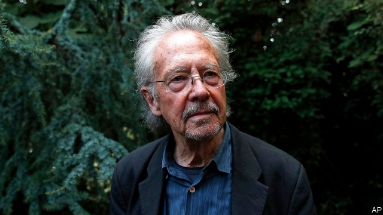

###### Explosive

# A Nobel prize for a writer some call an apologist for genocide 

 

> print-edition iconPrint edition | Europe | Oct 19th 2019 

IT SEEMS HARD to believe that the Swedish Academy, which awards the Nobel prize in literature, did not know that it would be fanning the flames of Europe’s culture wars. On October 10th Olga Tokarczuk, a dreadlocked vegetarian feminist, won the prize for 2018. At the same time the 2019 award was given to Peter Handke (pictured), an Austrian whom many see as an apologist for genocide. 

Last year the academy failed to award its prize because it was engulfed in a sex scandal. This year the two awards caused controversy which had nothing to do with the literary merits of either. One of Mr Handke’s most notorious books is his 1996 “Journey to the Rivers: Justice for Serbia”, which he published as part of his defence of Slobodan Milosevic and the wartime leaders of the Serbs. The award has sent shock waves through the former Yugoslavia and beyond. 

Mr Handke has been a prolific and experimental writer since the 1960s. The Swedish Academy hailed him as “one of the most influential writers in Europe after the second world war”. But few wanted to discuss his literary merits in the wake of the award. Edi Rama, the prime minister of Albania, tweeted a vomit emoji before penning a full-scale denunciation of a man he said provided “an implicit amnesty and apology” for Milosevic’s “genocidal endeavour”. 

In 2006 Mr Handke gave an oration at Milosevic’s funeral. During the wars he had repeated a Serbian propaganda line that Bosnian Muslims had killed their own people to elicit Western support. He also minimised what two international tribunals found to be genocide: the 1995 murder by Bosnian Serbs of some 8,000 Muslim men and boys at Srebrenica. Aleksandar Hemon, a Bosnian-American writer, called him “the Bob Dylan of genocide apologists”. 

The other laureate, Ms Tokarczuk, upsets a different group of people. A staunch opponent of Poland’s nationalist ruling Law and Justice (PiS) party, she has been denounced as a traitor for supporting gay rights and suggesting that Poles should face up to unpleasant parts of their history, including the suppression of minorities and murder of Jews. Still, PiS ministers mostly managed to swallow their distaste. The minister of finance even said he was willing to waive the income tax due on her prize.■ 

