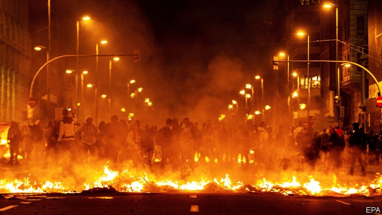

###### Dreams and nightmares

# Catalan nationalists protest as their leaders are jailed for sedition 

 

> print-edition iconPrint edition | Europe | Oct 19th 2019 

“THE WHOLE of one’s life is a dream, and dreams are nothing but dreams.” So says Prince Sigismondo in a play by Pedro Calderón de la Barca, the great dramatist of Spain’s Golden Age in the 17th century, currently being revived in Madrid. That, in effect, provided the question before Spain’s Supreme Court in the long-running trial of a dozen Catalan separatist leaders for their role in the referendum and declaration of independence in October 2017. Was their unilateral implementation of a democratic “right to decide” on independence for Catalonia, one of Spain’s largest and most prosperous regions, a mere pipe dream of political theatre; or was it a conspiracy to break up the country? 

The court concluded that it was somewhere in between. Dismissing the more serious charge of rebellion, it found nine of the leaders guilty of sedition and four guilty of misuse of public funds. It sentenced Oriol Junqueras, who was vice-president of the Catalan regional government at the time, to 13 years in jail. Six other former officials were sentenced to terms of ten to 12 years; the leaders of two separatist mass movements each got nine years. The court found that they had “led the citizenry in a public and tumultuous rising” which prevented the application of law and court decisions. The court also issued a fresh European arrest warrant, for sedition, against Carles Puigdemont, the former Catalan president, who fled to exile in Belgium in 2017. An extradition request against him on the charge of rebellion was rejected by a German court last year. 

Spanish conservatives were disappointed that the court dismissed the charge of rebellion. Others, abroad and in Catalonia, saw the jail terms as disproportionate. The defendants argued that they were merely carrying out a democratic mandate to seek a referendum on independence. Their supporters say they are “political prisoners” who faced a “political trial”. In a joint statement, Quim Torra, the current president of the Generalitat (the regional government) and Roger Torrent, the speaker of the Catalan parliament, described it as “an insult to democracy and a show of contempt for Catalan society”. 

The sentence triggered days of protests in which masked demonstrators first blockaded Barcelona airport and then set dozens of fires and barricades in the centre of the city. Among more than 150 people injured were 72 police, most of them from the Catalan force. Contradictorily, Mr Torra at first encouraged the protests while the Generalitat’s police was repressing them. The protests mark both a radicalisation and fragmentation of the independence movement. Pere Aragonès, Mr Torra’s deputy, warned against violence. 

Spanish officials stress that the defendants were on trial for their actions, not their ideas. The cause of independence has never enjoyed clear majority support in Catalonia. Josep Borrell, the foreign minister, who is Catalan, accused Mr Torra of a “totalitarian attitude” in denying the Catalan-ness of those who disagree with independence. “The root of the problem is that Catalan society is divided in two and one of those parts excludes the other,” said Mr Borrell, who is about to become the EU’s new foreign-policy chief. 

In 2017 the separatists used their narrow majority in the Catalan parliament to ram through laws tearing up the constitution and the region’s statute of home rule. They deployed the resources of the Generalitat to organise their “binding referendum” on independence, which they then used to declare an independent republic. They did all this despite repeated warnings of the illegality of their actions. 

In their unanimous verdict, the seven judges of the Supreme Court addressed not just the defendants’ actions but also the political basis on which they rested. Far from being unique, Spain’s constitutional protection of the nation’s territorial unity is the European norm, they noted. “No European constitution exists that recognises ‘the right to decide’.” Especially given the chaos triggered by the Brexit referendum, no European national government looks kindly on the separatists’ demands. 

Mr Junqueras claimed that the heavy sentences will galvanise the independence movement, which has recently been losing steam, albeit slowly. A survey in July by the Catalan government’s own pollster, the CEO, put support for independence at 44% (and only 35% when other options, such as greater devolution, are offered). A radical fringe is flirting with violence: last month the Civil Guard arrested nine people in Catalonia found with bomb-making equipment. But the CEO poll found that only 9% now support the unilateral approach pursued by the defendants in 2017. 

The threat of Catalan separation has revived long-dormant Spanish nationalism and prompted the emergence of Vox, a far-right party. If the protests are sustained, they may cast a shadow over Spain’s general election on November 10th, the fourth in four years. Pedro Sánchez, the Socialist leader, became prime minister in June 2018 following a censure motion against the then prime minister, Mariano Rajoy, backed by the Catalan nationalists. If, as seems likely, the Socialists are again the largest party, Mr Sánchez will seek—and probably gain—the acquiescence of the right to avoid relying on separatist support. 

In Calderón’s play Prince Sigismondo is freed from the prison to which his father has condemned him. No such happy ending seems in store for Mr Junqueras and the others. However, the court rejected a prosecution request that they be denied normal prison benefits. That means most could enjoy day release from prison within months. Even when the dust from the trial settles, the problem of Catalan separatism will remain. Mr Sánchez this week called for “a new era” to achieve “coexistence within Catalonia” through dialogue and the constitution. That may take a while. ■ 

