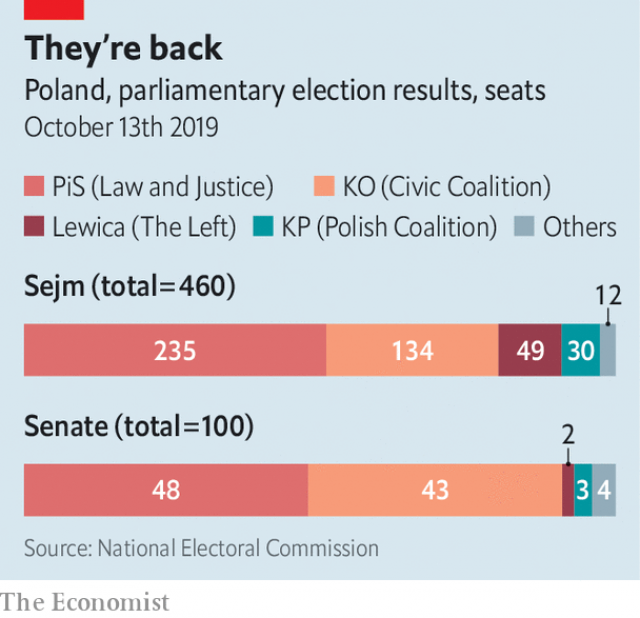

###### Zlotys for tots win lots of votes

# Poland’s ruling populists win again 

 

> print-edition iconPrint edition | Europe | Oct 19th 2019 

FOR THE past four years, the Law and Justice (PiS) party has seemed unstoppable. After coming to power in 2015, it set about reshaping Poland according to its nationalist and conservative vision, from the courts to the family. Despite a protracted conflict with the European Commission, which accused it of undermining the rule of law, the party remains remarkably popular. At parliamentary elections on October 13th it won a second term. But there are signs that second term will be more difficult than its first. 

“We received a lot, but we deserve more,” said PiS’s chairman Jaroslaw Kaczynski, the country’s unofficial leader, in his speech at party headquarters in Warsaw after exit polls were announced. His party received 43.6% of the vote, far ahead of its main rival, a centrist coalition led by Civic Platform, which ran Poland from 2007 to 2015. This time, the centrists got only 27.4%. With 235 out of the 460 seats in the Sejm, the lower chamber of parliament, PiS retains its majority, though only just. As the Polish economy starts to slow, that majority may be too narrow for comfort. 

Given PiS’s focused campaign, its result will probably have come as a slight disappointment. In the run-up to the vote, PiS courted voters with a combination of big handouts and social conservatism. It extended its flagship payment of 500 zloty ($127) per month per child to all children, introduced a one-off pension bonus to retirees, abolished income tax for workers up to the age of 26 and, from October 1st, lowered the personal income-tax rate from 18% to 17%. It also tried to mobilise voters through fear, as it did in 2015 when it portrayed refugees from the Middle East as a danger to national security. This time, Mr Kaczynski identified a new threat: an “attack on the family” by gay people. 

 

The new Sejm will be more diverse than the old one, ranging from the centre left to the far right. Unable to agree to form a single coalition, the opposition ran as three blocs: the Civic Platform-led centrists, who will have 134 MPs, the agrarian Polish Coalition, who will have 30, and the Left, which will have 49. After failing to cross the parliamentary threshold in 2015, the Left has reinvented itself as an alliance of the old social democrats and two younger progressive parties, with a platform that includes support for gay marriage, legal abortion and greenery. On the far right, Law and Justice faces a new rival: Konfederacja, a Eurosceptic alliance of nationalist movements, which will have 11 seats. Although it won just 6.8% of the vote, the exit poll suggests that this was much higher among young voters (20% in the 18-29 age group). 

PiS’s biggest problem was in the Senate, the upper chamber of parliament. After the three opposition blocs agreed not to run candidates against each other, the government narrowly lost its overall majority there. PiS will have 48 senators, down from 61 in 2015 (although it will try to poach a couple of independents). The Senate can amend and reject laws initiated in the Sejm, which should allow the opposition to stop PiS rushing controversial changes through parliament. But PiS will be able to overrule any amendments or vetoes, thanks to its absolute majority in the more powerful lower house. With next year’s presidential election approaching, the dangers of failing to co-operate should not be lost on the opposition. ■ 

