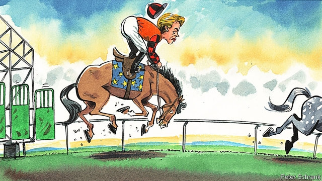

###### Charlemagne

# Ursula von der Leyen’s bumpy start 

 

> print-edition iconPrint edition | Europe | Oct 19th 2019 

EMMANUEL MACRON was visibly angry. “I need to understand what was at play,” he told journalists on October 10th, chopping the air with his hands. “I need to understand what was at play. Resentment. Pettiness perhaps. But I need to understand.” The European Parliament had just rejected Sylvie Goulard, his nominee for the next European Commission. This had not been part of the plan. Mr Macron won a diplomatic triumph in the summer when he persuaded Angela Merkel and other leaders to help him manoeuvre Ursula von der Leyen, a German minister who shares his vision of a tougher and more thrusting EU, into the leadership of the union’s executive. Mrs von der Leyen duly lined up Ms Goulard, a long-standing Macroniste, for a new mega-job overseeing industrial policy and defence. 

Sadly, the members of the three parliamentary committees charged with assessing Ms Goulard’s candidacy voted by 82 votes to 29, with one abstention, to reject it. Outside of her (and Mr Macron’s) liberal group she received just 12 votes; in other words, very few from the centre-right European People’s Party (EPP) and centre-left Socialists and Democrats (S&D) groups that Mrs von der Leyen will constantly have to rely on for majorities in the parliament. Both camps claimed afterwards that she had not contacted them to discuss the vote in advance. Mr Macron was not amused. 

MEPs cited Ms Goulard’s role in a past scandal over European parliamentary jobs and payments for her role at an American think-tank (she denies wrongdoing in both cases, investigations into the first of which cost her job as French defence minister after just one month in office in 2017). Wary of a “two-tier” EU, central and eastern Europeans in particular insisted that the French candidate not be subjected to lower standards of propriety than their own nominees. But a bigger factor in the rejection was the widespread sense in the EPP and the S&D that Mrs von der Leyen herself had been imposed on them. They would have preferred the next Commission president to be one of their own “lead candidates” who campaigned for the job ahead of the European elections in May. The apparent expectation that they defer to her and Mr Macron’s choice of internal market commissioner prompted the revolt. “Guys, we are going to kill [Goulard] in the vote later but do not say until then,” read an internal EPP memo accidentally tweeted ahead of the ballot. Mr Macron’s Europe minister declared the result “a major institutional crisis”. 

That was and is an overstatement—for now. MEPs also threw out the Romanian and Hungarian nominees over conflict-of-interest concerns. With insufficient time to find and approve three replacement candidates, on October 16th the parliament postponed its up-or-down vote on the final line-up and thus pushed the new commission’s arrival in office from November 1st to at least December 1st. It could all take even longer. Neither Mr Macron nor Mrs von der Leyen has the parliamentary muscle needed to guarantee that the next French nominee will meet with the support that eluded Ms Goulard. The French president’s power base there is not yet commensurate with his dominance among national leaders; he long dragged his feet on his party’s incorporation into the liberal group, considering himself above the contest between the EU’s party groups. Mrs von der Leyen hails from the EPP but is not considered “one of us” among its parliamentary ranks. 

Some sympathy is due to both of them. The parliament’s petty squabbles—and the grinding slowness of European initiative to which they contribute—is an indulgence the EU can scarcely afford. As The Economist went to press leaders were gathering in Brussels to discuss not just the Brexit drama but conflict in the Middle East, the new EU budget and unresolved EU carbon emissions targets. Mrs von der Leyen and Mr Macron, backed on some topics by the more cautious Mrs Merkel, want the continent to be a more decisive actor in such arenas and in Ms Goulard had a solid candidate for one of its crucial roles. Tit-for-tats and further delays are the last things they or Europe need. 

Yet both also have lessons to learn. In past decades France and Germany dominated. They could more easily settle decisions, sometimes with the commission president mediating, and impose them on the rest of the club. The parliament was relatively toothless. All of that has changed. The EU is more plural, its diplomatic and political landscape more diverse and its parliament more powerful. More by necessity than by design, and partly under the stress of crises, the European project has become more political and less narrowly technocratic—one reason why Mr Macron, fearful of adding any fuel to the fires of populism, rather shortsightedly decided this week to veto the start of EU accession talks with North Macedonia and Albania. The European elections in May saw turnout rise for the first time ever, betokening the genuine Europeanisation of some political debates. It produced a more fragmented parliament of shifting, hard-won majorities; one with, moreover, a stronger sense of its own legitimacy and a heightened willingness to assert itself. 

Both Mrs von der Leyen and Mr Macron have, in so many words, welcomed the trend towards a more confident and political European project. But if they are sensible, they will not merely treat that as a licence for technocrats and national leaders to ram through bigger things, faster. Irritating power games in the European Parliament are the manifestation of something important. In a more confident and political European project there may well be more opportunity to do big things, but the need to argue and win support for doing them is likely to be commensurately greater too. In future, European leaders will have to work harder to make their case, forge political bases, do deals and marshal coalitions. Whisper it softly, but “more Europe” will not make the EU easier to lead. Quite the opposite. ■ 

