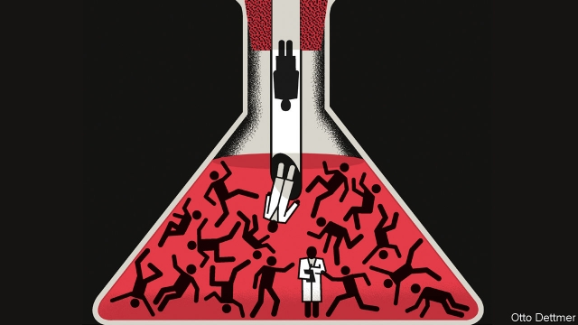

###### Free exchange

# A Nobel economics prize goes to pioneers in understanding poverty 

 

> print-edition iconPrint edition | Finance and economics | Oct 17th 2019 

THE MOST important question in economics is also the hardest: why do some countries stay poor while others grow rich? In 2015, 10% of the world’s population lived on less than $1.90 per day, down from 36% in 1990. But more than 700m people remain in extreme poverty, and the number grows every day in certain parts of the world, in particular sub-Saharan Africa. For their contributions to understanding gaps in development, the better to close them, Abhijit Banerjee, Esther Duflo and Michael Kremer have been awarded this year’s Nobel prize for economics. All three are Americans, though Mr Banerjee and Ms Duflo are immigrants (and married to each other). Ms Duflo is only the second woman to have received the prize and, at 46, the youngest winner ever. 

Thirty years ago, economists mostly looked at the big picture. They studied large-scale structural transformations: from rural and agricultural to urban and industrial. Macroeconomists built growth theories around variables such as human capital, then ran cross-country growth regressions to try to measure relationships—for example, between years of schooling and GDP per person. But data were scarce or poor, and the vast number of potentially relevant factors made it hard to be sure what caused what. 

In the mid-1990s Mr Kremer, at Harvard University, tried something different. With collaborators and co-authors, he began studying poverty with methods more commonly associated with chemists and biologists: randomised trials. If human capital—health, education, skills and so forth—is essential for development, then economists had better make sure they understand where it comes from. In Kenya he conducted field experiments in which schools were randomly divided into groups, some subject to a policy intervention and others not. He tested, among other things, additional textbooks, deworming treatments and financial incentives for teachers linked to their pupils’ progress. 

Each such experiment shed a little light on one small part of the “hardest question”. Educational resources—textbooks, say—turned out to do little for learning outcomes. Making pupils healthier improved their attendance, but did not necessarily mean they learned more. The experiments had a larger result, however: they taught the economics profession that randomised trials could work in the field. 

Mr Banerjee and Ms Duflo built on the foundation Mr Kremer laid, deploying randomised trials to study health care and entrepreneurship as well as education. In India, they found that focusing extra teaching resources on pupils who had fallen behind paid big dividends. They showed that microloans—small-scale lending to the cash-strapped poor—were less transformative than had been claimed, but could help ambitious entrepreneurs. The three scholars have studied absenteeism among teachers and nurses, immunisation programmes, the management of public infrastructure and the use of productivity-boosting technologies such as fertiliser. They have spent countless hours observing and learning from the daily struggles of the world’s poor. 

By breaking big questions into smaller ones, and tackling each in carefully designed experiments, they overcame some hard epistemological problems. Economists who used cross-country regressions could not easily say whether extra schooling boosted growth or merely occurred alongside it. Field experiments, by contrast, could show not only the link between better teaching and greater learning, but how the connection worked. 

There remained the problem of “external validity”: the extent to which a measured relationship holds outside the research context. People are complex, and the world ever-changing; thus it is hard to be confident that a relationship between two variables will endure. Researchers must also be aware that the groups being tested may differ subtly from a broader population, or that something in the experiment may be influencing participants’ behaviour. In mastering field research, Mr Banerjee and Ms Duflo showed how to overcome these difficulties. “Natural” experiments, such as an oil shock, cannot be rerun to satisfy nagging doubts. Field experiments can be replicated. Structuring experiments so that they can be scaled up over time permits greater confidence still. 

Each nugget of truth prised out of the data generated by field experiments represents a contribution to understanding the world. The hope is that many small truths can be piled together to make a big one. These laureates’ work uses economic theory as a guide, but nonetheless represents a departure from the discipline’s business-as-usual, in which economists peer down from on high at society and seek to discover the equivalent of Newton’s laws of motion. Randomised trials are a part of an important development in recent decades, away from high theory and towards an empirical grounding. With these awards the Nobel committee endorsed this shift. It is, furthermore, a practical award, celebrating work that offers ways to improve lives. 

But the hardest question still looms. Mr Banerjee and Ms Duflo reckon that their work builds toward an answer. Taken together, their experiments reveal that the gap in productivity between the most and least efficient producers is much wider in developing economies than in advanced ones. Fix that, one small intervention at a time, and perhaps eventually the hard question will go away. More macro-minded economists counter that the huge fall in global poverty of the past three decades owes little to such fiddling. It happened, rather, as a confluence of global forces buoyed poor countries’ fortunes. The mystery of global poverty remains. If enough economists emulate the innovative spirit and scholarly care of this year’s laureates, it will not remain for ever. ■ 

Listen to our interview with this year's economics Nobel laureates at economist.com/economicsnobel2019 

