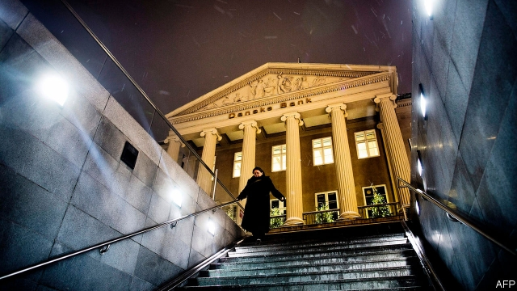

###### Northern blights

# A massive money-laundering scandal stains the image of Nordic banks 

 

> print-edition iconPrint edition | Finance and economics | Oct 19th 2019 

DANSKE BANK’S headquarters in Copenhagen, reminiscent of a Greek temple, speaks of an illustrious past. But Denmark’s biggest bank has “no vanity left”, says a spokesman. Since 2008 it has been embroiled in a disaster every five years. After one during the financial crisis, it was again in crisis mode in 2013 when the board sacked Eivind Kolding after 18 catastrophic months at its helm. Last year Thomas Borgen, Mr Kolding’s successor, resigned amid revelations about Danske’s role in a vast money-laundering scandal. In May Mr Borgen was charged by Denmark’s prosecutor. 

The money-laundering crisis is the most damaging yet for Danske, and for other Nordic banks allegedly involved. Last year the Organised Crime and Corruption Reporting Project, a group of investigative journalists, gave Danske its “Corrupt Actor of the Year” award. How did the bank squander its good name—and can it regain clients’ and regulators’ trust? 

The saga started in 2007, when it bought Finland’s Sampo Bank, which came with a branch in Tallinn, Estonia’s capital. In the same year Estonia’s authorities found flaws in Sampo’s procedures, and the Russian central bank told Danish supervisors that non-resident customers were participating in transactions intended to dodge taxes and customs payments, or to launder “billions of roubles monthly”. The Russians also alerted the Estonian authorities but failed to provide the information needed for an investigation, says Madis Reimand, the head of Estonia’s Financial Intelligence Unit (FIU), a police division dealing with financial crime. 

The main conduit for dodgy money at Danske’s Estonian branch was the “non-resident portfolio”, comprising about 10,000 accounts. By the end of 2013 this held 44% of all deposits from non-resident customers in Estonian banks (up from 27% in 2007). Investigators have examined thousands and deemed “the vast majority” to be suspicious. The branch filed suspicious-activity reports to the FIU for only 760 clients. 

Danske admits not doing enough to prevent abuses. In December 2013 Howard Wilkinson, the former head of the bank’s trading unit in the Baltics, alerted Finantsinspektsioon, the Estonian regulator. It searched Danske’s offices twice in 2014. “We found that risk controls were not working and procedures not implemented,” says Kilvar Kessler, the regulator’s boss. In 2015 Danske closed its non-resident portfolio in Estonia under pressure from Mr Kessler’s team. It commissioned a report from Bruun & Hjejle, a law firm, on how its anti-laundering procedures went so wrong. It revealed staggering sums: as much as €200bn ($220bn) flowed through the accounts in 2007-15, 23% from Russia. “It is expected that a large part of the payments were suspicious,” states the report. 

It paints a picture of managers and systems failing, in both Tallinn and Copenhagen. Danske’s Estonian branch kept its own IT platform, which meant it was not subject to the same risk-monitoring as the rest of the bank. Employees are suspected of having colluded with crooks from ex-Soviet countries. According to local lore, they even installed a helipad to accommodate oligarchs passing through. 

To clean house, Danske has hired Philippe Vollot as chief compliance officer. He was previously Head of Anti-Financial Crime at Deutsche Bank—which was caught up in the Danske scandal, as one of the Danish lender’s correspondent banks. Mr Vollot is beefing up compliance from 170 people to 300 and says he “wants to build something lasting to avoid this happening again”. His job is made easier by the recent liquidation of Danske’s Estonian operations (the sign on the branch was taken down in the middle of the night) and its decision to leave Latvia, Lithuania and Russia. Yet a heightened focus on compliance is costly: this month Danske initiated a hiring freeze because of its rising costs. 

Danske’s is just the most spectacular of the money-laundering scandals afflicting northern Europe. In February Swedish state television reported that tens of billions of dollars of illicit funds may have passed through the Estonian branch of Swedbank, Sweden’s oldest retail bank. In March Birgitte Bonnesen, the chief executive, was fired. In September Swedbank admitted shortcomings in its financial-crime controls and conceded it still had problems with “know-your-customer” practices in Estonia and Sweden. It asked Clifford Chance, a law firm, to conduct an investigation, which is expected to be made public next year. For now the bank, which declined to comment for this article, refuses to provide details. 

Finland’s Nordea, which is also embroiled in money-rinsing allegations, has stonewalled too, says Bill Browder, an anti-Kremlin campaigner. The Swedish and Finnish authorities refused to open criminal cases, which would have made it easier to track the money. In May Mr Browder persuaded a judge in America to subpoena both banks for their dollar transactions. His team is ploughing through the data. 

The story will continue to unsettle Nordic banking. Danske and Swedbank face several investigations, including a criminal probe by America’s Department of Justice, which investors fear could result in large fines. Estonia’s cabinet is mulling an increase in the maximum fine for facilitating money-laundering, from a mere €400,000 to the EU’s standard of 10% of annual turnover or €5m, whichever is higher. 

The head of Denmark’s regulator, Jesper Berg, blames the workload caused by the scandal for the loss of four teeth (he was too busy to visit a dentist). Overwork took an oddly similar toll on Mr Kessler, his Estonian counterpart: as the affair reached its height a tooth infection landed him in hospital. Both regulators have been cleared of wrongdoing after a probe by the European Banking Authority. They have strengthened their anti-money-laundering teams and await changes in national and international law to improve communication between regulators and police. After Danske, who could disagree with rules on financial crime being given more bite? ■ 

