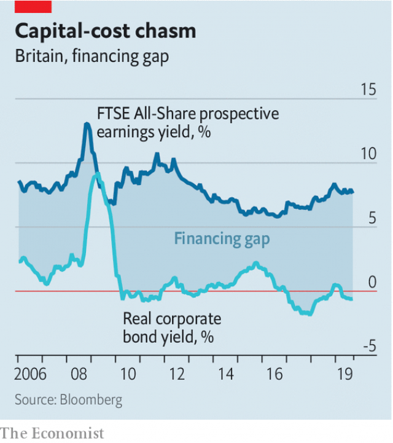

###### Buttonwood

# Britain’s equity market is shrinking 

 

> print-edition iconPrint edition | Finance and economics | Oct 19th 2019 

A  FEW MONTHS ago Trian, a hedge fund, revealed that it had built a 6% stake in Ferguson, a London-listed company that supplies the building trade. Trian is run by Nelson Peltz, who has a long history as the sort of activist investor who buys stakes in firms and then uses his influence over management to boost the share price. Ferguson makes most of its profits in America. Yet its shares traded at a discount to peers listed there. Perhaps something could be done to change this. 

Sure enough, Ferguson said last month that it would spin off the British part of the business to focus on its American operations. It also said it was considering moving its stockmarket listing. Should the firm leave, it will be part of a broader trend in Britain: the shrinking supply of equity capital. 

America’s stock of equity has been getting smaller for a while, because of share buy-backs, a secular fall in the number of new listings and the growing incidence of leveraged buy-outs, in which low-interest debt replaces equity. Britain is now the leading candidate for such “de-equitisation”, says Robert Buckland, of Citigroup. The net stock of equity outstanding has fallen by 3% since the start of 2018, faster than in America. Cheap debt is a factor. But debt is cheap everywhere. What makes Britain so ripe for the picking is its culture of accountability to shareholders. Activist investors, like Trian, can get results there. 

The backdrop is a shift in the relative costs of debt and equity finance. One way to look at this is through the prism of expected returns. A rough-and-ready gauge of expected returns on stocks is the earnings yield—the inverse of the price-to-earnings ratio. It is a measure of real returns: if a burst of inflation raised prices (of assets as well as consumer goods) at a uniform rate, the earnings yield would not change. The prospective earnings yield on the FTSE All-Share index of London-listed stocks is 7.6%. Compare this with a proxy for an expected real return on corporate debt—the yield on investment-grade bonds less the current inflation rate, which is below zero. The gap between the two is the reward demanded for holding riskier stocks. It is also, by symmetry, a measure of the relative cost to companies of issuing equity versus debt. 

This “financing gap” is noticeably wide in Britain (see chart). The size of the gap, says Mr Buckland, “offers a potential arbitrage opportunity for private equity and other debt-funded investors”. In other words, there is plenty of scope to replace dear equity capital with cheap debt capital. 

 

There are particular conditions in Britain that make this opportunity worth looking at. The FTSE All-Share has fared worse than most other rich-world stock indices since Britain voted to leave the European Union in 2016. The sharp fall in the pound since then has boosted the sterling value of foreign profits made overseas. More than 70% of the earnings of companies listed in Britain come from overseas; around a quarter comes from North America alone. There is thus an opening for American investors or companies to buy dollar earnings on the cheap. Mr Buckland’s research uncovers a range of British firms that earn most of their profits in America but have a lower valuation than their American peers. A lot of them are industrial firms. 

Scour the bourses of the world and you will not struggle to find lots of cheap industrial stocks. The problem with investing in such out-of-favour shares is that somebody else must come along to buy them off you at a higher price for the strategy to work. There is no law that says cheap stock cannot stay cheap for a long time, or become even cheaper. The activist approach is to buy cheap-looking stocks and then work to get their latent value realised. This is more likely to succeed in Britain than in Germany, Japan, South Korea or other places with cheap-looking cyclical stocks. It could involve a push to get a firm to buy back its own shares. It could mean hawking the company, or a division of it, to another company or to a private-equity firm. If buyers won’t come to you, go to them by relisting somewhere that puts a higher value on your shares, such as America. 

As yet there has been no nativist backlash. Britain’s stockmarket seems likely to shrink further. Whatever the means—under-the-radar buy-outs, mergers, spin-offs, or simply a drying-up of new issues—the underlying cause will be the same. Companies are turning their backs on the stockmarket because equity capital is relatively dear. The irony is that Britain’s A-list shareholder culture makes its de-equitisation all the likelier.■ 

