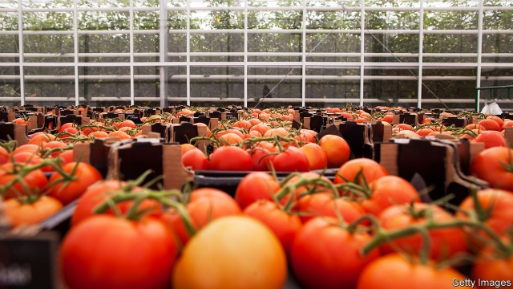
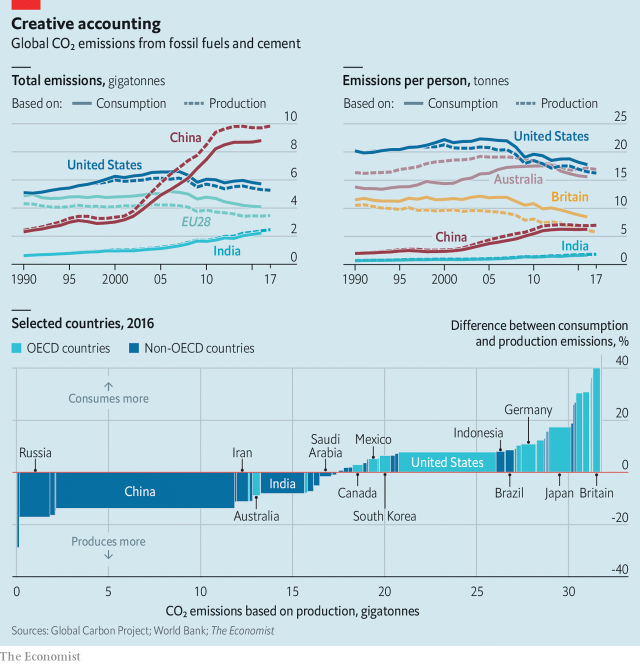

###### Not so green

# Greta Thunberg accuses rich countries of “creative carbon accounting” 

 

> print-edition iconPrint edition | Finance and economics | Oct 17th 2019 

IT IS 5AM, and New Covent Garden Market is in full swing. On its swarming 57-acre site in Battersea wholesalers are flogging fruit, vegetables and flowers to London’s greengrocers and restaurateurs. Costa Rican pineapples are stacked next to Kenyan passion fruits and Peruvian asparagus. Rows of Danish conifers sit by buckets of Dutch roses. Fresh produce shipped from all around the world is for sale. 

But what is a boon to chefs—and apologetic spouses—has become a mind-bending problem for politicians and regulators. Under mounting public pressure they are busy setting targets to limit their carbon emissions. At least 60 countries and over 100 cities have promised to get to “net zero”. The trouble is that few account fully for the emissions created by products that are consumed within their borders but produced outside them. 

Take, for example, a bunch of those Dutch roses. Britain’s “net-zero” target for its carbon impact includes only domestic emissions—the lorry trip carrying them on British soil, and so on. These carbon-dioxide emissions are trivial in comparison to the 30kg or so from heating greenhouses in the Netherlands and flying the roses to Britain. Through a production lens, Britain looks relatively virtuous. Through a consumption lens, it does not. 

Flowers are just one tiny part of the equation. Across the rich world the overall measurement gap is huge, particularly for service-oriented economies. Britain consumes about 40% more carbon emissions than it produces; the European Union as a whole, 19%. In America the difference comes in at 8%, according to the Global Carbon Project (GCP), a network of scientists. As for big cities, the gap between the two gauges of their carbon trail is bigger still, at about three-fifths, using the average figure for 79 cities reviewed by an international group of researchers. The problem even extends to individual buildings, which owners sometimes declare to be “carbon-neutral” while ignoring the concrete and steel used to build them. 

Inevitably, since production-based measures make rich countries look good (they also flatter small states that do little manufacturing), most have picked this methodology for their carbon targets. None of the 19 countries in the Carbon Neutrality Coalition have net-zero targets that explicitly aim to reduce consumption (carbon footprints are considered in another part of France’s legislation). Likewise New York’s net-zero target is production-based—helpful, since it is a state without much heavy industry. It is for this reason, among others, that Greta Thunberg, a teenage climate activist, told Britain’s Parliament in April that its climate goals amounted to little more than “creative carbon accounting”. 

The gap between national consumption and production measures comes from the emissions that are embedded in cross-border trade. Such emissions make up a quarter of the global total. Scientists began to pay more attention to them as China became a manufacturing powerhouse following its entry into the World Trade Organisation in 2001. Its factories were powered by coal, the fossil fuel that emits the most carbon per unit of energy. 

By 2009 China had become the world’s largest carbon emitter (see chart). Its exports alone now account for about 5% of the world’s fossil-fuel emissions. Most of this relates to goods that are ultimately consumed in the developed world: two-thirds of China’s emissions exports go to members of the OECD, a rich-country club. India and Russia are sizeable carbon exporters, too. (Saudi Arabia is not a big emissions exporter because both production and consumption statistics book the emissions from oil in the country where it is burned rather than extracted.) 

 

Cutting trade-related emissions is a daunting task. Cross-border supply chains are often complex, and making goods closer to home may not actually improve matters. The problem can be split into three parts: what is imported, where it comes from and how it travels. 

The imports that embed the highest carbon emissions are mostly industrial materials (iron, steel and chemicals) and consumer goods (cars, electronics and textiles). According to the Global Trade Analysis Project, a database maintained by Purdue University, these six products account for about 30% of trade-related emissions. But the CO2 released by the same item produced in two different countries can differ hugely, depending on how energy-efficient production is and how the countries make their electricity. 

Purdue’s data show that cars and car parts exported by China are responsible for nine times more CO2 per dollar than those exported by Germany. Mathieu Poitrat Rachmaninoff, an analyst at Newton Investment Management, notes that on average about half of the lifetime emissions from an electric vehicle come from making the battery. A medium-sized battery made in renewables-rich Sweden emits around 350kg of CO2. For coal-reliant Poland, that figure is over eight tonnes. 

To cut emissions, it is therefore necessary to look closely at products’ provenance. Sometimes the conclusions are counter-intuitive, as the tomatoes in New Covent Garden Market demonstrate. British tomatoes are grown in heated glasshouses and thus require three times more energy than sun-blessed Spanish ones. Even accounting for transport, local tomatoes are responsible for more emissions. Mike Berners-Lee of Lancaster University points out that a British apple bought in June has typically been in chilled storage for nine months. Keeping it cool for that long emits about as much carbon as shipping an apple from New Zealand.  

Modes of transport also matter. Around 87% of the world’s freight, measured in tonne-kilometres (a tonne transported one kilometre), goes by sea. Shipping accounts for about 2% of fossil-fuel emissions. But as a means of transport it is carbon-efficient. Producing a tonne of steel in China takes about two tonnes of CO2. Shipping that steel to New York adds only 322kg. Planes account for just 0.1% of the world’s tonne-kilometres of international freight, but an outsize share of all emissions. According to figures from the British government, the carbon emissions caused by transporting a given weight by air are about 70 times greater than if it had been shipped. That means sectors reliant on timely delivery, such as fast fashion, are particularly environmentally unfriendly. 

Just as governments and scientists are grappling with how to assess trade-related emissions, the world’s network of cross-border commerce has been disrupted by America’s trade war with China. In the first half of 2019, global trade volumes rose by 1% compared with the prior year, the slowest rate since 2012. But even if trade flows were to fall, it does not follow that global emissions would drop, points out Glen Peters of the Centre for International Climate Research in Norway. Moreover, China produces lots of carbon-saving technology. It is home to eight of the world’s ten biggest manufacturers of solar panels, and is pumping money into batteries and electric vehicles. An intensifying economic conflict between America and China could mean the flow of Chinese technology and know-how across borders dries up, hampering mitigation efforts elsewhere. 

The trade war could cause multinational firms to shift production away from China. But that might not reduce emissions much, if activity is relocated to other countries that are keen to fuel their export-led growth with coal. Already emissions exports are growing fastest in Bangladesh, India, Indonesia and Vietnam, says Dabo Guan of the University of East Anglia. None of these countries is emitting as much carbon per person as China did when its exports took off, mainly because they burn less coal. But all are attracting labour- and resource-intensive industries such as plastics and electronics, which are leaving China in search of lower wages and less stringent environmental standards. 

In the long run the only answer is for all economies, including manufacturing-heavy ones, to shift towards cleaner sources of energy. Trade deals could be used to encourage exporting countries to cut emissions, says Sam Lowe of the Centre for European Reform, a think-tank in London. The EU is considering a carbon “border-adjustment” tax—higher tariffs on goods from countries that do not meet the EU’s environmental standards. America’s trade deals already allow for penalties on countries that fail to meet their commitments under the Paris climate agreement of 2015—though President Donald Trump shows little interest in using them. The trade deal struck in June between the EU and Mercosur, a South American trade bloc, could be blocked by EU member countries, or MEPs, unless Brazil does more to protect the Amazon rainforest. 

As decarbonisation gets under way in rich countries, emissions embedded in imports will loom larger. Finding ways to curb them will be tricky. But they will become harder to ignore. ■ 

