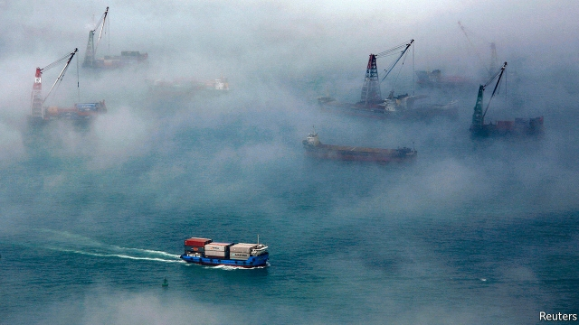
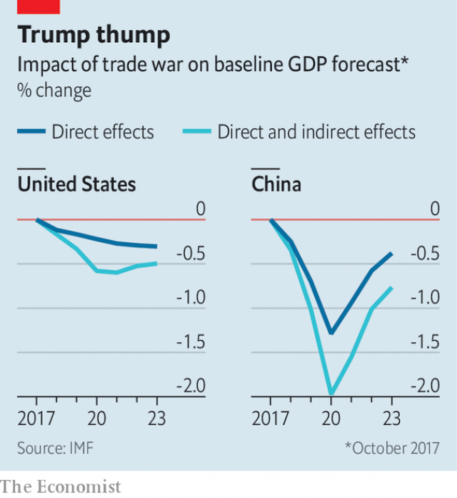

###### Foggy outlook

# How the twists and turns of the trade war are hurting growth 

 

> print-edition iconPrint edition | Finance and economics | Oct 17th 2019 

AFTER WELCOMING the St Louis Blues, a championship-winning ice-hockey team, to the White House on October 15th, President Donald Trump fondly recalled a recent triumph of his own: last week’s tentative trade deal with China. Simply put, America will impose no further punitive tariffs on Chinese imports if China promises to buy American farm goods worth billions of dollars. How many billions? “It’s very big numbers,” Mr Trump emphasised. “I said, ‘Ask for 70.’…My people said, ‘All right, make it 20.’ I said, ‘No, make it 50.’” 

Will this carefully calibrated amount ever materialise? China does not want to pay over the odds or deprive other, friendlier suppliers of its custom. It also wants America to go beyond promising no new tariffs and to start removing existing ones. The deal may unravel before it is written down, let alone signed by the two countries’ leaders next month at the Asia-Pacific Economic Co-operation forum in Santiago. 

That unpredictability is a problem. Not just higher tariffs but “prolonged trade-policy uncertainty” are damaging the world economy, said Gita Gopinath, the IMF’s chief economist, this week as the fund again cut its forecast for global growth. “Manufacturing firms have become more cautious about long-range spending and have held back on equipment and machinery purchases,” the fund notes. The fog of trade war is depressing investment spending. And because machinery, equipment and other capital goods are often imported, weak investment spending is further hurting trade. The IMF now expects the world economy to expand by just 3% this year, compared with 3.6% last year. That would be the slowest rate in the decade since the global financial crisis. 

Both America and the euro zone are expected to grow more slowly this year than the fund had envisaged in July, before trade tensions escalated. India’s prospects have dimmed sharply: it is forecast to grow by 6.1% rather than the 7% expected only months ago. And in 2020 China is now projected to expand by less than 6% for the first time in 30 years. 

The fund has, unsurprisingly, slashed its forecast for Hong Kong. The city is now expected to grow by only 0.3%, compared with the 2.7% foreseen in April, before its economic prospects vanished in a cloud of tear-gas. The unrest could also jeopardise the fragile trade truce between America and China. On October 15th the House of Representatives passed a measure enjoining America to assess Hong Kong’s autonomy annually and sanction officials who violate it. China reacted angrily to what it describes as meddling in its affairs. 

 

The IMF’s economists have valiantly tried to quantify the damage to the world economy from the trade war if Mr Trump’s putative deal falls apart. The direct impact is surprisingly modest. The tariffs already in place and in the pipeline could reduce America’s GDP by just over 0.2% next year, compared with a world in which the trade war had never started (see chart). More harmful are indirect effects: weaker business confidence, productivity and risk-appetite on financial markets. These bring the damage to almost 0.6% of America’s GDP in 2020. The damage to China would be almost 2% of its GDP. 

These are small percentages—but of vast economies. If the IMF is right, an unresolved trade war could cost America roughly $125bn of forgone output next year alone. The cost to China could exceed $300bn (at market exchange rates). Big numbers indeed. ■ 

