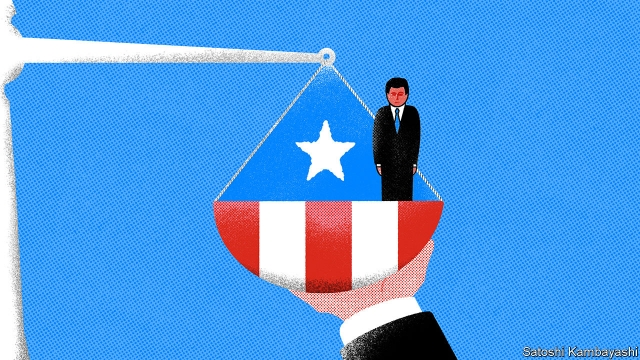

###### Territorial claims

# Is the board overseeing Puerto Rico’s bankruptcy unconstitutional? 

 

> print-edition iconPrint edition | Finance and economics | Oct 19th 2019 

“ARE YOU and your client here just to defend the integrity of the Constitution?” asked Samuel Alito, an associate justice of the America’s Supreme Court, on October 15th. “Or would one be excessively cynical to think that something else is involved here, involving money?” The court had heard arguments from Donald Verrilli, for the board overseeing Puerto Rico’s bankruptcy; Jeffrey Wall, for the federal government; and Theodore Olson, to whom the judge’s remarks were addressed. His client is Aurelius Capital Management, a hedge fund that invests in distressed debt. At stake are $125bn of creditor claims. 

Aurelius was founded in 2006 by Mark Brodsky, formerly of Elliott Management. Both funds were involved in a fight with Argentina about its bonds in 2014, during which Cristina Fernández de Kirchner, then the president, dubbed them “vultures”. They were among six funds that held out for full repayment. In 2016 they settled favourably and were paid $9.3bn. Aurelius now aims to get the Supreme Court to declare the Puerto Rico oversight board unconstitutional, in the hope of improving on its offer to the territory’s creditors of 35-45 cents on the dollar. 

In 2014 rating agencies downgraded Puerto Rico’s debt. It ended up defaulting. In 2016 Congress passed the Puerto Rico Oversight, Management and Economic Stability Act (PROMESA) to approve the island’s budget and supervise its debts. The president, then Barack Obama, was to appoint the board members, with no requirement to seek the Senate’s approval—which the constitution says is needed for “officers of the United States”. Aurelius argues that this should cover the board members, and that the board is unconstitutional. 

The board and federal government argue that the board’s business is “primarily local”. Lower courts had disagreed. The board was created to oversee bankruptcy proceedings unresolvable by Puerto Rico’s governor, arguably implying that its powers supersede the island’s. But those lower courts also blessed the board’s actions under the “de facto” doctrine, which allows actions by officials to stand, even if they are found to have been wrongfully appointed. 

On October 15th the Supreme Court spent little time on the de facto doctrine. It focused on whether the board acts locally, in the interest of Puerto Rico, or federally, in the interests of all Americans. Remarks from some of the liberal justices seemed to lean towards the latter—and thus towards Aurelius. “One option could have been some kind of financial bail-out,” said Elena Kagan. Congress “instead chose an option that had less financial cost for the American people as a whole”. Sonia Sotomayor probed the idea that the act gave the board members powers that ordinary local officials did not previously have. 

A ruling is due by July. If it goes Aurelius’s way, it would be a mighty upset—and hugely disruptive for Puerto Rico. The board has collected and paid out claims, and issued $12bn of bonds. “I have no idea how one unwinds this,” said Mr Wall, for the federal government. He seems unlikely to have to find out. The conservative justices, who are in a majority, seemed to lean towards seeing the board members as Puerto Rican officers. “If we conclude that the powers and duties here are primarily local…do you lose?” Brett Kavanaugh asked Mr Olson. The court will now decide. ■ 

