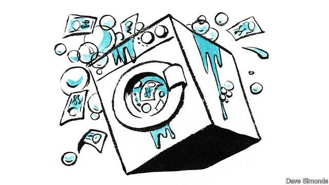

###### Nordic noir

# Another piece of Europe’s financial architecture needs fixing 

 

> print-edition iconPrint edition | Leaders | Oct 19th 2019 

IF A BANK is accused of money-laundering or sanctions-busting by Uncle Sam, the fallout is often devastating. Consider the case of Halkbank, a big Turkish lender, which was indicted this week by prosecutors in New York for evading sanctions on Iran. When the news broke, its share price sank and yields on its bonds soared as investors worried that it might face crippling punishment. Yet the surprising thing is that, notwithstanding America’s tough approach, dodgy business by international banks remains common, even in jurisdictions that you might think were squeaky clean. In particular, Europe seems to have a serious money-laundering problem that it needs to get a grip on (see article). 

The most egregious recent case involved Danske Bank, Denmark’s largest lender. For a while a single office with a dozen staff in Tallinn, that Mecca of global capital markets, was generating fully a tenth of its profits. Too good to be true? You bet. It turned out that in 2007-15 some €200bn ($220bn) of iffy money, much of it from Russia, sloshed through this one tiny Estonian branch. Other Nordic lenders have had problems, too. Some €135bn of potentially dubious funds may have flowed through the Estonian branch of Swedbank, which has its headquarters in Sweden. Nordea, based in Helsinki, is also under scrutiny, as are banks in Austria and Germany. Deutsche Bank, which helped process Danske’s cross-border transactions as a correspondent bank, has been raided by the police. 

Europe is quick to preach to the rest of the world on matters of financial rectitude—through its leadership of the IMF, for example, and its key role in the Financial Action Task Force, a body that fights financial crime. The scandals show that it needs to get its own house in order. Fighting money-laundering is not easy, however. Europe consists of a patchwork of legal and regulatory jurisdictions. And its neighbours are often unco-operative—Estonian police had a tip-off about Danske back in 2007, for instance, but Russia declined to provide information that could have helped connect money passing through the bank to specific crimes. It would help if there were a global standard for cross-border co-operation in such cases, but that seems some way off. 

One option would be for Europe to rely on America to act as the global policeman. Its financial enforcers are happy to use their extra-territorial legal powers to punish banks outside their own borders, and they find it easier to get hold of information because they can threaten to cut off lenders and their counterparties from access to the global dollar-payments system. When HSBC was caught helping drug cartels move money around, America fined it $1.9bn and the bank promptly cleaned up its act. 

The trouble is that American enforcement abroad is erratic. In the Nordic scandals, American officials were no quicker to pick up on funny business than European regulators were. On other occasions the punishments meted out by American courts and regulators to European banks are so extreme that they threaten financial stability. In 2014, for example, they fined BNP Paribas $8.9bn for sanctions violations, leaving one of the euro zone’s most important banks reeling. 

To fight the scourge, Europe can do some things on its own. It can strengthen detection by boosting intelligence-sharing between banks, regulators and the police. To do this, the EU does not need the central anti-money-laundering agency that some have called for. This would risk turning into yet another bureaucracy. Instead it would make more sense to pool data on suspicious clients across the continent, so that national authorities, who are closer to the action but struggle to join the dots, could gain a more complete view. Remarkably, hundreds of dubious clients jettisoned by Danske when regulators closed in were scooped up by rivals apparently unaware of their toxicity. 

Insiders also have to be encouraged to spill the beans. Whistleblower protections are patchy in Europe; Denmark’s are among its weakest. A new EU directive will strengthen them by 2021, but it is limited in several areas to breaches of EU law. 

And last, fines should be higher. Under EU law they can be up to 10% of annual turnover. But some countries set the limit far lower—just €400,000 in Estonia, for instance—and actual penalties lower still. Europe may never wield as big a stick as America does, but it could do with more than twigs in the fight against dirty money passing through its financial system. ■ 

