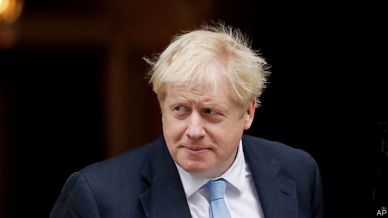

###### Beyond the summit

# Any deal struck between Britain and the EU should be put to voters 

 

> print-edition iconPrint edition | Leaders | Oct 17th 2019 

Editorial update (October 17th 2019): This piece has been changed to include news of the announcement of a Brexit deal 

AS WE WENT to press on October 17th Britain’s prime minister, Boris Johnson, and Jean-Claude Juncker, president of the European Commission, announced that a Brexit deal had been reached. Any agreement made in Brussels would still have to be approved by Britain’s cantankerous House of Commons, which threw out the deal that was struck late last year and may scupper any future one, too. Nonetheless, the new—and welcome—willingness of both sides to compromise suggests that, whatever happens in the next few days, the odds of a chaotic no-deal exit have lengthened considerably. 

That is a relief for all parties, and particularly Britain, which stood to suffer the most from crashing out. Yet it is hardly time to celebrate. The outlines of a draft deal that were being circulated as the European summit began were pretty grim for Britain. Excitement at the prospect of at last “getting Brexit done”, as Mr Johnson puts it, should not obscure the fact that his proposed deal would be bad for the economy, bad for the union, and bear little relation to what voters narrowly backed in a referendum more than three years ago. 

The deal that seems to be taking shape is economically worse for Britain than the one negotiated by Theresa May last year. It would remove the unpopular “Irish backstop” arrangement by taking Britain out of the EU’s customs union altogether, and scrapping a promise to maintain regulatory alignment with the bloc. That would erect barriers to trade with what is by far Britain’s biggest partner. Unless things were to change dramatically during the short transition period, within ten years Mr Johnson’s deal would have reduced Britain’s total trade by about 13%, making people roughly 6%, or £2,000 ($2,560) a year, poorer than they would otherwise have been, one estimate finds. That is almost a third more than the hit that would have been delivered by Mrs May’s deal. 

Mr Johnson’s deal would also, in effect, establish a customs border between mainland Britain and Northern Ireland. Not only would this make life harder for businesses in the region, one of the poorest in the United Kingdom. It would also risk inflaming sectarian tensions, just as a border between north and south would have done. The Good Friday peace agreement of 1998 rested on the idea that the Northern Irish could feel equally part of Britain or Ireland, or both. Building a customs barrier in the Irish Sea would rattle that agreement. 

Nor is that the only part of the union that is coming loose. Since the Brexit referendum, support for independence has been growing in Scotland, where polls now put it at 50% and rising. The ruling Scottish National Party believes that a second independence referendum will be given the green light within two years (see article). An earlier one, in 2014, was an uncomfortably close-run thing. Brexit, which Scots voted strongly against, could well tip the next vote the other way. Meanwhile, even in Wales, long the most contented member of the union, independence has crept back on the agenda. One recent poll found that 40% of the Welsh would gladly leave Britain, if it means they could stay in the EU after Brexit. 

It may be that English voters are itching so badly to break free of Europe that they see all this as a reasonable price. Three years of wretched talks have made everyone keen to get the whole thing over with. Perhaps a majority are willing to forgo a couple of thousand pounds a year, and a nation or two. But there is a grave risk that voters are no longer up for this. Mr Johnson’s proposed deal carries a much heavier economic and constitutional cost than any plan advertised when they were asked for their opinion back in 2016. Most polls suggest a majority have since cooled on the idea of Brexit and, given the choice, would now vote to remain. It is good news that a deal has been struck. But it would be no triumph of democracy if it were pushed through without first being put to a confirmatory popular vote. 

