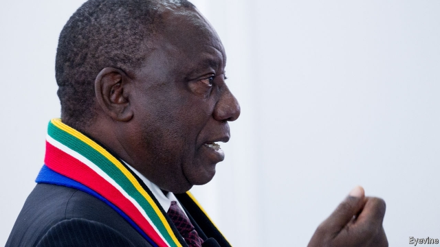

###### The need for speed

# Cyril Ramaphosa is running out of time to reform South Africa 

 

> print-edition iconPrint edition | Leaders | Oct 19th 2019 

IN 1991 CYRIL RAMAPHOSA went fishing with Roelf Meyer, his opposite number in the negotiations to end apartheid. When Mr Meyer got a trout hook stuck deep in his hand, Mr Ramaphosa proved the only one able to extract it, with the aid of an analgesic dram of Scotch. The tale is part of South African political folklore. For some it symbolises how the man who in February 2018 became the country’s president has long been able to forge relationships with any interlocutor—and to make sure they both get what they want, without too much pain. By the end of the constitutional convention, Mr Meyer later recalled, he felt that there was nothing the two of them could not resolve. 

Twenty-five years after the end of apartheid, South Africa is at another perilous moment. Years of corruption under Jacob Zuma, the man Mr Ramaphosa replaced as president, ravaged a country that was already facing deep problems. Today the rainbow nation has unemployment of 29%, one of the highest rates in the world. Growth has been negative in three of the past six quarters. Public debt as a share of GDP is rising steadily, partly thanks to insolvent state-owned enterprises such as Eskom, a power utility that cannot keep the lights on. In the next few weeks Moody’s may become the third large credit-rating agency to downgrade the country’s debt to “junk” status, a signal that could send foreign capital fleeing. 

In an interview with The Economist on October 13th (see article), Mr Ramaphosa vowed to turn things round. He argues that soon the country will reap the benefits of the new (competent, honest) leaders he has installed at crucial institutions such as the prosecution and tax authorities. This month his government will unveil a new “growth strategy” and a budget. An overdue plan for Eskom is also in the works. Critics fret that Mr Ramaphosa is moving too slowly to fight graft and kick-start growth. He retorts that big reforms must be patiently negotiated. With the skills he honed as a union boss, constitutional architect and tycoon, he says he can ensure that “everybody rises from the table feeling that they are a winner.” 

Maybe so. The problem is that, in South Africa, only an elite few ever have a place at the table. Economic life is dominated by big business, big labour and big government. Firms face too little competition, cushy labour laws lock the jobless out of work and the public sector provides woeful services. Many well-paid teachers barely teach. Many bureaucrats do little but slow-walk paperwork and embezzle. Most are never held accountable. A quarter of South Africans enjoy a middle- or upper-class life, while the rest struggle to get by. When a country has an insider-outsider problem, you cannot let the insiders dictate terms. 

Fortunately for Mr Ramaphosa, a better blueprint is available. In August Tito Mboweni, his rumbustious finance minister, published a paper proposing sweeping yet doable reforms. The document suggests easing visa rules for skilled migrants, lowering barriers to entry for small businesses, breaking up and privatising parts of Eskom, enhancing education standards, improving property rights for the poor and much more. Independent analysts broadly agree with the Treasury’s estimate that if the plan were adopted, the economy could grow by 4-5% a year (more than double current forecasts). That is roughly the rate which economists think is required to put a dent in the hideous unemployment figures. It would surely be enough to avoid a downgrade from Moody’s, too. 

Will Mr Ramaphosa heed such good advice? The answer seems to be: somewhat. He says he endorses all Mr Mboweni’s ideas, but slips in a crucial qualification—that “of course” these mooted changes cannot all be implemented at once. That sounds suspiciously like timidity. 

Mr Ramaphosa cannot boost growth without upsetting people. Public servants who do not serve the public need to be fired; pampered industries, unpampered; crooked bigwigs, locked up. All this will be hard. The pro-corruption lobby within the ruling African National Congress (ANC) is exceptionally powerful. Mr Ramaphosa is right to pay heed to intra-party politics and the ANC’s union allies—to do otherwise would be naive. But he is wrong if he believes that fixing South Africa is like negotiating a strike, clinching a business deal or even ending apartheid. It requires more than finding common ground among vested interests. It requires leadership.■ 

