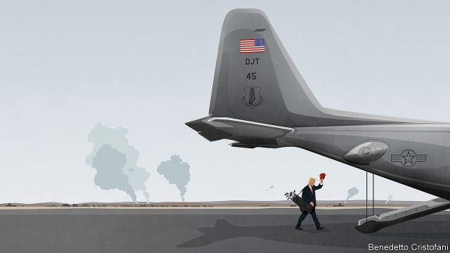

###### Who can trust Trump’s America?

# Donald Trump’s betrayal of the Kurds is a blow to America’s credibility 

 

> print-edition iconPrint edition | Leaders | Oct 17th 2019 

THE PITHIEST summary of Donald Trump’s foreign policy comes from the president himself. Referring to the mayhem he has uncorked in Syria, he tweeted: “I hope they all do great, we are 7,000 miles away!” Mr Trump imagines he can abandon an ally in a dangerous region without serious consequences for the United States. He is wrong. The betrayal of the Kurds will lead friends and foes to doubt Mr Trump’s America. That is something both Americans and the world should lament. 

His decision to pull out 1,000 American troops has rapidly destroyed the fragile truce in northern Syria (see article). The withdrawal created space for a Turkish assault on the Kurds that has so far cost hundreds of lives; at least 160,000 people have fled their homes. Hordes of Islamic State (IS) backers, once guarded by the Kurds, have escaped from internment camps. With nowhere else to turn, the Kurds have sought help from Bashar al-Assad, Syria’s blood-drenched despot, an enemy of America. 

Mr Trump campaigned on bringing troops home. He has argued that America must rid itself of “endless wars”. When he says Russia, Iran and Turkey can deal with the mess in Syria, many of his voters will agree. After almost two decades at war, they have tired of America acting as the world’s policeman. Some Democrats would like to pull troops out of the Middle East, too, including Elizabeth Warren, a leading contender to replace Mr Trump. 

However understandable the frustration, the thoughtless abandonment of the region would be self-defeating. It undermines America’s credibility around the world, which means that the United States will have to work harder and spend more to get its way on issues that are vital to its people’s prosperity and their way of life. 

Mr Trump’s exit from Syria fails the trust test on many levels. One is seriousness. The president seemingly neglected the briefing papers warning of the dire consequences of a power vacuum created by withdrawing the 1,000-strong tripwire force. The abruptness of the decision took nearly everyone by surprise, including his own officials. The Kurds were startled and appalled. British troops woke up to discover that their American brothers-in-arms were packing up. No one had time to prepare. 

The policy also fails on loyalty. Kurdish troops in Syria fought beside American special forces and air power to crush IS’s “caliphate”. Some 11,000 Kurdish fighters lost their lives; five Americans also perished. The superpower had fused its matchless intelligence-gathering with a local ally to drive out the world’s worst terrorists at a relatively modest cost in blood and treasure. 

Worst of all, the policy fails on strategy. Not just because of the potential revival of IS and the fillip to Mr Assad. But also because Iran, a bitter foe of America and ally of Mr Assad, will benefit from America’s withdrawal. Russians, too, are taking gleeful selfies in abandoned American bases. Vladimir Putin, Mr Assad’s backer, is claiming America’s mantle as the guarantor of order in the Middle East, a role the Soviet Union lost in the 1970s. In order to extract from Syria a small force that was sustaining few casualties, America has needlessly unleashed a new cross-border conflict, empowered its enemies and betrayed its friends. 

Alas, shallowness and impulsiveness have become the hallmarks of Mr Trump’s foreign policy. After Iran attacked an American drone, he blocked retaliation at the last minute; after Iran or its proxies attacked Saudi oil facilities last month, he stood back. As if superpower diplomacy was an extension of domestic politics, governed by the same hyperbole and showmanship, he has ditched painstakingly negotiated treaties, noisily launched trade wars and, in places such as Venezuela and North Korea, promised transformations that never seem to bear fruit. Mr Trump takes momentous decisions on a whim, without pondering the likely fallout or devising a coherent strategy to contain it. 

Mr Trump seems to think that he can use America’s titanic commercial clout as a substitute for hard power. Economic sanctions have become his answer to every problem—including that of Turkey’s invasion. Yet when vital interests are at stake, states rarely seem to give ground. Just as Russia still occupies Crimea, Nicolás Maduro runs Venezuela and Kim Jong Un has his nukes, so Turkey has vowed to fight on in Syria. As China’s economy develops, sanctions may also be a wasting asset. Even today, pressed by America to cut ties with Huawei, a Chinese telecoms giant, many countries are reluctant to comply. 

The Syrian debacle shows how all this could harm America. In Europe even before the assault, Turkey was at loggerheads with NATO over its purchase of Russian air-defence missiles. Because the invasion has led to sanctions and arms embargoes against Turkey, the cracks in NATO will only deepen. Mr Putin may be tempted to test America’s commitment to defending the Baltic states, tiny NATO allies on Russia’s border. In Asia the Taliban will redouble their efforts, reasoning that if Mr Trump can dump the Kurds, he can dump Afghanistan, too. China will take note, bide its time and steadily press its territorial claims against its neighbours. Taiwan, an admirable democracy, has just got a little less secure. Around the world, America’s allies—of which it still has more than any nation in history—will have more reason to arm themselves, possibly fuelling regional arms races. Will South Korea or Saudi Arabia, fearful of being abandoned, be tempted to acquire nuclear weapons to guard themselves from North Korea or Iran? 

Taken together, these concerns represent the unravelling of the order that America worked hard to build and sustain in the decades since the second world war, and from which it benefits in countless ways. If it pulled back it would still have to invest in arms and soldiers to protect its people and firms—and without so much support from allies. More important, distrust, once earned, could not be confined to military affairs. Other countries would be less keen to strike long-term trade deals with America. They would hesitate to join in countering Chinese industrial espionage or rule-breaking that harms the United States. Most important, America would undermine its own values. Human rights, democracy, dependability and fair dealing, however patchily honoured, are America’s most powerful weapon. If China and Russia had their way, might would be right. For the West, that would be a profoundly hostile world. ■ 

