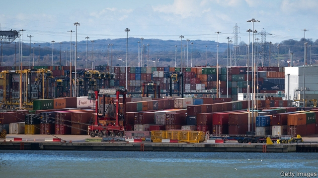
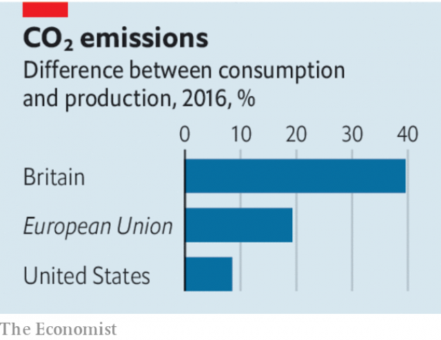

###### Carbon-reduction targets

# The right way to measure carbon emissions 

 

> print-edition iconPrint edition | Leaders | Oct 19th 2019 

SLOWLY BUT surely, climate change is taking a prominent place in the rich world’s political debates. Extinction Rebellion protests, backed by hedge-fund managers and barristers as well as students and celebrities, shut down parts of London for several days this month. The Green Party is now the second-most popular political force in Germany and the main opposition party. Some 57% of Americans, and 84% of self-declared Democrats, say climate change is a big threat. 

As public opinion shifts, politicians are reacting by adopting new policies. One of the most popular is to set targets to reach “net zero” carbon emissions within a defined geographical border. These targets have plenty going for them. They are easy to understand, galvanising and will spur countries to shift their energy mix towards renewables. They also have two drawbacks. One stems from the word “net”. Net zero means taking as much carbon dioxide out of the atmosphere as you put in, and this requires assumptions about as yet unproven ways of subtracting that carbon from the atmosphere. The more generous such assumptions are, the less emissions need to be cut. The other is that, because they ignore the impact of trade, such targets typically undercount the emissions for which rich countries are responsible. Countries and cities tackling climate change need to make their assumptions more transparent and take a more holistic view of their carbon footprint (see article). 

Around the world more than 60 countries and 100 cities have adopted, or promised to adopt, targets that will take them to net zero, typically by around 2050. The majority of the signatories are European countries, small island states, or rich cities or regions. This summer Britain and France became the first big economies to enshrine targets into law. The state of New York quickly followed. The idea is so popular that airports, shopping malls, offices and even rock concerts are rushing to join the club. 

 

But most net-zero targets refer only to the carbon produced within the target-setting entity’s borders. They exclude the carbon that is related to goods consumed there but produced elsewhere. When a Briton buys a smartphone made in a Chinese factory that is powered by a coal plant the carbon emitted in its manufacture does not count as “British”; the jet fuel that brings a South American guava to New York City is not counted as part of the Empire State’s emissions. 

If every country had a production-based net-zero target none of this would matter. At a global level, there is no difference between the carbon emissions that are produced and consumed. But so far targets have been set by economies that generate only a sixth of global GDP. The volume of carbon that slips through is huge—a quarter of all global emissions are tied to trade flows. And the gap between carbon consumption and production is especially big for rich economies that focus on services and import lots of manufactured goods. When consumption-based measures are used, Britain’s emissions jump by two-fifths. Imported emissions add a fifth to the European Union’s carbon count, and a tenth to America’s. If you measure them properly, emissions from big cities such as New York, London and Berlin double. 

What to do? The worst approach would be an indiscriminate backlash against cross-border commerce. This is because the carbon footprint of trade varies according to the provenance of individual products. For example, a medium-sized electric-car battery made in Sweden, which uses lots of renewable energy, emits 350kg of carbon dioxide. The same battery made in Poland, which relies on coal, emits over 8,000kg. The mode of transport matters, too—goods that are transported by aircraft are far dirtier than those carried on ships. 

Almost as bad would be simply to say that all the rich countries should promise to increase their putative negative emissions to match their carbon consumption. That would be fair in principle; but also a way to increase yet further the world’s reliance on the unproven technologies of carbon capture. 

The world needs to shift towards goods that have a cleaner footprint, regardless of where they are produced. That will require manufacturing hubs to shift away from dirty sources of fuel such as coal, and fewer goods to be transported by air. A range of policies could accelerate this shift. At the gentle end of the spectrum, better labelling could prod consumers to consider the carbon footprint of what they buy. At the tougher end, the EU is considering a climate tax on dirty goods it imports. Today’s net-zero targets are better than nothing. But if climate change is to be tackled, countries and consumers must take full responsibility for their carbon.■ 

