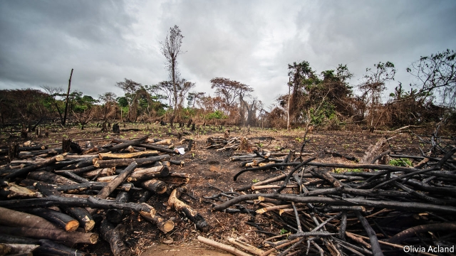
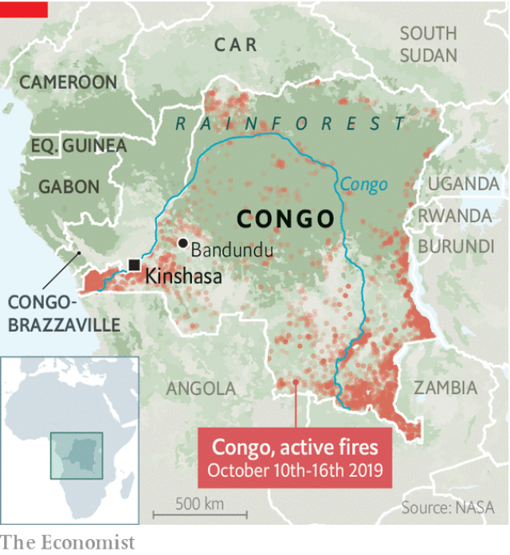

###### That shrinking feeling

# Congo’s enormous rainforest is getting smaller 

 

> print-edition iconPrint edition | Middle East and Africa | Oct 19th 2019 

JAGGED, CHARRED tree stumps jut out of blackened earth in what was once part of the rainforest in the Democratic Republic of Congo. One man, Rafael, standing amid the devastation, reckons he has set fire to around 40 sections of the forest near the city of Bandundu in the past two months. He bags the scorched wood and flogs it as charcoal in the capital, Kinshasa, some 250km away. Most of the city’s 12m residents, unable to afford gas or electric ovens, rely on charcoal for cooking. 

The Congo basin rainforest is the second biggest tropical forest in the world, after the Amazon. It stretches across six central African countries (though more than half its trees are in Congo). Its absorbent peatlands hold the equivalent of three years’ worth of global carbon emissions, mitigating global warming. But it is shrinking fast. Between 2001 and 2018 Congo lost 13m hectares of tree cover (around 6% of the entire rainforest), an area almost twice the size of Ireland. 

The charcoal trade is partly to blame. Most of Congo’s 85m people are poor. Entire villages subsist by selling burnt wood. The rainforest hugs the Congo river, so it is easy for sellers to pile charcoal onto boats and float it to Kinshasa. Farmers add to the problem. Over two-thirds of Congolese grow what they eat. Many chop down trees to make space for crops. The population is growing fast. More mouths will require more farmland—and less forest. 

At the United Nations General Assembly in September the president of Congo, Félix Tshisekedi, said he was committed to saving his country’s trees and asked for more money to do so. “Nature has made my country the depository of 47% of the continent’s forests,” he said. “It is incomprehensible that the forests of the Congo basin...capture only 1% of available financing.” 

But even if Mr Tshisekedi gets more money, he may not have the clout to fulfil his promises. The election that he “won” in December was widely deemed to have been rigged. He and his predecessor, Joseph Kabila, are now glued together by a secret power-sharing deal. Mr Kabila has allowed corruption to flourish. And he has done little to protect the forests. Shortly before leaving office he approved a contract that allows two companies to explore for oil in the peatlands. His government was also loose with logging permits. 

Mr Tshisekedi may face more scrutiny. “We’re watching him and we will remind him of his words at every possible occasion,” says Raoul Monsembula of Greenpeace, an environmental group. More of the world is watching, too. In August, as fears over fires in the Amazon grew, people began checking NASA’s satellite maps and noticed that there were even more conflagrations in central Africa. 

In central Africa, though, fires in August are common, as farmers burn their fields to make way for new crops. Most of the fires appear to have been lit on purpose in savannah, outside of the rainforest. They were much smaller than those in the Amazon, which spread quickly into sensitive areas. Congo’s rainforest is damp enough to stop blazes from tearing through it. 

There are far fewer fires now in Congo (see map), but worries remain. As clusters of trees disappear and dry patches take their place, the risk of big fires increases. Hunters often burn grass to trap animals at the edge of the forest. These blazes can grow out of control. “There is no mechanism to stop those fires from taking down the forests,” says Don Madikani, an environmental expert working for the Congolese government. “We don’t have the technology to fight them.” 

 

Using fires to hunt is forbidden, as is chopping down trees for charcoal without a licence. But both are common. Congo is enormous and its police are corrupt. The enforcement of forestry laws is lax. All along the muddy road from Bandundu to Kinshasa there are pockets of smoke and burnt trees. Tarpaulin bags filled with charcoal line the roadside. Until more jobs are created and governance improves, Congo’s trees will continue to go up in smoke. ■ 

