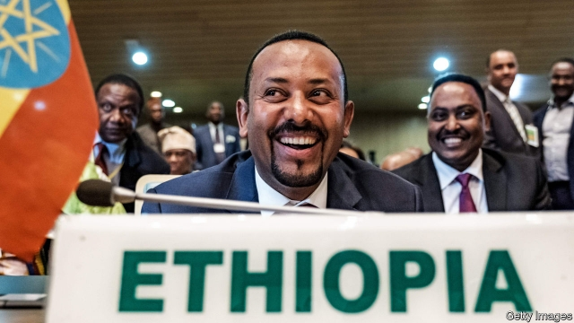

###### A dilemma in the Horn

# Did Ethiopia’s premier deserve the Nobel peace prize? 

 

> print-edition iconPrint edition | Middle East and Africa | Oct 19th 2019 

THERE ARE two types of Nobel peace-prize winner. The uncontroversial ones are often campaigners, such as Nadia Murad (who won last year for her work highlighting rape during war) or the Organisation for the Prohibition of Chemical Weapons (which won in 2013). The controversial ones are often the politicians who actually negotiate peace deals—think of Yasser Arafat or F.W. de Klerk. Politics in violent places is a nasty, messy affair, and peace deals don’t always last. The award of the prize on October 11th to Abiy Ahmed, Ethiopia’s prime minister, will spark more debate than most. 

On the plus side, Abiy has tried hard to be a unifier since he took office last year. He often uses the Amharic word medemer (to add together) in speeches. Millions of Ethiopians have welcomed his promises of democracy, reconciliation and reform in a country that had long been oppressed. 

In June 2018 he signed a historic peace deal with Eritrea, a smaller neighbour that seceded from Ethiopia in 1993. The accord brought to a close two decades of pointless conflict over a scrap of barren land. The war had led to tens of thousands of deaths, ripped apart families and severed the deep ties of blood, culture and language between the two countries. 

Abiy broke the deadlock by promising to withdraw from the disputed territories, thus implementing the findings of a UN commission that Ethiopia had long rejected. He also took advantage of his close relationship with Saudi Arabia and the United Arab Emirates, whose financial largesse may have helped nudge Issaias Afwerki, Eritrea’s president, to the table. After the agreement, families and friends were reunited and cross-border trade flourished. 

Berit Reiss-Andersen, the Nobel committee’s chair, said the prize recognised Abiy’s “efforts to achieve peace and international co-operation, and in particular his decisive initiative to resolve the border conflict with neighbouring Eritrea.” He has also been praised for helping to mediate a power-sharing accord between pro-democracy protesters and a military junta that took power earlier this year in Sudan. 

But the peace he forged with Eritrea is far from complete. Earlier this year Eritrea once again closed all its border crossings with Ethiopia. A trade agreement drafted by Ethiopian negotiators has gathered dust in the Eritrean capital, Asmara, for almost a year. Physical demarcation of the border, the trickiest part of the deal, has not begun. 

The lack of progress highlights some of Abiy’s shortcomings as a peace-broker. Ahmed Soliman of Chatham House, a think-tank in London, notes his reliance on “charm and bold personal initiatives” at the expense of institutions. He bypassed Ethiopia’s foreign ministry to strike his deal with Issaias (the details of which were never made public). And his attempts to foster goodwill between Kenya and Somalia, at odds over their maritime border, as well as between warring factions in South Sudan, have yet to show results. 

The prime minister’s record as a peacemaker in Ethiopia is also mixed. He has released political prisoners and promised fair elections. But he has failed to keep order. In 2018 almost 3m Ethiopians were forced from their homes by ethnic conflict. The causes were complex and many of the tensions long predate his term in office. But his government was slow to react, and at times appeared more concerned with its public image than with tackling the spiralling humanitarian crisis in the country’s south. For several months it blocked aid from reaching homeless shelters, and forced people to return against their will to areas that were not yet safe. This contributed to more violence, as well as starvation. 

The Nobel prize will be a boost for the prime minister, who faces a national election next year. “At home we’re always squabbling, but when it comes to the outside world, we’ll stand with any Ethiopian,” says a resident of the capital, Addis Ababa. Abel Abate Demissie, a political analyst, suggests that international recognition might keep Abiy honest, especially as his administration shows signs of reverting to the authoritarian tactics of its predecessor. “Hopefully, it will encourage him to live up to the prize,” he says. “He knows all eyes will be on him now.” ■ 

