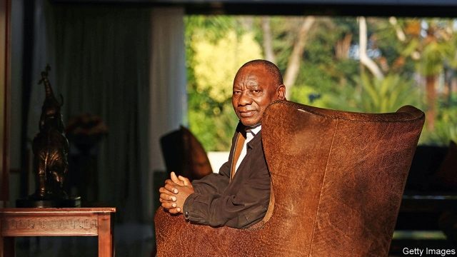
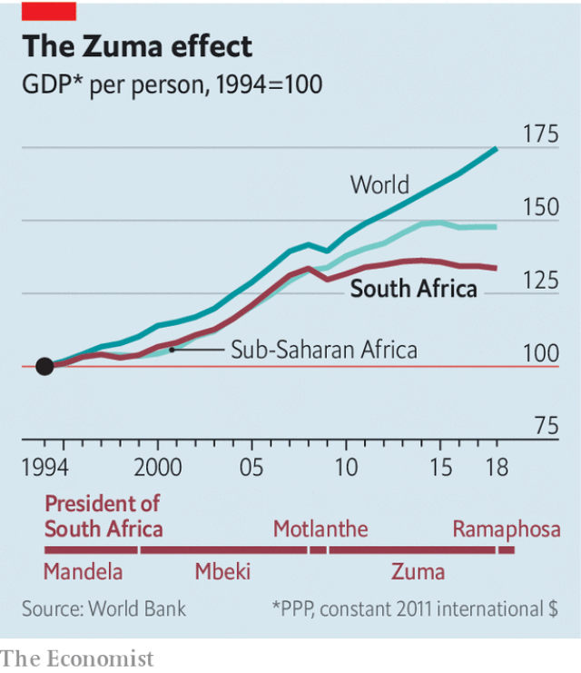

###### Cleaning up the rainbow nation

# South Africa’s president promises big results—eventually 

 

> print-edition iconPrint edition | Middle East and Africa | Oct 19th 2019 

SOUTH AFRICANS are growing impatient with Cyril Ramaphosa, the former union boss, anti-apartheid activist and tycoon who is now their president. In his 20 months in office, no one has been prosecuted for the looting of the state that took place under his predecessor, Jacob Zuma. In an interview with The Economist in London on October 13th, Mr Ramaphosa gave a message to his critics. And it involves a rip-roaring second-world-war film. 

In “Force 10 from Navarone”, explains Mr Ramaphosa, British commandos try to blow up a dam so that the water will sweep away a bridge that the Nazis want to use. When the explosives go off, nothing happens. The commandos are furious. “It didn’t work!” they say. But the explosives expert tells them to wait. The dam is damaged and will soon collapse, he says. Once the fuse has been lit, there is no going back. 

For Mr Ramaphosa that fuse is the National Prosecuting Authority of South Africa, one of several institutions he has sought to revive after their evisceration by Mr Zuma. The spectacular results people want may take time, but the process Mr Ramaphosa has set in motion “is irrevocable”, he says. Arrests will happen. 

A big bang is also what is needed in the economy. It has a long list of structural problems. These include a lack of competition, a low savings rate, lousy schools and cities where poor people can spend hours—and 40% of their pay—getting to work. Then came Mr Zuma. During his reign GDP per head barely grew (see chart). Public debt as a share of GDP doubled from 28% to 56%. Erratic policies put off investors. Africa’s most industrialised economy became one of its most sluggish. 

 

Under Mr Ramaphosa there has, as yet, been little sign of improvement. GDP growth has been negative in three of the past six quarters. The official unemployment rate has risen to 29%—even higher than under his predecessor. Eskom, the state-run electricity company, has spiralling debts equivalent to 8.5% of GDP and remains insolvent and unreformed. 

The next few weeks will help determine whether Mr Ramaphosa can turn things around. A “growth strategy” is expected soon and a budget is due on October 30th. Both are urgent. In November Moody’s will decide whether to become the third big credit-rating agency to downgrade the country’s debt to “junk” status. That would force some bondholders to sell off their holdings, weakening the South African rand and delivering a blow to the president. 

On August 27th, in an effort to nudge the president, his finance minister, Tito Mboweni, published a 77-page paper on the National Treasury website, replete with sensible ideas. If implemented they could bring the country closer to the 4-5% growth rate required to dent its horrifically high unemployment. So how many of Mr Mboweni’s suggestions does Mr Ramaphosa endorse? 

“I endorse all of them,” says the president. Does that include some of the more controversial ideas, such as on migration? South Africa needs more skilled workers, yet it is all but impossible for foreign graduates or entrepreneurs to move there in search of work. Will he liberalise the visa rules so that there is an open-door policy for migrants with degrees? “Absolutely,” says Mr Ramaphosa, citing the benefits enterprising migrants have brought to Silicon Valley. “That’s precisely what we need.” 

Another pressing area for reform is Eskom. It would help, for example, if municipalities paid their electricity bills. Many currently do not. Soweto, a township on the outskirts of Johannesburg, owes Eskom about 18bn rand ($1.2bn). Mr Ramaphosa explains that non-payment stems partly from the era of apartheid when, as a union leader, he called for rent boycotts. “But now I’m saying the war is over, the struggle is over, we’ve now got to pay our way.” 

Having people pay their bills is just one step towards putting Eskom on a sound financial footing. Another idea mooted by Mr Mboweni is to sell off power stations. Here Mr Ramaphosa is more cautious. There is “no way” that he would sell some of the new plants, but he would welcome buyers for old ones, so as to extend their lives. Even then, though, buyers would have to pledge that communities in coal-rich areas receive a “just transition”. 

This sounds like classic Ramaphosism: reform, but only up to a point, and after a lot of jaw-jaw. He endorses Mr Mboweni’s tough ideas, but there is a crucial qualification: “Of course you can’t implement them all in one go.” So how determined is he really? Is he willing to pursue changes where there will be losers as well as winners? 

“I prefer win-win solutions,” says Mr Ramaphosa, “but of course there comes a time when there will be losers along the way.” He believes that the skills he honed as one of the negotiators who ended apartheid will help ensure that “everyone rises from the table thinking they are a winner.” 

But what about the people not at the table? The unemployed, say, or the pupils taught by one of the 80% of maths teachers who cannot do sums expected of 12- and 13-year-olds? How can South Africa have a good education system without reducing the power of the teaching unions, or create new jobs for the unemployed when the government is more concerned with preserving the pay of unionised workers? 

Here the president says that he is trying to sway his “allies” in the unions. He likens the situation to having a rotten toe from diabetes: it is sad to lose it, but it would be worse to lose a leg. “It could well mean that your whole leg and your whole life could be at risk. You have to make choices.” 

“So when is Dr Ramaphosa going to operate?” asks your correspondent. The president guffaws. “People are asking when the operation…,” he begins, before wisely deciding against continuing with the metaphor. He knows South Africans want action, whether on Eskom or prosecutions. “People are asking when are you going to arrest people? When are you going to put people into jail?” But it is not his job to arrest people, he argues. It is to “strengthen the institutions that must do their work”. 

Will they be able to go after powerful people, such as Ace Magashule, the secretary-general of the ruling party, who has been accused of corruption? “Once the institutions are strengthened, they should be able to go after anybody—including the president,’’ says Mr Ramaphosa. And they must be allowed to do so “without fear, favour or prejudice”. 

Nelson Mandela reportedly wanted Mr Ramaphosa to succeed him two decades ago, but his party chose Thabo Mbeki instead. Does Mr Ramaphosa wish he had got the top job sooner? “It’s a difficult one. It’s a tough job...being the president of South Africa at this time...I wish I had come in when the economy was better.” South Africans are hoping that it is better late than never. If their cautiously reforming president stumbles, the crooks who captured so much of the state under his predecessor might grab it again. ■ 

