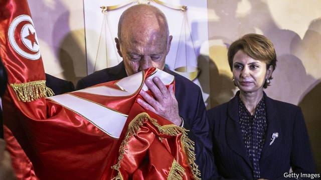

###### A new hope

# The election of Kais Saied gives Tunisians something to cheer 

 

> print-edition iconPrint edition | Middle East and Africa | Oct 17th 2019 

IT HAS BEEN a difficult eight years since Tunisia toppled its dictator and embraced democracy in 2011. The economy remains stagnant, corruption is still endemic, terrorism is a problem and politicians have disappointed. But the election of Kais Saied (pictured) as president on October 13th has brought a new sense of hope. After it became clear that Mr Saied had won, thousands of Tunisians gathered in the capital, many chanting the same slogans from eight years earlier. Mr Saied himself hailed his victory as a “new revolution”. 

What that revolution will look like is hard to say. In both style and substance, Mr Saied defies easy political labels. The 61-year-old retired law professor was an awkward campaigner, delivering stiff speeches in formal Arabic. He says homosexuality is “an illness and foreign plot” and opposes equal inheritance for men and women. He also calls for radical changes to the democratic system. He has no political party, yet he won the backing of secular and left-wing groups, as well as Ennahda, a moderate Islamist party, which came top in the parliamentary election on October 6th. 

Mr Saied trounced Nabil Karoui, a fiery businessman who ran a populist campaign aimed at the poor. That two political outsiders made it to the final round, over many more familiar faces, was a rebuke of the political elite. But many voters considered Mr Karoui, who is facing corruption charges, an opportunist. Mr Saied, by contrast, was seen as a monastic figure who will root out corruption and take on the establishment. He spent little on his campaign, yet he won 73% of the vote, including 90% of 18- to 25-year-olds, according to Sigma Conseil, a pollster. Nearly a third of his supporters did not vote in the parliamentary election. 

The president-elect’s boldest proposal would do away with such elections. Instead, he says, Tunisians should elect local councillors, based on their character, not their ideology. These officials would pick regional representatives who would in turn choose members of a national assembly. “Power must belong to people directly,” says Mr Saied of his indirect-voting plan. Many like the idea of giving more power to local communities. But Mr Saied would need to convince two-thirds of parliament to alter the constitution. That is unlikely. 

The parliamentary election produced a divided legislature, with some 20 parties represented. Ennahda won 52 of the 219 seats (down from 69 in 2014). Mr Karoui’s new party, Qalb Tounes, came second with 38. Nidaa Tounes (NT), the former ruling party, was nearly wiped out. Beset by infighting, many of its leading members started new parties. It was also hit by the death of its founder, Beji Caid Essebsi, Tunisia’s first democratically elected president, in July. As a result, NT won just three seats, down from 86 in 2014. 

Ennahda will have the first opportunity to name a prime minister, who will then have two months to form a government. The coalition talks will probably be long and hard. Mr Saied may benefit from any bickering. The president usually has less say over policy than the prime minister, but Mr Saied received more votes than all MPs combined. His mandate is enormous. 

So are the challenges he faces. The unemployment rate is about 15%. The government is up to its eyes in debt. The IMF wants it to show a little fiscal restraint, while the people want it to provide more jobs. Their faith in democracy is ebbing. But the election of Mr Saied shows that they have not given up on the system. They just want someone to clean it out. ■ 

