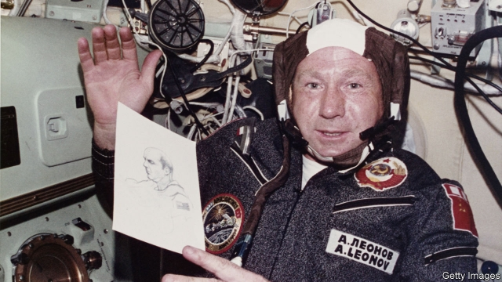

###### The blue of Earth

# Obituary: Alexei Leonov died on October 11th 

 

> print-edition iconPrint edition | Obituary | Oct 19th 2019 

CLIMBING FROM the open airlock of Voskhod-2, Alexei Leonov felt quite calm. He was cool-headed, focused. This often disappointed people. “What!” they would exclaim. “The door into the universe had been opened, and you felt nothing?” They forgot that he had been through all that training at the Star City cosmonaut school, jumping into deep water, acrobatics, and the rest. They forgot that his head was full of data and instructions. All the same, as he released one hand, then one foot, then the whole of him, until only a 5.5-metre rope held him to the world of men, he could feel a smile starting on his face and spreading. He was calm mostly because he was enthralled. He spread his bulky suited arms, kicked his legs and floated, free. In the silence he could hear only his heartbeat and his heavy breathing. Stars were all around him against a coal-black sky. They did not blink. 

Below him, 500km below, lay the Black Sea. He knew it well, not only as a Russian patriot, but because he had visited its shores dozens of times. Now, on March 18th 1965, he saw it whole, gun-metal grey, with a tiny dot of a ship on it that seemed caught from all sides in a flow of light. He too was a dot, a grain of sand in the near-blinding dazzle of the unobscured sun. It came through his visor like a welder’s torch. He saw the Earth revolve, the only moving thing apart from himself. What struck him most forcibly was how round it was, how beautiful, and how blue. 

His reverie ended in near-disaster. In the vacuum of space his space suit expanded, until he could not get back into the craft without bleeding it of oxygen. Moreover, in minutes, the craft’s orbit would take it into total darkness. Training kicked in; he kept his nerve and at last, drenched in sweat, tumbled head-first back through the airlock. Then the craft’s re-entry went wrong. The guidance system failed and they had to steer manually, bumping down in a snowy forest 1,600km from the landing site. They waited two nights to be rescued, wondering whether bears or wolves would get them first. Yet the elation did not leave him. Partly this was because the mishaps were officially hushed up, leaving only his triumph. And there were other reasons. 

First, he had survived. Astonishingly, he always did when danger felt his collar. His car flipped over on a frozen lake, and he didn’t drown. In 1969 he got caught in a hail of bullets when he was riding in a motorcade behind Leonid Brezhnev, then Soviet leader; four passed through his coat, but not through him. In 1971 he was bumped from the Soyuz 11 flight to the Salyut 1 space station, and was furious, but the craft opened prematurely on re-entry, and the crew died. The space-walk was another brush with annihilation from which he emerged, just about, in one piece. 

It had also affected him in a particular way. He had gone on this mission not just as a cosmonaut, but as an artist, self-taught from childhood, when he had painted pictures on the white stoves of his neighbours in the remote Siberian village where his parents farmed. A passion to be a fighter pilot, then a cosmonaut, diverted him from that, but he preserved his insatiable love of looking at things. Whether it was odd alleyways in a town, or random birds and mushrooms on a hunting trip, he was always lagging behind, appreciating them. One of his pilot-training photos showed him, in full uniform, lying in a clover field to gaze tenderly at a stem of flowering grass. Now he had seen the colours of space. 

He had prepared for it, he thought, taking a sketch pad and crayons onto Voskhod-2. Yet nothing could have prepared him. There were so many more colours than on Earth, and so much brighter. Onboard he sketched the sunrise, with its astonishing sharp luminescence of red, green and yellow against the black and the blue. When Yuri Gagarin, the first man in space and his best friend from cosmonaut training, the short handsome foil to his tall, fair, bland-faced self, came on the radio during the walk to ask how “Artist” was, he simply said: “I can see so very much.” 

Undoubtedly he had to mention that blue if, as he hoped, he spoke to Earth as the first man standing on the Moon. He trained hard for that, mostly by using helicopters as mock lunar-landing craft, but the Soviet plans struck him as downright dangerous. In any case, in the space race that consumed the world’s two great powers for almost two decades, the Americans nosed past in 1969 with the Apollo 11 landing. He watched it, one of the few Russians allowed to, his heart pounding with anxiety for the crew. Six years later, during a brief thaw in the cold war, he found himself training in Houston with Americans, larking around in a Stetson like a cowboy. On the joint Soyuz-Apollo Test Project that followed he and Tom Stafford bear-hugged in the docking tunnel between their craft, the first international handshake in space. Later he and his new friends, whom he kept for life, drank each other’s health in borscht which he had led them to believe was vodka. Space was not a place where men should be anything but brothers. 

Whenever he had time, from his first training into his retirement, he painted at his easel. Two subjects in particular he kept returning to. One was the air crash in 1968 that killed Gagarin, which he later officially investigated. He had been among the first to get to that awful scene of wreckage and snow, with the tops of the birch trees torn off by the impact. He had had to identify his friend’s body. Death had never seemed closer, or so terrible. 

Yet so far as there could be comfort, it came from his other constant subject, his walk in space. Beside the lovingly rendered module he floated again, sometimes with his hands out like an explorer, sometimes simply swimming, with his tether slack around him. Beyond him the sun blazed, a spotlight with a star’s red aura round it; behind and below him lay Earth’s blue. It was straight-out-of-the-tube blue, improbably bright. But that was what he had seen—and seen directly, out in empty space. ■ 

