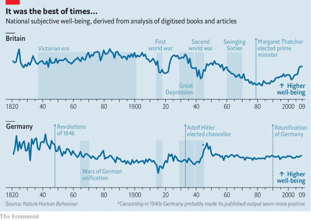

###### Happiness and history

# How to reveal a country’s sense, over the years, of its own well-being 

> print-edition iconPrint edition | Science and technology | Oct 19th 2019 

 

DO A COUNTRY’S inhabitants get happier as it gets richer? Most governments seem to believe so, given their relentless focus on increasing GDP year by year. Reliable, long-term evidence linking wealth and happiness is, however, lacking. And measuring well-being is itself fraught with problems, since it often relies on surveys that ask participants to assess their own levels of happiness subjectively. 

Daniel Sgroi of the University of Warwick and Eugenio Proto of the University of Glasgow, both in Britain, think, nevertheless, that they have an answer. By examining millions of books and newspaper articles published since 1820 in four countries (America, Britain, Germany and Italy), they have developed what they hope is an objective measure of each place’s historical happiness. And their answer is that wealth does bring happiness, but some other things bring more of it. 

Previous research has shown that people’s underlying levels of happiness are reflected in what they say or write. Dr Sgroi and Dr Proto therefore consulted newspaper archives and Google Books, a collection of more than 8m titles that constitute around 6% of all books physically published. They searched these texts for words that had been assigned a psychological “valence”—a value representing how emotionally positive or negative a word is—while controlling for the changing meanings of words such as “gay” and “awful” (which once most commonly meant “to inspire awe”). The result is the National Valence Index, published this week in Nature Human Behaviour. 

Placed alongside the timeline of history (see chart), the valence indices for the places under study show how changes in national happiness reflect important events. In Britain, for example, happiness fell sharply during the two world wars. It began to rise again after 1945, peaked in 1950, and then fell gradually, including through the so-called Swinging Sixties, until it reached a nadir around 1980. 

America’s national happiness, too, fell during the world wars. It also fell in the 1860s, during and after the country’s civil war. The lowest point of all came in 1975, at the end of a long decline during the Vietnam war, with the fall of Saigon and America’s humiliating defeat. 

In Germany and Italy the first world war also caused dips in happiness. By contrast, during the second world war these countries both got happier as the war continued. Initially, that might be put down to their early successes, but this can hardly explain German happiness when the Red Army was at the gates of Berlin. The researchers hypothesise that what is being measured here is the result of propaganda and censorship, rather than honest opinion. But they cannot prove this. Earlier in Italian history, though, there was a clear and explicable crash in happiness in 1848, with the failure of revolutions intended to unite into a single nation what were then half a dozen disparate states. Surprisingly, however, successful unification in the 1860s also saw a fall in happiness. 

As to wealth, the steady progress of the Victorian period matched a steady increase in British happiness, as did the economic boom of the 1920s, which also lifted American spirits. Both countries’ spirits fell again in the Great Depression that followed the stockmarket crash of 1929. After the lows of the 1970s, though, happiness in both has been on the rise ever since. 

Overall, then, Dr Sgroi and Dr Proto found that happiness does vary with GDP. But the effect of health and life expectancy, which does not have the episodic quality of booms, busts and armed conflict, is larger, even when the tendency of wealth to improve health is taken into account. A one-year increase in longevity, for example, has the same effect on national happiness as a 4.3% increase in GDP. And, as the grand historical sweep suggests, it is warfare that causes the biggest drops in happiness. On average it takes a 30% increase in GDP to raise happiness by the amount that a year of war causes it to fall. The upshot appears to be that, while increasing national income is important to happiness, it is not as important as ensuring the population is healthy and avoiding conflict. ■ 

