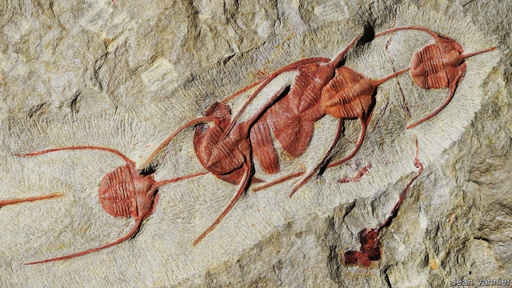

###### Palaeontology

# Trilobites marched across the seabed in single file 

 

> print-edition iconPrint edition | Science and technology | Oct 19th 2019 

TRILOBITES ARE long-extinct, but they lasted for 270m years and dominated the sea floor for the first 150m years of that span. In their heyday they developed many exotic features including, in some species, long spines. One such spine-wearer was Ampyx priscus, which thrived 480m years ago, during the Ordovician period. What the spines were for had been a mystery. But this photograph and others like it, published in Scientific Reports by Jean Vannier of the University of Lyon, France, suggest the mystery is solved. Ampyx priscus, it seems, sometimes traversed the seabed in marching columns, with the spikes helping the animals to keep in contact with one another. These days, spiny lobsters form similar columns, maintaining contact by resting their long antennae on the animal in front, when they are migrating to and from the deep waters where they overwinter to escape the cold. What propelled Ampyx priscus to migrate remains a mystery.■ 

