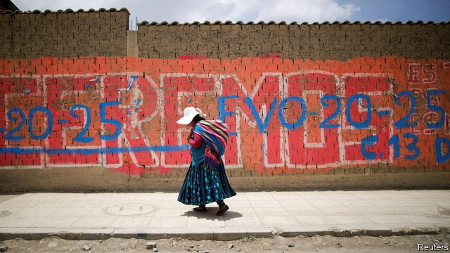

###### Morales’ hazard

# Bolivia’s Evo Morales faces his toughest re-election battle yet 

 

> print-edition iconPrint edition | The Americas | Oct 19th 2019 

“BOLIVIA IS AN insurrectionary nation,” declares Norma Berno, a tiny woman with piercing eyes at a “rally for democracy” on October 10th in La Paz, the administrative capital. In the early 2000s she demonstrated in favour of nationalising Bolivia’s large gas reserves, a cause whose popularity paved the way for Evo Morales, a coca farmer and union organiser, to become the country’s first indigenous president in 2006. 

Now some insurrectionists are turning against him. At the democracy rally, held on the 37th anniversary of the end of military dictatorship, Ms Berno joined tens of thousands of demonstrators in Plaza San Francisco to toot vuvuzelas and hurl insults at the absent president. Among her chief complaints are the poor quality of public services, the lack of formal jobs and the president’s decision to run for a fourth term, in defiance of the constitution and a referendum vote in 2016. “I thought he was going to change the country for the better,” she says. “I was wrong.” 

Mr Morales has certainly brought change. Profits from exports of gas, which he nationalised at the start of a global commodities boom, were redistributed to the poor. Since he came to power, the share of the population living on less than $1.90 a day has dropped by two-thirds, to 6%, according to the World Bank. A new constitution expanded the rights of indigenous people, who make up perhaps half of the population. Women now occupy half the seats in congress. The government built highways, airports and teleféricos, cable cars that criss-cross La Paz. Eli, an indigenous woman selling anti-government flags at the democracy rally, is grateful, despite the message on her wares. She says the teleféricos—and the government’s leniency towards vendors selling smuggled goods—allow her to eke out a living. 

The president is counting on voters like her to re-elect him on October 20th, when legislative elections will also be held. He won the past three elections with more than half the vote in the first round. His Movement to Socialism (MAS) has a majority in congress. Now polls suggest he may not meet the threshold needed to avoid a runoff, which would be held on December 15th: 40% with a ten-point lead over his nearest rival. 

His defeat would be catastrophic for Bolivia, says the vice-president, Álvaro García Linera. He calls the president “a weaver” of different social, regional and economic groups. “The absence of Evo would generate a kind of social dismemberment and convulsions that are characteristic of Bolivia’s history,” he says. 

His absence is now thinkable for a mix of reasons. Many Bolivians take their prosperity for granted. That prosperity is now under threat. Above all, many worry that Mr Morales aims to make himself president for life. He is “the path toward authoritarianism, and we are the path toward democracy,” says his leading challenger, Carlos Mesa, a bookish former president. 

Bolivia’s economy has grown by an average of nearly 5% a year since 2006. Unlike left-wing presidents in Argentina, Brazil and Ecuador (see Bello), Mr Morales did not indulge in the sort of spending binge that results in brief euphoria followed by inflation and recession. “We’re responsible not because the IMF tells us to be, but because inflation attacks the poor the hardest,” says Luis Arce, the economy minister. Growth has remained strong in Mr Morales’s current term (see chart). 

 

But his magic is losing potency. Income from gas exports has dropped. The fiscal deficit this year will be nearly 8% of GDP. The government trumpets a plan, called Agenda Patriótica, to encourage private investment in industries such as plastics and lithium batteries. But the state still invests more than the private sector. “Bolivia wants to join the first industrial revolution, but the world is already on the fourth or fifth,” says Gonzalo Chávez, an economist at the Catholic University in La Paz. 

A push to expand soya and beef production to feed demand from China encouraged farmers to burn swathes of the Bolivian Amazon. Since August these fires have destroyed 5m hectares (12m acres) of forest, an area larger than Costa Rica. This contributed to indigenous voters’ disenchantment. Scores of protesters walked 450km (280 miles) from Chiquitania, a region in eastern Bolivia, to Santa Cruz, the country’s agricultural hub. Joaquín Orellana, one of their leaders, credits the president for forcing elites “to take us into account”. But, “he has abandoned us now.” 

He could hold on to power despite voters’ disappointment. In part that is because the opposition is fragmented and lacklustre. Mr Mesa, his main opponent, is little known in remote rural areas. “He has barely gone out in public in the past eight months,” gripes a member of his inner circle. Mr Morales’s ever tighter grip on the state and other institutions adds to his advantage. He has the backing of trade unions and uses government advertising to boss the media. The judiciary does his bidding. Billboards with the president’s image, paid for by the government, are ubiquitous. In recent weeks it has been handing out free food, computers, ovens and even tractors across the country. 

International monitors will watch Bolivia’s vote, so widespread fraud is unlikely. But that does not mean it will be fair. The members of the electoral court are loyal to Mr Morales. They recently banned publication of a poll that showed him with only a narrow lead over Mr Mesa. Supporters of both the president and opposition candidates have promised to take to the streets if they lose. “I’m worried about the day after the elections,” the German ambassador, Stefan Duppel, told the Bolivian press. The MAS is likely to lose its absolute majority in congress. If the president is re-elected, he will find it harder to govern. Ms Berno would welcome an end to his monopoly of power. “Bolivia is no longer a bastion of Evo Morales,” she says. “We’re sick of him.”■ 

