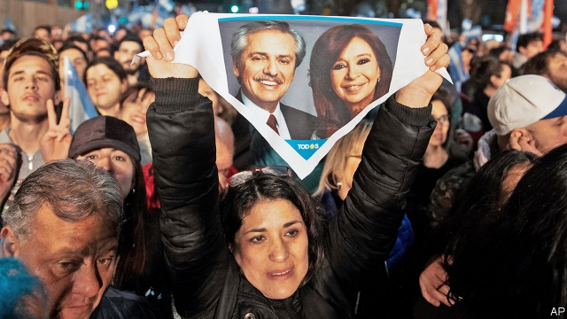
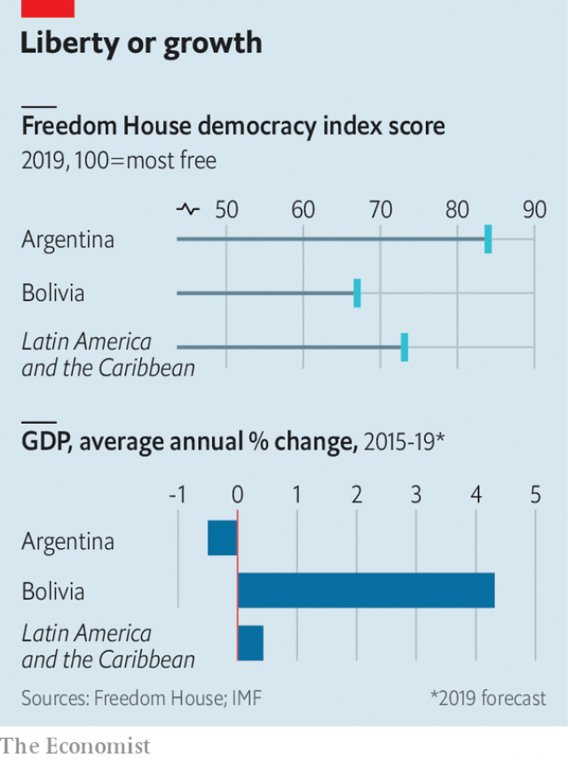

###### Practising Peronology

# If the Peronists win in Argentina, which Fernández will be in charge? 

 

> print-edition iconPrint edition | The Americas | Oct 19th 2019 

TRES DE FEBRERO, a grimy industrial suburb of Buenos Aires, is named for the date of a battle that took place nearby in 1852. The victorious general, Justo José de Urquiza, went on to promulgate Argentina’s federalist constitution. Today the district is a battleground in a national election whose result could be nearly as momentous. It pits President Mauricio Macri, a reformer who has failed to modernise Argentina’s economy, against Alberto Fernández, whose Peronist movement is the reason the country needs so much reform. 

In 2015 Tres de Febrero voted for Mr Macri, helping end 14 years of Peronist rule in Argentina. But his mistakes helped bring about a recession, an inflation rate of more than 50% and a $57bn bail-out agreement with the IMF, the fund’s largest ever (see chart). Argentina’s poverty rate of 35.4% is its highest in more than a decade. Now voters in Tres de Febrero are swinging back to the Peronists. “I voted for Macri, but not again,” says Carlos, a worker at a biscuit factory. “After four years I can barely pay my bills or feed my family.” He backs Mr Fernández, who has a commanding lead in the polls nationwide. Mr Fernández could win in the first round of voting, scheduled for October 27th. 

What stirs hope in Tres de Febrero inspires fear in the financial markets and much of Argentina’s middle class. That is largely because Mr Fernández’s running-mate is Cristina Fernández de Kirchner (no relation), who preceded Mr Macri as president and created the economic mess that he tried, but failed, to clean up. During her eight-year presidency, she vastly increased welfare, subsidies and public employment. She warred with foreign creditors and hobbled exporters with high taxes and an overvalued exchange rate. Her tenure ended with a stalled economy, a fiscal deficit of 5.9% of GDP and high inflation. 

 

Memories of that era spooked the financial markets on August 11th, when Mr Fernández decisively won a primary vote that is considered to be a dress rehearsal for the election. The peso plunged by 25% against the dollar, propelling inflation higher. Most Argentina-watchers assume that Mr Fernández will win the presidential election. Their main question is whether he will bring back kirchnerismo—Ms Fernández’s left-wing sort of Peronism—or plot his own, more moderate course. 

He fulminates against Mr Macri’s “neoliberal” policies, including the IMF agreement, while reassuring voters that he is not like his divisive running-mate. The coalition he leads is called Frente de Todos (Front for All). “Alberto is a bridge-builder, always looking for dialogue rather than confrontation,” says Jorge Argüello, a former diplomat who has known him since university days. Once a goalkeeper on a university football team, Mr Fernández portrays himself in television ads as a seasoned crisis manager and a regular guy, who loves playing catch with his collie, Dylan. As chief of staff for the late Néstor Kirchner, who was Ms Fernández’s husband and preceded her as president, he oversaw negotiations with the IMF and creditors after the country defaulted in 2001. Mr Fernández is “totally non-ideological”, says Federico Sturzenegger, who was a central-bank governor under Mr Macri. 

But will he be in charge? According to a recent poll, more Argentines believe that Ms Fernández, rather than Mr Fernández, would be de facto leader of the government, were they victorious. To counter that impression, other than in places where she remains popular, the Peronist campaign has kept her out of the limelight. 

Some Peronologists think her only ambitions now are personal, not political. She faces prosecution in half a dozen corruption cases. Because she is now a senator, she cannot be sent to prison; as vice-president, she might hope for a pardon. Her frequent visits to Cuba are probably not motivated by ideology: her daughter is undergoing medical treatment there. 

But Ms Fernández’s alignment with the movement’s left wing suggests that, should she be in effective charge, the consequences would be more than personal. One of the left’s most powerful organisations is La Cámpora, a Peronist youth group with cells throughout the country, which was founded by her son, Máximo Kirchner. The Peronist candidate for mayor in Tres de Febrero, Juan Debandi, is a member. In the next congress, which will also be chosen on October 27th, perhaps 40 deputies in the 257-seat lower house will be from Ms Fernández’s wing of Peronism. The views of La Cámpora will prevail, predicts a gloomy businessman. If that happens, hyperinflation will be a “high probability”. 

To avoid bending to the Peronist left Mr Fernández is expected to seek alliances with Peronist governors, most of whom have no sympathy for La Cámpora, and perhaps with Mr Macri’s defeated coalition, Juntos por el Cambio (Together for Change). Sergio Berensztein, a political consultant, thinks Mr Fernández could form a “government of national unity” with the opposition. 

His government would probably be less radical than Ms Fernández’s was, but less reformist than Mr Macri had hoped his would be. It would seek a revised agreement with the IMF. It would probably need a more aggressive rescheduling of Argentina’s debt than Mr Macri has proposed. It would try to control the budget deficit, in part by omitting to raise pension benefits in line with past inflation, and to forge a “social pact” with unions and businesses to help contain inflation. Mr Fernández would be friendlier than was Ms Fernández to exports, which should get a boost from the peso’s devaluation. Another win could come from fast-rising production from the Vaca Muerta shale oil and gas deposits in northern Patagonia. Mr Berensztein thinks Mr Fernández would “do the minimum reforms to get the country going”. 

But he might not do much more. He has given little sign that he means to overhaul an overgrown state that undermines the productivity of its citizens and enterprises. His coolness towards a trade accord agreed in June by Mercosur, a trade bloc dominated by Brazil and Argentina, with the European Union is discouraging. The agreement, if ratified, could be a “total game shifter”, says Mr Sturzenegger. To win its battles, Argentina needs to compete. ■ 

