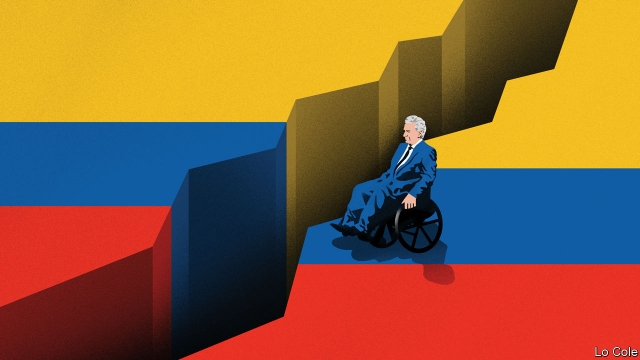

###### Bello

# The cost of Ecuador’s surrender on fuel subsidies 

 

> print-edition iconPrint edition | The Americas | Oct 19th 2019 

IT IS BECOMING a familiar story. In the aftermath of the South American commodity boom, a centrist president has to repair economic damage caused by a leftist populist and, either because of technical or political mistakes, botches the job. The IMF is blamed for measures that would be even more painful without its money. It has happened in Argentina. And now it is happening to Lenín Moreno in Ecuador. After a fortnight of protests, rioting and looting, on October 13th he withdrew a decree eliminating fuel subsidies. His government will find it hard to recover. 

Mr Moreno was elected in 2017 as the successor of Rafael Correa, an autocratic populist. Ending a period of instability which had seen five presidents come and go in ten years, Mr Correa ruled successfully for a decade, thanks to the commodity boom. Higher oil revenues, plus expensive and opaque Chinese loans, allowed him to build roads, hospitals and schools while also squandering billions. He doubled the size of the state. But after the oil price plunged in 2014 the economy fell into recession. Mr Correa stepped aside, but backed Mr Moreno, his former vice-president, who has used a wheelchair since he was shot in an attempted robbery in 1998. 

Mr Moreno broke with the policies of his predecessor. He had little choice. In 2000 Ecuador adopted the dollar after its people abandoned a currency rendered valueless by hyperinflation. So the authorities can’t print money to cover budget shortfalls, or devalue. Inflation quickly undermines the competitiveness of businesses. To make matters worse, Ecuador has a poor reputation in financial markets. Investors have not forgotten that Mr Correa defaulted on bonds in 2008. 

Mr Moreno inherited a fiscal deficit of 8% of GDP, and few means of financing it. This year the government turned to the IMF, in a deal that unlocked $10bn in cheap money. In return, it committed to cutting the deficit by five percentage points over three years, to make Ecuador’s public debt sustainable. While some spending cuts were easy, meeting the target meant also raising 1.5% of GDP either by increasing VAT or by cutting fuel subsidies. 

The government chose the latter. There were good reasons to do so: subsidies on fossil fuels, which cost $1.4bn a year, are environmentally damaging and socially regressive. As officials pointed out, much of the benefit goes to the better-off, to those who smuggle fuel to Peru and to Colombian drug-traffickers who use it in making cocaine. 

But the price increases were steep—for diesel, from $1.04 to $2.27 per gallon, and for higher-octane petrol from $1.85 to $2.39. This was hard on remote rural areas, which depend on road transport. The government failed to prepare the ground in advance by consulting people and mitigating the impact on the poor. After the price hikes had taken effect, the cash-transfer payments which go to the poorest 20% of the population were increased; but by then the damage had been done. 

The measure united disparate opponents: the indigenous federation (called Conaie), bus owners, students and supporters of Mr Correa. The ex-president’s allies, according to the government, caused much of the violence. Pickup trucks of thugs patrolled Quito, the capital. In two weeks of mayhem, at least six people died, more than 1,400 were injured and more than 1,100 arrested. The economic damage may have reached $1.5bn (or 1.4% of GDP). The damage to Ecuador’s social and political fabric is harder to calculate, but substantial. 

Mr Moreno gave in and scrapped the decree. He will work with Conaie on a new package that involves targeted subsidies, he said. That may involve forfeiting around half the proposed savings, reckons Siobhan Morden of Amherst Pierpont, a securities firm. A weakened government will have to find the rest in other ways. 

Latin Americans have a tradition of blaming the IMF for unpopular measures their governments would have to take anyway. The populist left, which is largely silent on Venezuela’s economic and humanitarian disaster, has now seized on the setbacks in Ecuador and Argentina to argue that it was right all along. In fact, a return to policies it advocates would lead to yet another round of painful adjustment. 

Mr Correa once boasted, “Because we are bad pupils of the IMF things are going well in Ecuador.” If Mr Moreno’s failure helps populists back into power in 2021, they may find that the opposite is true.■ 

