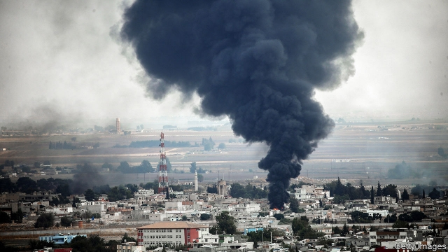

###### Who can trust Trump’s America?

# Politics this week 

 

> Oct 19th 2019 

Turkey continued its invasion of northern Syria, despite Western pressure to stop. Turkey’s autocratic president, Recep Tayyip Erdogan, aims to crush Syria’s Kurds, who have been ditched by President Donald Trump. The Kurds have turned to Syria’s despot, Bashar al-Assad, for protection. Russia, which backs Mr Assad, strolled into abandoned American outposts. Mr Trump, who has been criticised even by fellow Republicans for creating a power vacuum in the Middle East, said he would impose sanctions on some Turkish officials and raise tariffs on Turkish steel. Later, he said the conflict has nothing to do with America. See here.  

Kais Saied trounced his opponent in Tunisia’s presidential election. The former law professor and political outsider spent little on his campaign. Voters chose him in the hope that he will tackle corruption and take the elite down a peg. See article.  

Iran said one of its oil tankers was attacked by an unknown assailant off the coast of Saudi Arabia, its regional rival. Photos showed two large holes in the vessel. Iran itself has been blamed for several attacks on shipping this year. Meanwhile, Imran Khan, Pakistan’s prime minister, travelled to Tehran to broker talks between Iran and Saudi Arabia. 

Abiy Ahmed, the prime minister of Ethiopia, won the Nobel peace prize. Since taking office last year Abiy has freed dissidents and vowed to hold free elections. He signed a peace deal with Eritrea, ending a 20-year-old conflict over a sliver of worthless desert. However, he has failed to stop local politicians from fomenting ethnic cleansing at home. See article.  

Hundreds of forest fires broke out in Lebanon, prompting the government to ask for help from neighbouring countries. The cause of the blazes, which have spread into Syria, remains unknown. 

Britain and the European Union held last-minute talks on a Brexit agreement ahead of a crucial EU summit. Boris Johnson, the British prime minister, said a “great new deal” had been agreed. Any agreement needs the support of the House of Commons, which is not assured. A special Saturday sitting is scheduled for October 19th.  

Spain’s Supreme Court handed down sentences of up to 13 years in prison to a group of nine Catalan separatists for their role in an illegal referendum and independence declaration in 2017. The sentences were much tougher than expected and sparked huge demonstrations, and some rioting, in Barcelona. See article.  

Hungary’s nationalist leader, Viktor Orban, lost control of Budapest. The opposition were uncharacteristically united in city elections, and Mr Orban’s cronies do not completely dominate the media in the capital, unlike in the rest of the country. See article.  

In Poland, the ruling Law and Justice party retained its majority in elections to the Sejm, the lower house of parliament. However, it narrowly lost control of the less powerful Senate. See article.  

The impeachment inquiry into Donald Trump’s dealings with Ukraine continued in the House of Representatives. John Bolton, who recently resigned as national security adviser, described Rudy Giuliani, Mr Trump’s personal lawyer, as “a hand grenade who’s going to blow everybody up”, a former White House aide reportedly testified. Mr Giuliani is refusing to comply with subpoenas. Democrats want to quiz him about his request to Ukrainian officials to find material that could hurt Joe Biden.  

At the latest Democratic presidential debate Elizabeth Warren’s rivals roasted her for repeatedly refusing to say how she would pay for her plan to provide health care for every American. Bernie Sanders admits he would raise middle-class taxes to pay for his similar plan. Ms Warren ducked the question six times. In polls, she vies for the front-runner spot with Mr Biden. 

A furore erupted in Hong Kong’s Legislative Council. Pro-democracy legislators heckled the territory’s leader, Carrie Lam, when she arrived to deliver an annual policy speech, demanding that she resign and waving pictures of her with bloody hands. Mrs Lam withdrew and released a recorded video of her speech instead. 

America’s House of Representatives passed a bill to impose sanctions on Hong Kong’s leaders if they suppress human rights. The Chinese government was furious, and warned of “strong countermeasures” if the bill becomes law (it must first pass through the Senate). China’s leader, Xi Jinping, warned that support for independence for any part of China “will end in crushed bodies and shattered bones”. 

Typhoon Hagibis dropped record-breaking rains on Japan, killing 70 people and flooding some 10,000 homes. Several matches in the rugby World Cup, which Japan is hosting, had to be postponed. 

Cho Kuk resigned as South Korea’s justice minister. He had come under investigation on suspicion of obtaining unfair academic advantages for his daughter. 

Ecuador’s president, Lenín Moreno, dropped his plan to end subsidies of fuel prices after 12 days of mass protests. He had cut the subsidies to comply with an agreement with the IMF, which has approved a $4.2bn loan to Ecuador. Critics say subsidising fossil fuels is costly, regressive and environmentally damaging, but it is popular, so many countries do it. See article.  

Fourteen police officers were murdered in an ambush in the western Mexican state of Michoacán. The killers are thought to be members of the Jalisco New Generation drug gang. 

Colombia’s constitutional court declared illegal a tax-reform law, which cut taxes for business and raised them for people with high incomes, finding that the law had not been correctly published. Before the ruling the finance minister said failing to uphold the law would damage confidence and reduce GDP growth. 

Eliud Kipchoge, a Kenyan runner, became the first person to run a marathon in under two hours, clocking a finishing time of one hour 59 minutes and 40 seconds. He ran at an average speed of just over 21kph (13mph), or 100 metres every 17 seconds. His recorded time at 5,000 metres would have won him gold at every Olympics before 1952, and at 10,000 a gold at every Olympics before 1972. It was not a solo effort; 42 pacemakers helped him maintain his speed until the final straight. 

