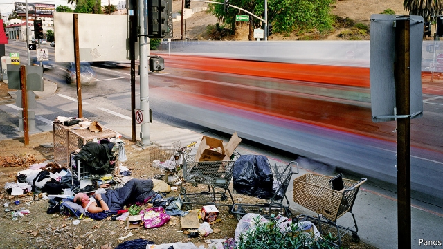
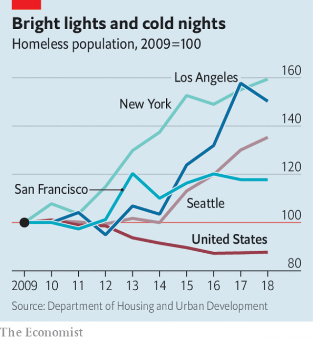

###### Urban myths

# Homelessness is declining in America 

 

> print-edition iconPrint edition | United States | Oct 19th 2019 

FIFTEEN-HUNDRED rubbish bins fill a room that stretches the length of an entire city block. Each one of the 60-gallon containers is neatly labelled and arrayed in a perfect line. Each holds the possessions of a homeless person or family. The facility, fittingly called The Bin, was set up by Chrysalis, a charity, to provide free storage for those living on the streets of Skid Row in Los Angeles. 

There are few harsher vistas of America’s homelessness problem than this neighbourhood, which adjoins a flourishing downtown and arts district. The city says that 4,800 homeless people live there, of whom 23% have an addiction and 43% have a mental illness. They are a fraction of the 50,000 homeless people estimated to live in the Los Angeles area, who are seen not just in Skid Row but also on the bustling pier of Santa Monica and along Venice Beach, where a peaceful-looking woman in her 50s wears plastic bags for shoes and a young man clothed in too many layers gestures to himself on the sand. 

Despite significant public efforts—such as a surcharge on sales tax directed entirely towards homeless services and a $1.2bn bond issue to pay for affordable housing—the problem of homelessness is worsening in Los Angeles. It has emerged as the greatest liability for Eric Garcetti, the mayor, and may have hindered his ambitions to run for president. After spending hundreds of millions, the city was surprised to learn in July that the number of homeless people had increased by 12% from the previous year (city officials point out that this was less than in many other parts of California). Though it can be found everywhere, homelessness, unlike other social pathologies, is not a growing national problem. Rather it is an acute and worsening condition in America’s biggest, most successful cities. 

Every year in January, America’s Department of Housing and Urban Development mobilises thousands of volunteers to walk the streets and count the unsheltered homeless. Along with data provided by homeless shelters, these create an annual census of types of homeless residents. Advocates think that the methodology produces a significant undercount, but they are the best statistics available (and much higher quality than those of other developed countries). Since 2009 they show a 12% decline nationally, but increases of 18% in San Francisco, 35% in Seattle, 50% in Los Angeles and 59% in New York. 

On the surface the problem of homelessness looks intractable. This prompts policy misadventures. In September, just before the Trump administration was subsumed by impeachment chaos, the White House began publicly flirting with intervening in California’s homelessness predicament (one in four homeless Americans lives in the state). However, the suggestions they floated—more arrests, and warehousing those living on the streets in unused aeroplane hangars—would not have been helpful. The real aim seemed to be more to embarrass prominent Democrats than to help. Around the same time, the Council of Economic Advisors put out a report suggesting that spending on shelters would incentivise homelessness. 

The pessimism is the result of three widely believed myths. The first is that the typical homeless person has lived on the street for years, while dealing with addiction, mental illness, or both. In fact, only 35% of the homeless have no shelter, and only one-third of those are classified as chronically homeless. The overwhelming majority of America’s homeless are in some sort of temporary shelter paid for by charities or government. This skews public perceptions of the problem. Most imagine the epicentre of the American homeless epidemic to be San Francisco—where there are 6,900 homeless people, of whom 4,400 live outdoors—instead of New York, where there are 79,000 homeless, of whom just 3,700 are unsheltered. 

The second myth is that rising homelessness in cities is the result of migration, either in search of better weather or benefits. Homelessness is a home-grown problem. About 70% of the homeless in San Francisco previously lived in the city; 75% of those living on the streets of Los Angeles, in places like Skid Row, come from the surrounding area. Though comparable data do not exist for Hawaii—which has one of the highest homelessness rates in the country—a majority of the homeless are ethnic Hawaiians and Pacific Islanders, suggesting that the problem is largely local. 

The third, and perhaps most pernicious, myth is that nothing can be done about it. Much of this results from conflating temporary, sheltered homelessness—the majority of cases—with chronic street homelessness. Most bouts are short and sheltered, driven chiefly by an inability to pay rent and likely to stabilise after rapid rehousing and time-limited housing vouchers. For the most challenging cases of triple affliction—homelessness, addiction and mental illness—more exhaustive interventions are needed. 

 

One promising approach is the “housing first” model. This seeks to place people in supportive housing without preconditions, such as sobriety, and to provide social services afterwards. Although America pioneered this approach, it has not been scaled up. Instead, the Finns have adopted it and nearly halved their homelessness rates in the past decade. Homelessness among ex-servicemen in America has been cut substantially by dedicating federal funding to this sort of service, suggesting that the approach can work outside the Nordic countries. Houston also credits the approach with reducing its homeless counts by more than half in less than a decade. A study of Denver’s programme suggests that permanent supportive housing, though costly, ultimately saves public dollars because it avoids the huge costs of policing, hospitalisation and providing emergency shelter for the homeless. 

All this obscures the chief culprit, however, which is the cost of housing. Even among the poor—of which there are officially 38m in America—homelessness is relatively rare, affecting roughly one in 70 people. What pushes some poor people into homelessness, and not others, remains obscure. So too are the reasons for the sharp racial disparities in homelessness; roughly 40% of the homeless are black, compared with 13% of the population. But remarkably tight correlations exist with rent increases. 

An analysis by Chris Glynn and Emily Fox, two statisticians, predicts that a 10% increase in rents in a high-cost city like New York would result in an 8% increase in the number of homeless residents. Wherever homelessness appears out of control in America—whether in Honolulu, Seattle or Washington, DC—high housing costs almost surely lurk. Fixing this means dealing with a lack of supply, created by over-burdensome zoning regulations and an unwillingness among Democratic leaders to overcome entrenched local interests. 

Unaffordable rental markets make homelessness harder to fix, because housing vouchers go only so far. High housing costs also erase signs of progress. If the engine driving homelessness is left running, the problem in high-cost cities only gets worse. “We effectively remove 133 people from the streets each day, only to be met by an inflow of 150 people each day,” says Mark Ridley-Thomas, of the Board of Supervisors for Los Angeles County. “Our homelessness budget is $462m, which is 25 times what it was in 2015,” says Christina Miller, the deputy mayor of Los Angeles for the issue. 

The ideal way to get stable housing, as is the case with most anti-poverty programmes, is a stable job. But that proves difficult. Chrysalis, the charity that runs The Bin, also maintains an entirely voluntary job-skills-and-placement programme, which they say helped put 2,100 people to work last year (of whom 70% were still retained six months later). One of them is Marshall May, who was recently promoted to a manager’s job at The Bin after years of prison and homelessness. With the bigger pay cheque comes greater financial stability, but also a new source of angst. The rent, he says, is worryingly high.■ 

