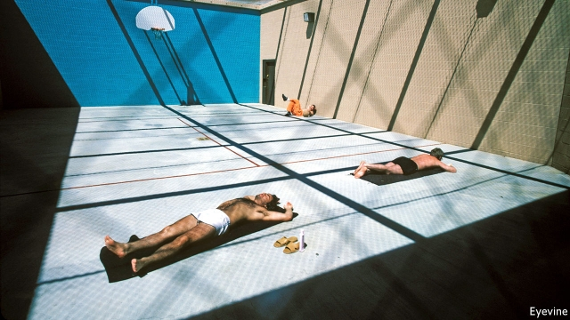

###### Capital punishment

# In defence of America’s prison-industrial complex 

 

> print-edition iconPrint edition | United States | Oct 19th 2019 

ON A CLOUDLESS October day, the early autumn sun still scorching, prisoners line up outside the education building of Saguaro Correctional Centre in Eloy, Arizona. They joke with the corrections officer on duty as she inspects their books. Her uniform does not sport the badge of the state of Arizona or the federal government but rather of CoreCivic, America’s largest private-prison provider. 

After decades of growth, the private-prison industry is under threat. On October 11th the governor of California signed a bill designed to phase out private-prison contracts. Banks, city pension funds and universities have announced their intention to divest. Most Democratic presidential hopefuls want to dismantle the industry. Wary that the public mood is turning, private-prison firms are diversifying into parole services, electronic monitoring, mental-health care and halfway houses. However, although private prisons have indeed profited from America’s obsession with incarceration, they did not cause it. The case for their abolition is much weaker than it might seem. 

America has used private prisons since the early 19th century, but they took off in the 1980s. Between 1978 and 2014, inmate numbers quadrupled. Private companies promised safer, more innovative prisons at a fraction of the cost. Neither advantage has materialised. Direct cost comparisons are difficult, but there is little compelling evidence of increased savings or innovation. Nor do the data make clear which type of institution is worse in terms of abuse, according to Lauren-Brooke Eisen, author of “Inside Private Prisons: An American Dilemma in the Age of Mass Incarceration”. 

Opponents offer a number of criticisms beyond the industry’s failure to make good on its promises, but the main one is that the profit motive creates incentives to skimp on services, put minimal efforts into curtailing reoffending, save money by employing a less well-trained workforce and take only prisoners who are cheaper to house. Critics also allege that private prisons lack transparency and accountability. But these criticisms must be put in context. Private prisons may fail in myriad ways, but the question is whether they are worse than state institutions. Budgetary constraints already lead public prisons to cut costs, often by contracting out services to private companies. Data on reoffending, which is hard to define and measure, are inconclusive. Some public prisons are violent and poorly managed. It is not clear that privatisation causes such problems. 

Better governmental oversight, restructuring contracts to specify desirable results, and more public transparency would improve the industry. More competition would help, too. Fear of losing contracts should improve quality, but 96% of private prison beds are owned by three companies and often a state has only one provider. 

Practical concerns aside, many opponents take it as read that private prisons are immoral and therefore ought to be shut down. Their reasoning is rarely spelt out, but three arguments seem to be in the air. The first suggests that prisoners should be treated like people, not profit centres. But this is hardly unique to private prisons. 

The second argument claims it is immoral to profit from suffering. But companies have always been allowed to profit from permissible forms of suffering, as anyone who has ever missed a loan repayment knows. Finally, some argue that the state should not contract out its core functions. Yet government agencies outsource essential functions, from legal arbitration to war. One salient difference is that private prisons are often permitted to use deadly force against citizens. But if the argument for abolition is primarily moral, it must be made more carefully than it often is. 

None of this suggests that private and public prisons are equally good—better data or clearer moral arguments are needed to reach that conclusion—but it does weaken the case for abolition. One source of opinion, too rarely considered, is that of the prisoners. Evidence here is also mixed. When California brought prisoners back from out-of-state private prisons, some lamented the move. Dean, a prisoner at Saguaro who spent time in state-run facilities in Hawaii, enthuses about CoreCivic’s programming, especially “Go Further”, a cognitive-behaviour therapy course. “For 30 years I’ve been a tyrant,” he reports. “[The programme] allows me to step back and see things through different eyes.” 

Politicians, especially presidential hopefuls, often jump from criticism of over-incarceration to commitments to close private prisons, implying that private prisons are the problem. This is a non sequitur. As Michael Jacobson, of City University of New York’s Institute for State and Local Governance, points out, “it’s not like if you end private prisons the prisoners disappear.” Closing private prisons without reducing prisoner numbers would mean increasing public-prison capacity. In any case, the number of prisoners in private facilities is only 8% of the total prison population. And the Department of Justice can close only federal prisons. Twenty-seven states have contracts with private-prison companies. In 2017, only 23% of private prisoners were in federal prisons. 

Critics of mass incarceration should focus on the number of prisoners, not where they are held. Many Democratic candidates have ambitious criminal-justice plans; but there is a danger, given the difficulty of reform, that they will do no more than abolish private prisons and claim victory, leaving the underlying problem untouched.■ 

