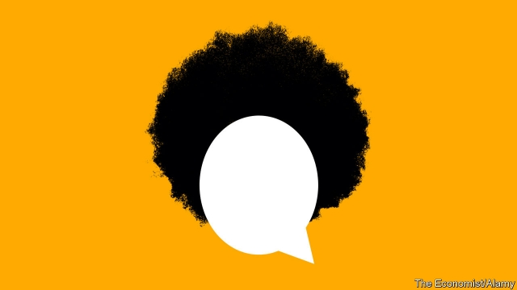

###### Twi for two

# The other African-Americans 

 

> print-edition iconPrint edition | United States | Oct 19th 2019 

“I  JUST CAME to hustle,” explains Gabriel, a recent migrant, as he wields an electric razor to sculpt an impressive structure from a teenage customer’s hair. During shifts at Afrikiko Hair & Fashion Boutique, in northern Chicago, he gets the chance to display a range of skills. Not least, his gift for languages: he speaks four, all from Ghana, besides English. Mostly he chatters in Twi, the most popular tongue in the west-African country. 

Twi is spreading in Chicago. Nearby is WGHC, an FM radio station housed in a gloomy third-floor room above an African hair-braiding shop (“Human Wigs, 100% virgin”). It broadcasts African music and talk in Twi, and other languages, largely to African-born listeners in the city. Its shows play, for example, from speakers mounted in the Makola African Supermarket. The shop’s owner says customers usually speak Twi too, although Nigerians who come for palm oil, okra powder, foufou, yams and beans rely on English. 

African languages are growing rapidly, especially in bigger cities, mostly because the influx of migrants is so recent. Swahili and other central, eastern and southern-African languages are the fastest-growing in America, according to the Census Bureau, albeit from a low base. The number of speakers increased by 22% between 2016 and 2018. Nigerians, Ethiopians and Ghanaians are settling in the largest numbers: by last year the stock of migrants from the three countries numbered 850,000. The overall African-born population, meanwhile, has been doubling in every decade of the past half-century: census officials last year estimated the stock had reached 2.4m, from just 80,000 in 1970. 

Yoruba is the most widely spoken tongue among Nigerian migrants. Vicky, the co-owner of African Wonderland Imports, who arrived from Nigeria in the 1960s, says her copies of Yoruba dictionaries, teach-yourself books and Yoruba-English Bibles sell well. Solomon Abebe, a former refugee who owns Selam Ethiopia Kitchen and a butcher’s, also in the Uptown part of the city, says Amharic is commonly used at home, at weddings, online, on television and at restaurants. Both say it is hard, however, to get children (let alone grandkids) to pick up more than the basics. “They don’t speak outside the house,” he says. 

African migrants typically do well in America, though different nationalities do not mix much. (And in Chicago, at least, the migrants also shun predominantly African-American neighbourhoods.) Many are highly educated and benefit when their countrymen help each other out, especially on arrival. Census estimates, from 2017, suggest 77% speak a language other than English while at home, which reflects how many have arrived recently. Most are employed, notably in health and education jobs. Some sustain their language—and try to motivate children to learn—with trips to see family in Africa. 

Will the influx go on? Researchers from Pew, a think-tank, who looked at more than 400,000 African migrants in the seven years to 2016, say nearly half arrived thanks to family ties. The rest, mostly, were resettled as refugees or won a lottery for hugely popular “diversity” visas. Since then President Donald Trump has all but ended the refugee resettlement route and, with several proclamations, tried to block poor applicants from seeking visas or green cards (though courts are delaying those efforts). The result: Africans will not stop coming entirely, but the dramatic growth in the number of speakers of Amharic, Twi and Yoruba is set to slow. ■ 

